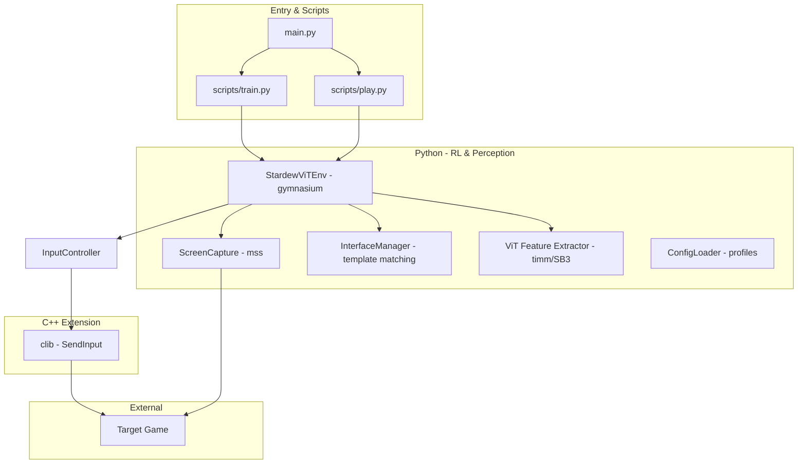

## AI agents: start here (authoritative)

This file is the **authoritative technical context** for AI work in this repo.

If anything conflicts between documents, **prefer this file**, then the code, then `README.md`.

---

## Project intent and boundaries

- **Scope**: local, offline experimentation for **single-player** games you own/control.
- **Hard constraints**:
  - **No memory reading** or process injection for gameplay state.
  - **No game modification**.
  - **Pixels in, actions out** is the core philosophy.
- **Safety expectations**:
  - Keep automation constrained to the intended game window.
  - Pause/stop mechanisms should remain reliable (don’t regress user override behavior).

---

## What is true about the current implementation

### Canonical architecture (today)

GameTrainer is a **vision-based RL pipeline**:

- **Observation**: 224×224 RGB frames.
- **Policy training**: PPO via Stable-Baselines3.
- **Vision backbone**: Vision Transformer (ViT) feature extractor via `timm`.
- **Screen capture**: Python (`mss`, plus OpenCV/numpy preprocessing).
- **Input injection**: C++ extension (`SendInput`) called from Python.

There is **no** separate C++ CV module and **no** C++ AI “decision engine”. The “AI” is the learned policy (ViT + policy head) trained with PPO.

### Key modules (expected locations)

From the architecture/design docs, the implementation is organized around:

- `main.py`: CLI entry (`train` / `play`) which launches scripts.
- `scripts/train.py`, `scripts/play.py`: build env, create/load PPO model, run learn/inference, manage checkpoints.
- `src/gametrainer/env_vit.py`: `StardewViTEnv` gymnasium environment (obs/action/reward/step/reset).
- `src/gametrainer/screen.py`: `ScreenCapture` using `mss`.
- `src/gametrainer/interface.py`: `InterfaceManager` template matching helpers (e.g., UI regions).
- `src/gametrainer/input.py`: `InputController` facade over the C++ extension.
- `src/gametrainer/vit_extractor.py`: SB3 feature extractor using `timm` ViT variants.
- `src/gametrainer/config.py`: `ConfigLoader` for profiles (exists; **not fully wired** everywhere yet).

If the code differs from these expectations, treat **the code as the source of truth** and update docs accordingly.

---

## “Working agreements” for AI contributions

## Developer profile (optimize help for this repo)

- **Experience level**: matured beginner → intermediate
- **Learning goals**:
  - understand architectural design patterns and principles
  - practice interview-level problem solving
  - build production-quality code with good structure
  - learn the “why” behind implementation choices, not just the “what”

### Communication style (learning-focused)

The repo is a learning project for a matured beginner → intermediate developer. When proposing changes:

- **Explain the why** (trade-offs, alternatives).
- **Challenge suboptimal design** respectfully and directly.
- **Relate decisions to interview-ready concepts** when relevant (patterns, SOLID, testing strategy, performance).

Avoid dumping code without rationale.

### Disagreement protocol

If you believe a design choice is suboptimal:

1. Acknowledge the approach (“I see you’re planning to use X…”)
2. Explain the concern (“This might cause issues because…”)
3. Suggest alternatives (“Consider Y instead, which…”)
4. Explain trade-offs (what improves, what gets harder)
5. Provide learning context (interview / real-world analogy)

### Documentation policy (lightweight + centralized)

- `README.md` is **human-facing** and intentionally monolithic.
- `AGENTS.md` is **dense technical context** for agents.
- `CHANGELOG.md` is **append-only** for notable changes.

If you need to add new docs, prefer:

- adding a section to `README.md` (human),
- or adding a section to `AGENTS.md` (AI/technical),

instead of creating a new standalone markdown file.

### Changelog rules

- `CHANGELOG.md` is **append-only**. Do not rewrite existing entries.
- Use `README.md`’s “Design pivot log” for high-level direction changes (why we changed course).

---

## Doc consolidation note (so nothing “disappears”)

This repo previously used multiple markdown files (`PROJECT_OVERVIEW.md`, `architecture.md`, `design.md`, `docs/design.md`, `context.md`, `tasks.md`, `.agent/README.md`).

Current intention:

- Keep `README.md` as the **canonical human narrative**.
- Keep `AGENTS.md` as the **canonical agent context**.
- Keep `CHANGELOG.md` as **append-only** change notes.

If older docs still exist, treat them as **archived** unless they explicitly state they are canonical.

---

## Architecture snapshot (so agents don’t have to hunt)

High-level component graph (current RL implementation):

---

## Current known gaps / priorities (technical)

- **Profile wiring**: `ConfigLoader` / profiles should be connected into env/train (window title, template dir, regions).
- **Tests**: unit tests for screen/config/interface (and env where feasible) are a next step.

---

## Task/rationale tracking (moved here from tasks/context docs)

### Current next steps (shortlist)

- Wire `ConfigLoader` / profiles into env and train script (window title, template dir, regions)
- Add automated unit tests for screen/config/interface (and env where feasible)

### Decision log template (append when a real pivot happens)

**Context**:  
**Decision made**:  
**Rationale**:  
**Alternatives considered**:  
**Trade-offs**:  
**Follow-ups / next actions**:

### Learning checklist (optional, keep lightweight)

- **Design patterns to practice**: Observer, Factory, Singleton (only where appropriate)
- **Topics to practice**: testing strategy, performance profiling, error handling, concurrency

---

## Learning-focused code review checklist

When reviewing or writing code, try to explicitly address:

1. **Design patterns**: what pattern is this, why here?
2. **SOLID**: what principle is being helped or harmed?
3. **Trade-offs**: what are we optimizing for, what are we sacrificing?
4. **Alternatives**: what else could work, why not chosen?
5. **Interview relevance**: how this would show up in a screening/system design discussion?
6. **Real-world context**: how production systems typically handle similar constraints?

---

## Non-goals (for now)

- Multiplayer automation.
- Anti-cheat evasion.
- Memory reading, DLL injection, or process manipulation for state.
- Replacing the RL policy with a fixed rule engine as the primary control loop.

