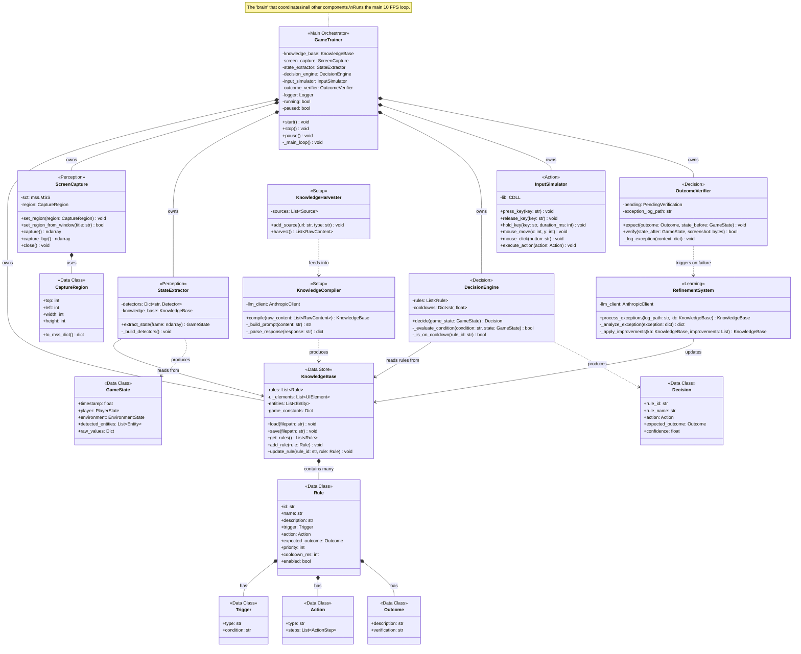
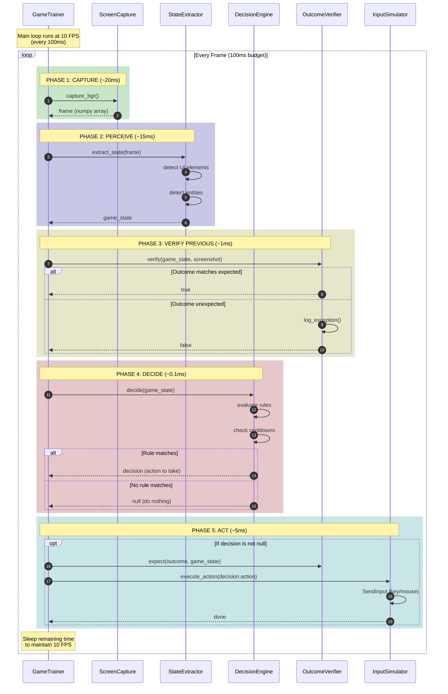
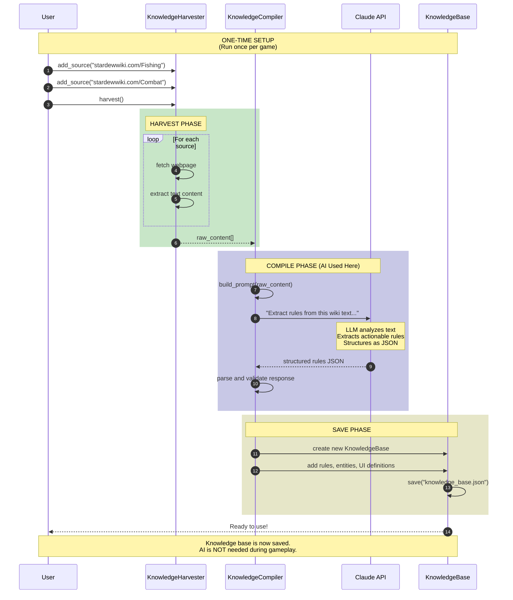
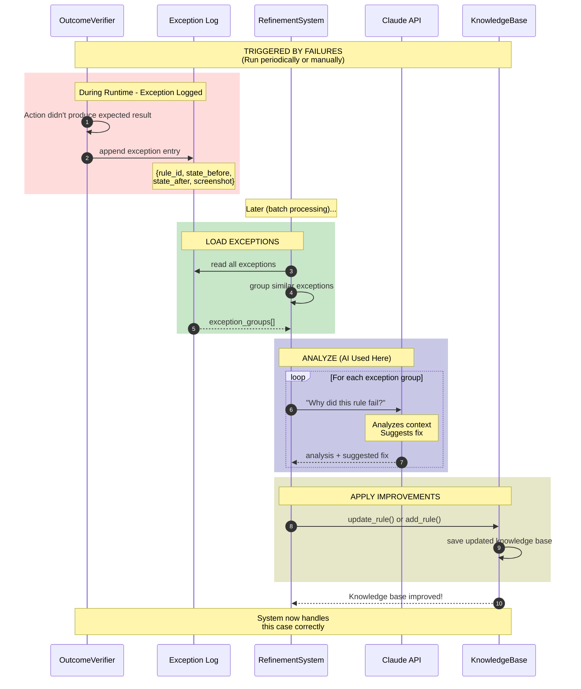
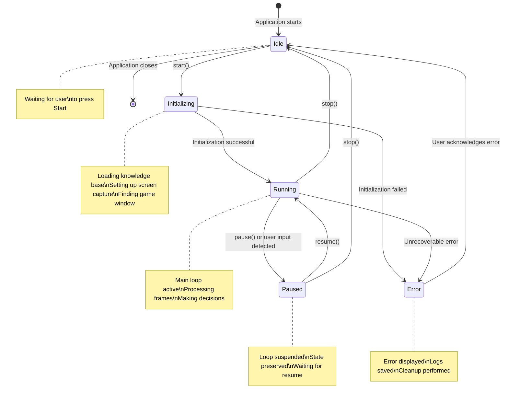
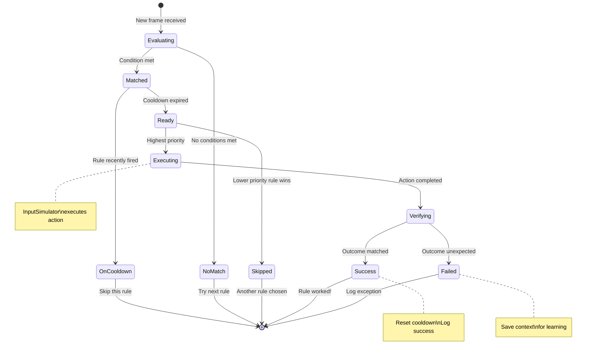
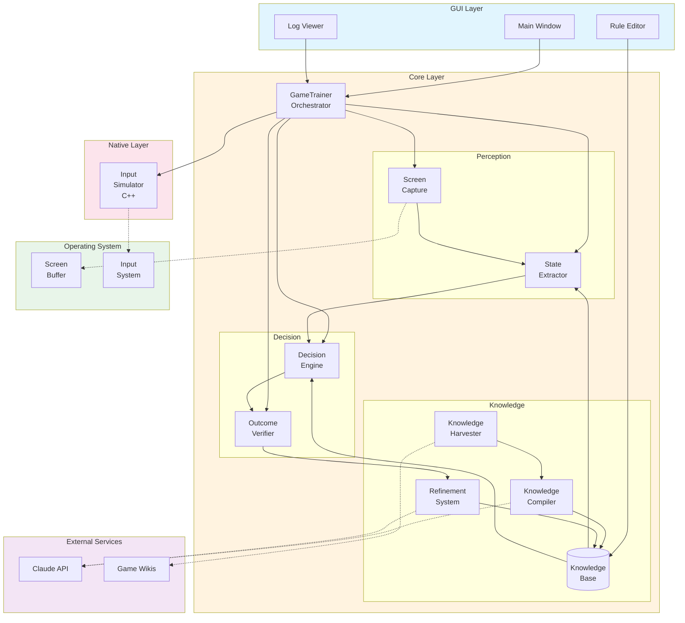
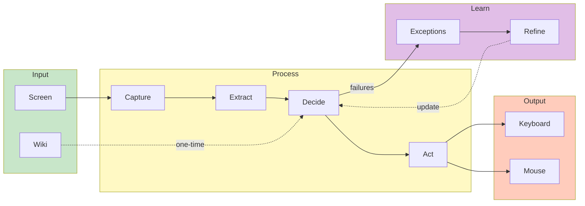

# UML Diagrams

> **Teacher Note:** UML (Unified Modeling Language) diagrams help us visualize
> the structure and behavior of our system. These diagrams use Mermaid syntax,
> which renders automatically on GitHub and in many editors (VS Code, etc.).

---

## Table of Contents

1. [Class Diagram](#1-class-diagram)
2. [Sequence Diagrams](#2-sequence-diagrams)
3. [State Diagram](#3-state-diagram)
4. [Component Diagram](#4-component-diagram)

---

## 1. Class Diagram

> **Teacher Note:** A class diagram shows the "nouns" of our system - what
> objects exist and how they relate to each other. Arrows show relationships:
> - Solid arrow (→): "uses" or "has a reference to"
> - Diamond (◇→): "contains" or "owns"
> - Triangle (▷): "inherits from" or "implements"

### 1.1 Core System Classes



### 1.2 Class Relationship Legend

```
┌─────────────────────────────────────────────────────────────────┐
│                    RELATIONSHIP TYPES                           │
├─────────────────────────────────────────────────────────────────┤
│                                                                 │
│  A *-- B    "A owns/contains B" (composition)                  │
│             If A is destroyed, B is destroyed too              │
│             Example: GameTrainer owns ScreenCapture            │
│                                                                 │
│  A --> B    "A uses/references B" (association)                │
│             A knows about B but doesn't own it                 │
│             Example: StateExtractor reads from KnowledgeBase   │
│                                                                 │
│  A ..> B    "A produces/creates B" (dependency)                │
│             A creates instances of B                           │
│             Example: DecisionEngine produces Decision          │
│                                                                 │
│  A --|> B   "A inherits from B" (inheritance)                  │
│             A is a specialized version of B                    │
│             (Not used much in our design - prefer composition) │
│                                                                 │
└─────────────────────────────────────────────────────────────────┘
```

---

## 2. Sequence Diagrams

> **Teacher Note:** Sequence diagrams show the "verbs" of our system - what
> happens over time. They show messages passing between objects from top to
> bottom. Time flows downward.

### 2.1 Runtime Loop (Single Frame)



### 2.2 Knowledge Bootstrap (Setup Phase)



### 2.3 Exception-Based Learning (Refinement Phase)



### 2.4 Sequence Diagram Legend

```
┌─────────────────────────────────────────────────────────────────┐
│                    SEQUENCE DIAGRAM SYMBOLS                     │
├─────────────────────────────────────────────────────────────────┤
│                                                                 │
│  ─────>>   Synchronous message (caller waits for response)     │
│                                                                 │
│  ─────>    Asynchronous message (caller doesn't wait)          │
│                                                                 │
│  --──>>    Return message (response to a call)                 │
│                                                                 │
│  rect      Grouped actions (phases, transactions)              │
│                                                                 │
│  loop      Repeated actions                                    │
│                                                                 │
│  alt/else  Conditional branching                               │
│                                                                 │
│  opt       Optional actions (may or may not happen)            │
│                                                                 │
│  Note      Explanatory comment                                 │
│                                                                 │
└─────────────────────────────────────────────────────────────────┘
```

---

## 3. State Diagram

> **Teacher Note:** State diagrams show the different "modes" an object can
> be in and what causes transitions between them. This is useful for
> understanding the GameTrainer's lifecycle.

### 3.1 GameTrainer States



### 3.2 Rule Evaluation States



---

## 4. Component Diagram

> **Teacher Note:** Component diagrams show the high-level "boxes" of our
> system and how they communicate. This is a zoomed-out view compared to
> class diagrams.

### 4.1 System Components



### 4.2 Data Flow Overview



---

## 5. How to View These Diagrams

### 5.1 GitHub

GitHub automatically renders Mermaid diagrams in markdown files. Just push
this file and view it on GitHub.

### 5.2 VS Code

Install the "Markdown Preview Mermaid Support" extension:
1. Open Extensions (Ctrl+Shift+X)
2. Search "Mermaid"
3. Install "Markdown Preview Mermaid Support"
4. Open this file and press Ctrl+Shift+V for preview

### 5.3 Online Editor

Copy any diagram code to: https://mermaid.live/

### 5.4 Export to Image

Use the Mermaid CLI or online editor to export as PNG/SVG:
```bash
npm install -g @mermaid-js/mermaid-cli
mmdc -i uml_diagrams.md -o diagrams.png
```

---

## 6. Quick Reference Card

```
┌─────────────────────────────────────────────────────────────────┐
│                    GAMETRAINER ARCHITECTURE                     │
│                       QUICK REFERENCE                           │
├─────────────────────────────────────────────────────────────────┤
│                                                                 │
│  SETUP (one-time, uses AI):                                    │
│  ┌─────────┐   ┌─────────┐   ┌─────────┐                       │
│  │ Harvest │──►│ Compile │──►│  Save   │                       │
│  │  Wiki   │   │  Rules  │   │   KB    │                       │
│  └─────────┘   └─────────┘   └─────────┘                       │
│                                                                 │
│  RUNTIME (fast, no AI):                                        │
│  ┌─────────┐   ┌─────────┐   ┌─────────┐   ┌─────────┐        │
│  │ Capture │──►│ Extract │──►│ Decide  │──►│  Act    │        │
│  │  Frame  │   │  State  │   │  Rule   │   │  Input  │        │
│  └─────────┘   └─────────┘   └─────────┘   └─────────┘        │
│                                  │              │               │
│                                  │              ▼               │
│                                  │         ┌─────────┐         │
│                                  └────────►│ Verify  │         │
│                                            │ Outcome │         │
│                                            └─────────┘         │
│                                                 │               │
│  LEARNING (occasional, uses AI):               │               │
│                                                 ▼               │
│                              ┌─────────┐   ┌─────────┐         │
│                              │ Analyze │◄──│  Log    │         │
│                              │ Failure │   │ Exception│        │
│                              └─────────┘   └─────────┘         │
│                                  │                              │
│                                  ▼                              │
│                              Update KB                          │
│                                                                 │
└─────────────────────────────────────────────────────────────────┘
```

---

*Document version: 1.0*
*Last updated: December 2024*
