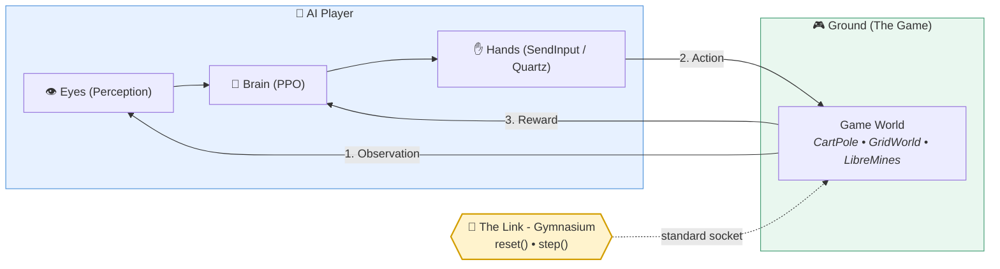

# GameTrainer

> **Covers:** repository front-door, project overview, quickstart instructions, and documentation map.
> **Status:** current.
> **Last verified:** 2026-10-04 (M5 closed; established unified project README).
> **Authority:** front-door landing page. For detailed concepts and onboarding, see [`docs/MASTER_GUIDE.md`](docs/MASTER_GUIDE.md); for milestone roadmap and requirements, see [`docs/PRD.md`](docs/PRD.md).
> Written to `docs/DOC_STANDARD.md`.

GameTrainer connects **video games** to **AI brains** through a **standard Gymnasium socket**, allowing reinforcement learning agents to observe, play, and learn games through trial and error. 

The primary goal of GameTrainer is the **architecture**: creating clean, decoupled plumbing where any game world and any learning algorithm can snap together with zero hacky glue code.

---

## The Core Concept: Ground, Link, AI

Everything in GameTrainer is built around the strict, standard **Observe-Act-Reward** loop:



- **We Build:** The Ground environments, the Link factory wiring, custom reward calculators, CV board classifiers, and native OS keyboard hands.
- **We Borrow:** The learning brain (`stable-baselines3` PPO), the visual backbone (pretrained frozen ViT-Tiny from `timm`), and the environment interface (`Gymnasium`).

---

## Current Verification State (Milestones 0 to 5)

GameTrainer is built brick-by-brick, verified live on both **macOS** and **Windows 11**:

| Milestone | What is Proven | Status | Key Metric / Result |
| :--- | :--- | :--- | :--- |
| **M0: Setup** | The Gymnasium socket contract runs without crashing | ✅ PASS | CartPole baseline ~ 22 steps/episode (CPU) |
| **M1: Borrow the Brain** | Borrowed PPO learns to maximize rewards | ✅ PASS | CartPole reward **22.0 ➔ 500.0** (ceiling reached) |
| **M2: Build Our Ground** | Custom in-memory GridWorld environment | ✅ PASS | **+0.93** mean reward, **20/20** greedy goals reached |
| **M3: Add the Eyes** | Visual perception via frozen ViT-Tiny on CPU | ✅ PASS | Baseline **+0.48** ➔ Trained **+0.99** (100% goals) |
| **M4: Make It Swappable** | 100% config-driven via YAML profiles | ✅ PASS | 4/4 referee checks PASS (`test_m4_verdict.py`) |
| **M5: Add the Hands** | Real external desktop window (`LibreMines`) | ✅ PASS | 4/4 live controls PASS; 20/20 unattended resets |
| **M6: Stardew Valley** | Complex commercial game | ⏳ Planned | Multi-region visual perception profile |

---

## Quickstart

### 1. Installation

```bash
# Clone the repository
git clone https://github.com/phillip/GameTrainer.git
cd GameTrainer

# Create and activate virtual environment
python -m venv .venv
# On Windows:
.venv\Scripts\Activate.ps1
# On macOS/Linux:
source .venv/bin/activate

# Install with RL dependencies
pip install -e ".[rl]"
```

### 2. Interactive Terminal Menu (TUI)

Launch the interactive console menu to run baselines, view profiles, or train models:

```bash
python main.py
```

### 3. Run Tests & Linting

```bash
# Run unit tests (deterministic, ~2-4 seconds)
pytest

# Code style check
ruff check .
```

### 4. Milestone 5 Live Hands Proof

Open `LibreMines` (v2.3.0, Beginner 8x8) and run:

```bash
python scripts/check_hands.py
```

---

## Documentation Map

All project documentation follows the standards defined in [`docs/DOC_STANDARD.md`](docs/DOC_STANDARD.md) (*"One authority per question"*):

| If You Want... | Read |
| :--- | :--- |
| **Complete Architectural Guide, Rosetta Stone & Onboarding** | [`docs/MASTER_GUIDE.md`](docs/MASTER_GUIDE.md) |
| **Full Architecture & UML Diagrams (C4 Layers + Classes + Sequences)** | [`docs/UML_FULL.md`](docs/UML_FULL.md) |
| **What Gets Built & Milestone Plan (M0 ➔ M6)** | [`docs/PRD.md`](docs/PRD.md) |
| **Project History & Version Changes** | [`docs/CHANGELOG.md`](docs/CHANGELOG.md) |
| **Documentation Standards & Rules** | [`docs/DOC_STANDARD.md`](docs/DOC_STANDARD.md) |
| **Archived Stardew Track B Prototype (Historical Record)** | [`docs/ARCHIVED_STARDEW_TRACK_B.md`](docs/ARCHIVED_STARDEW_TRACK_B.md) |
