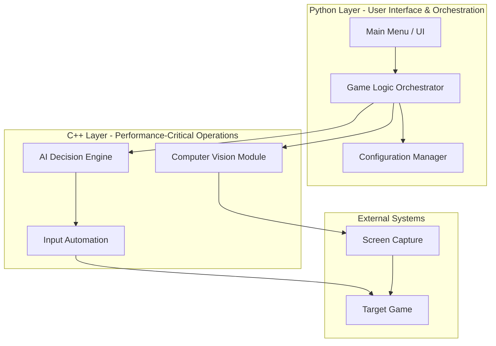

# GameTrainer - System Architecture

> **Last Updated**: 2026-02-01  
> **Status**: Initial architecture documentation

## Overview

GameTrainer is a hybrid Python/C++ application that combines computer vision, AI, and game automation to create an intelligent training assistant for games.

## High-Level Architecture



## Technology Stack

### Python Components
- **Purpose**: High-level logic, UI, and system orchestration
- **Why Python**: 
  - Rapid development for UI and business logic
  - Rich ecosystem for configuration and data handling
  - Easy integration with C++ via ctypes/pybind11
- **Trade-offs**: 
  - ✅ Fast iteration, readable code
  - ❌ Slower execution for performance-critical tasks

### C++ Components
- **Purpose**: Computer vision, AI inference, and input automation
- **Why C++**: 
  - Real-time performance requirements (CV processing, input timing)
  - Direct memory access for screen capture
  - Low-latency input simulation
- **Trade-offs**: 
  - ✅ High performance, low latency
  - ❌ Longer development time, more complex debugging

### Integration Strategy
- **Approach**: Python calls C++ shared libraries (.dll/.so)
- **Why**: Leverages strengths of both languages
- **Alternative Considered**: Pure Python with OpenCV
  - Rejected because: Input automation and CV processing need native performance

## System Components

### 1. User Interface Layer (Python)
**Responsibility**: Present options to user, gather input, display results

**Design Pattern**: MVC (Model-View-Controller)
- **View**: Console/GUI rendering
- **Controller**: Input handlers and menu navigation
- **Model**: Game state and configuration

**Why MVC**: Separates presentation from logic, making it easier to swap UI implementations (console → GUI) without changing core logic.

### 2. Orchestration Layer (Python)
**Responsibility**: Coordinate between UI, configuration, and C++ modules

**Design Pattern**: Facade Pattern
- Provides simplified interface to complex C++ subsystems
- Handles error translation and logging
- Manages lifecycle of C++ components

**Why Facade**: C++ modules have complex initialization and state management. Facade hides this complexity from UI layer.

### 3. Computer Vision Module (C++)
**Responsibility**: Capture screen, detect game elements, track state

**Design Considerations**:
- **Performance**: Must process frames at 30-60 FPS
- **Accuracy**: Balance speed vs detection quality
- **Memory**: Efficient buffer management for frame data

**Interview Relevance**: Image processing pipelines, optimization techniques, memory management

### 4. AI Decision Engine (C++)
**Responsibility**: Analyze game state, make decisions, plan actions

**Design Pattern**: Strategy Pattern
- Different AI strategies for different game scenarios
- Swappable algorithms without changing core engine

**Why Strategy**: Games have different phases (early game, combat, exploration) requiring different decision-making approaches.

### 5. Input Automation (C++)
**Responsibility**: Send keyboard/mouse inputs to game with precise timing

**Design Considerations**:
- **Timing Precision**: Microsecond-level accuracy
- **Anti-Detection**: Humanized input patterns
- **Safety**: Input validation and rate limiting

## Data Flow

```mermaid
sequenceDiagram
    participant User
    participant Python UI
    participant Python Orchestrator
    participant C++ CV
    participant C++ AI
    participant C++ Input
    participant Game
    
    User->>Python UI: Start Training
    Python UI->>Python Orchestrator: Initialize Session
    Python Orchestrator->>C++ CV: Start Screen Capture
    
    loop Training Loop
        C++ CV->>C++ CV: Capture Frame
        C++ CV->>C++ AI: Send Game State
        C++ AI->>C++ AI: Analyze & Decide
        C++ AI->>C++ Input: Execute Action
        C++ Input->>Game: Send Input
        C++ CV-->>Python Orchestrator: Status Update
        Python Orchestrator-->>Python UI: Display Progress
    end
    
    User->>Python UI: Stop Training
    Python UI->>Python Orchestrator: Cleanup
    Python Orchestrator->>C++ CV: Stop Capture
```

## Design Principles Applied

### 1. Separation of Concerns
- UI doesn't know about C++ implementation details
- C++ modules don't know about Python UI
- Each component has single, well-defined responsibility

### 2. Language-Appropriate Responsibilities
- Python: Orchestration, configuration, user interaction
- C++: Performance-critical, real-time operations

### 3. Modularity
- Components can be developed and tested independently
- Easy to swap implementations (e.g., different CV algorithms)

### 4. Extensibility
- New game support: Add new CV detection rules
- New AI strategies: Implement Strategy interface
- New UI: Implement against Orchestrator interface

## Scalability Considerations

### Current Scale
- Single game instance
- Local execution
- Single-threaded CV/AI pipeline

### Future Growth Paths
1. **Multi-threading**: Parallel CV processing and AI decision-making
2. **Multi-game**: Support multiple games simultaneously
3. **Cloud**: Offload AI training to remote servers
4. **Analytics**: Collect and analyze training data

## Technical Debt & Future Refactoring

*To be populated as project develops*

## Open Questions

1. **C++/Python Integration**: ctypes vs pybind11 vs cython?
   - Need to evaluate based on performance and ease of use
   
2. **CV Library**: OpenCV vs custom implementation?
   - OpenCV is feature-rich but heavy; custom is lean but more work
   
3. **AI Approach**: Rule-based vs ML-based?
   - Rule-based is simpler to start; ML is more powerful but requires training data

## Learning Resources

- **Design Patterns**: "Head First Design Patterns" - Strategy, Facade, MVC
- **System Design**: "Designing Data-Intensive Applications" - Architecture principles
- **C++/Python Integration**: Official Python C API docs, pybind11 documentation
- **Computer Vision**: OpenCV tutorials, real-time processing techniques

---

**Note**: This is a living document. Update as architecture evolves and design decisions are made.
