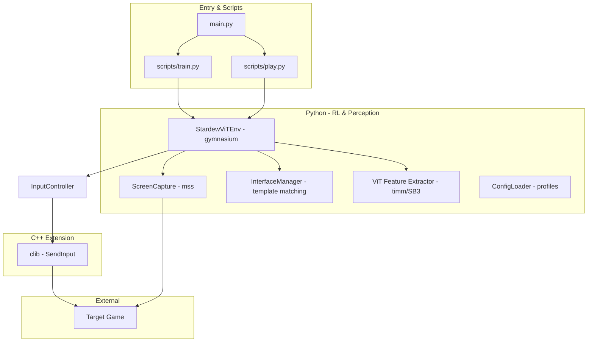
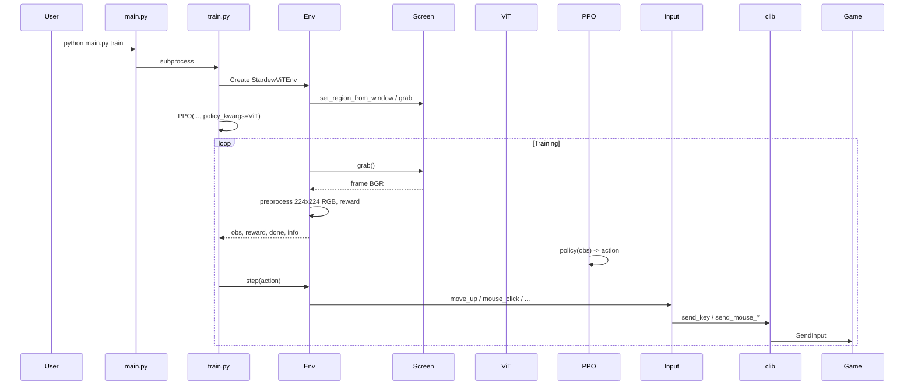
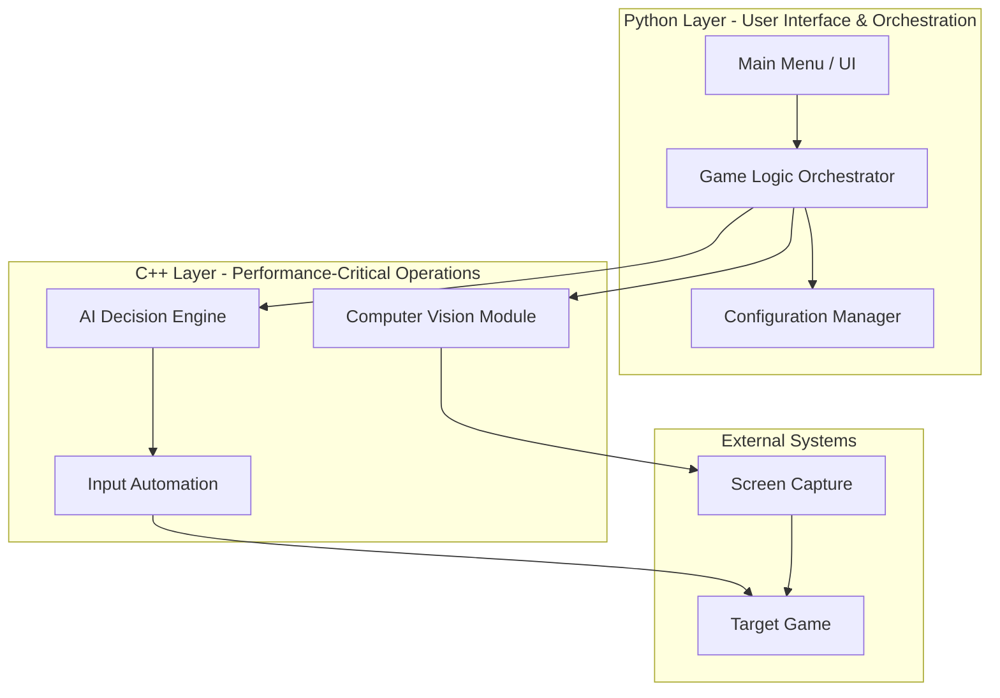

# GameTrainer - System Architecture

> **Last Updated**: 2026-02-23  
> **Status**: Aligned with current RL implementation

## Overview

GameTrainer is a **vision-based Reinforcement Learning (RL)** system. The agent learns from screen pixels using a Vision Transformer (ViT) and Proximal Policy Optimization (PPO). Screen capture and image processing are in **Python** (mss, OpenCV); only **input injection** uses a **C++** extension (Windows SendInput) for reliability. There is no separate C++ CV or AI engine—the "AI" is the neural policy (ViT + MLP) trained with Stable-Baselines3.

**Canonical RL design**: See **[docs/design.md](docs/design.md)** for the RL-specific architecture (observation space, action space, reward, data flow).

---

## Current Implementation: High-Level Architecture

## Current Technology Stack

### Python (primary)
- **Entry**: `main.py` → subprocess to `scripts/train.py` or `scripts/play.py` (no graphical menu; CLI only).
- **Screen capture**: `mss` in `src/gametrainer/screen.py` (`ScreenCapture`). Region set by window title or fullscreen.
- **Perception**: OpenCV for resize/normalize; **Vision Transformer** (timm) in `src/gametrainer/vit_extractor.py` as SB3 custom feature extractor (224×224 RGB).
- **RL**: Gymnasium env in `src/gametrainer/env_vit.py`; PPO from Stable-Baselines3 in scripts; observation = image, action = discrete (e.g. 12 actions).
- **UI detection**: `src/gametrainer/interface.py` (`InterfaceManager`) — template matching for energy bar etc.; optional fallback regions.
- **Config**: `src/gametrainer/config.py` (`ConfigLoader`) — loads game profiles (e.g. `regions.yaml`). Not yet wired into env/train (window title and paths currently hardcoded).

### C++ (input only)
- **Purpose**: Reliable keyboard/mouse injection for games (Windows SendInput).
- **Surface**: Python `InputController` in `src/gametrainer/input.py` calls `src.gametrainer.clib` (C extension built via setup.py).

### What is *not* implemented (vs original design)
- **No** Main Menu / MenuItem / Orchestrator (no Facade over C++ CV/AI).
- **No** C++ CV module or C++ AI decision engine (rule-based or otherwise). Vision and "AI" are the ViT + PPO policy in Python.

## Current System Components

### 1. Entry point (`main.py`)
- Parses CLI for `train` or `play`; launches `scripts/train.py` or `scripts/play.py` via subprocess.

### 2. Training / play scripts (`scripts/train.py`, `scripts/play.py`)
- Build Gymnasium env (`StardewViTEnv`), create or load PPO model (ViT feature extractor), run `model.learn()` or inference. Handle checkpoints and dependencies.

### 3. Environment (`src/gametrainer/env_vit.py` — `StardewViTEnv`)
- **Observation**: 224×224 RGB (channel-first). **Action**: Discrete (e.g. 12: movement, mouse, ESC).
- Uses `ScreenCapture`, `InputController`, `InterfaceManager`; implements reward (movement, energy, notifications, interaction, anti-spam, etc.).

### 4. Screen capture (`src/gametrainer/screen.py` — `ScreenCapture`)
- Sets region by window title or fullscreen; `grab()` returns BGR numpy array. Uses `mss`.

### 5. Input (`src/gametrainer/input.py` — `InputController`)
- High-level API (e.g. `move_up()`, `mouse_click()`); delegates to C++ `clib` for SendInput.

### 6. UI detection (`src/gametrainer/interface.py` — `InterfaceManager`)
- Template matching for UI elements (e.g. energy icon); provides regions for reward logic.

### 7. Config / profiles (`src/gametrainer/config.py` — `ConfigLoader`)
- Loads profile dirs (e.g. `regions.yaml`). Ready for multi-game use; not yet connected to env or train script.

### 8. ViT feature extractor (`src/gametrainer/vit_extractor.py`)
- Custom SB3 feature extractor (ViT-Tiny/Small/Base via timm); 224×224 input; optional freeze backbone.

## Current Data Flow

---

## Original Design (Reference — Not Implemented)

The following described an earlier, **unimplemented** plan: Python Menu + Orchestrator + Config talking to C++ CV, C++ AI engine, and C++ Input. The project **pivoted to the RL implementation** above; this is kept for reference only.

### Original High-Level Architecture

### Original Component Intent (reference)
- **UI**: Menu + MenuItem (Command pattern); **Config**: GameConfig + ConfigManager; **Orchestrator**: Facade over C++ CV/AI/Input.
- **C++ CV**: Screen capture + game detection; **C++ AI**: Strategy-based decision engine; **C++ Input**: Keyboard/mouse with humanization.
- Only the **input** part exists today, as the `clib` extension used by `InputController`.

---

## Design Principles Applied

### 1. Separation of Concerns
- Env does not depend on PPO/training script internals; scripts depend on env interface only.
- Input layer (Python + clib) is the only C++ boundary; screen and "AI" are pure Python.

### 2. Language-Appropriate Responsibilities
- Python: Screen capture (mss), image processing (OpenCV), RL (Gymnasium, SB3, ViT), config, UI detection.
- C++: Input injection only (SendInput for game compatibility).

### 3. Modularity
- Env, screen, input, interface, config, ViT extractor are separate modules; train/play scripts compose them.

### 4. Extensibility
- New game: New profile (regions, templates) and/or new env; ConfigLoader is ready. ViT/PPO unchanged.
- New ViT size: Add extractor variant in `vit_extractor.py` and wire in `train.py`.

## Scalability Considerations

### Current Scale
- Single game instance (Stardew Valley); window title and paths hardcoded in env/train.
- Local execution (GPU training via PyTorch/SB3).
- Single-threaded training loop (env step → policy → action).

### Future Growth Paths
1. **Multi-game**: Wire `ConfigLoader` and profiles into env/train (window title, template dir, regions).
2. **Distributed training**: SB3 supports vectorized envs; could add more envs or async sampling later.
3. **Analytics**: TensorBoard and session logs already in place; extend as needed.

## Technical Debt & Future Refactoring

- **Profile wiring**: `ConfigLoader` exists but is not used by `env_vit.py` or `scripts/train.py`.
- **Platform**: Windows-only (win32gui, SendInput); no abstraction for other OSes.

## Open Questions (current)

1. **Profile integration**: When to load profile (window title, regions, template dir) in env/train?
2. **Cross-platform**: Stub or document non-Windows behavior for screen/input?
3. **ViT vs larger resolution**: 384×384 or frame stacking if 224×224 proves limiting?

## Learning Resources

- **Design Patterns**: "Head First Design Patterns" - Strategy, Facade, MVC
- **System Design**: "Designing Data-Intensive Applications" - Architecture principles
- **C++/Python Integration**: Official Python C API docs, pybind11 documentation
- **Computer Vision**: OpenCV tutorials, real-time processing techniques

---

**Note**: This is a living document. Update as architecture evolves and design decisions are made.
