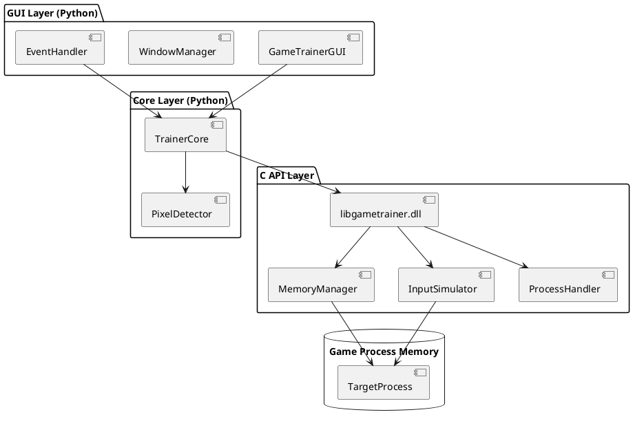
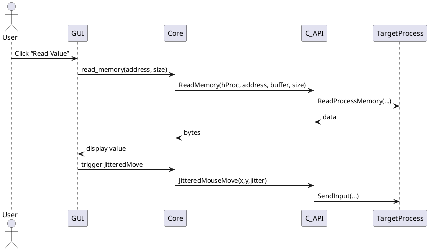

# GameTrainer Design Document

## 1. Introduction

### 1.1 Purpose

Define the architecture and design for **GameTrainer**, a hybrid C/Python application that allows safe, maintainable memory-modification and input-simulation for local single-player games to automate things such as farming, attacking, crafting

### 1.2 Scope

- Read and write target process memory (pointer offsets, pattern scans)
- Read in-game state for automated bots (quest clicks, material farming, enemy detection)
- Simulate user input (keyboard, mouse, Arduino-driven HID)
- Pixel-based screen monitoring for automated reactions
- Graphical user interface for configuration and control
- Modular, extensible code following SOLID principles

### 1.3 Definitions

- **Trainer**: the core module orchestrating memory reads/writes and input simulation
- **GUI Layer**: Python/Tkinter or Qt interface
- **C Memory Layer**: Windows-API wrappers in C for undetectable processes and undetectable memory manipulation from any detection methods
- **Pixel Detector**: Python module to watch screen regions for specific pixel patterns

---

## 2. Requirements

### 2.1 Functional Requirements

1. **Process Attachment**: Locate and open target process by name or PID

2. **Memory Read/Write**:

   - Read arbitrary address ranges
   - Write back modified bytes
   - Support pattern (AOB) and pointer-chain scanning

3. **Input Simulation**:

   - Simulate mouse moves/clicks with jitter and random delays
   - Configure humanization parameters (click curvature, random missed clicks, timing deviations, variable click coordinates)
   - Send keystrokes via WinAPI or Arduino HID
   - Incorporate logout timers (auto-pause or logout after configurable idle/activity intervals)

4. **Pixel Monitoring**:

   - Capture screen regions
   - Detect pixel/color patterns and notify core

5. **Configuration**:

   - Save/load profiles (addresses, offsets, input mappings)
   - Adjustable randomness parameters for anti-detection

### 2.2 Non-Functional Requirements

- **Performance**: ≤5 ms memory-read latency; input jitter ≤50 ms
- **Reliability**: robust error handling, no memory leaks
- **Maintainability**: clear layering, thorough comments for beginners
- **Security**: validate all addresses, sandbox C library calls

---

## 3. Architecture Overview

### 3.1 Component Diagram



### 3.2 Layering

1. **GUI Layer** (Python): user interactions, profile management
2. **Core Layer** (Python): business logic, event routing
3. **C API Layer** (shared library): WinAPI wrappers, performance-critical code
4. **OS/Hardware**: Windows process memory, screen buffer, USB/HID

---

## 4. Detailed Design

### 4.1 Python GUI Layer

#### 4.1.1 `GameTrainerGUI`

- **Responsibilities**: initialize windows, bind events, load/save profiles
- **Key methods**:
  - `__init__(self, core: TrainerCore)`
  - `run(self)`
  - `on_start_clicked(self)`
  - `on_stop_clicked(self)`

#### 4.1.2 `WindowManager`, `EventHandler`

- Manage multiple dialogs (settings, logs)
- Dispatch GUI events to `TrainerCore`

---

### 4.2 Python Core Layer

#### 4.2.1 `TrainerCore`

- **Dependencies**: `libgametrainer.dll` via `ctypes`
- **Responsibilities**:
  - Attach/detach process
  - Schedule memory reads/writes
  - Relay pixel-detector notifications → input calls
- **Key methods**:
  - `attach_process(self, name: str)`
  - `read_ptr_chain(self, base: int, offsets: List[int]) → int`
  - `write_memory(self, addr: int, data: bytes)`

#### 4.2.2 `PixelDetector`

- Capture screen region at X fps
- Compare against expected color/pattern
- Emit events when thresholds met

---

### 4.3 C Memory & Input Layer

#### 4.3.1 `MemoryManager` (memory\_manager.c/h)

```c
#define PROCESS_ALL_ACCESS 0x1F0FFF
HANDLE OpenTarget(DWORD pid);
BOOL ReadMemory(HANDLE h, LPCVOID addr, LPVOID buf, SIZE_T sz);
BOOL WriteMemory(HANDLE h, LPVOID addr, LPCVOID buf, SIZE_T sz);
```

#### 4.3.2 `InputSimulator` (input\_simulator.c/h)

```c
void SendMouseMove(int dx, int dy);
void JitteredMouseMove(int x, int y, int max_jitter);
void SendKey(WORD vkCode, BOOL keyDown);
```

#### 4.3.3 `ProcessHandler` (process\_handler.c/h)

```c
DWORD FindProcessId(const char* name);
HMODULE GetModuleBase(HANDLE hProc);
DWORD GetProcessRights(HANDLE hProc);
```

---

### 4.4 Sequence Diagram: Memory Read & Mouse Jitter



---

## 5. Project Structure

```
GameTrainer/
├── src/
│   ├── c/
│   │   ├── memory_manager.c
│   │   ├── memory_manager.h
│   │   ├── input_simulator.c
│   │   ├── input_simulator.h
│   │   ├── process_handler.c
│   │   ├── process_handler.h
│   └── python/
│       ├── gui/
│       │   ├── main_window.py
│       │   ├── window_manager.py
│       │   └── event_handler.py
│       └── core/
│           ├── trainer.py
│           └── pixel_detector.py
├── tests/
│   ├── c_tests/
│   └── python_tests/
├── CMakeLists.txt
├── setup.py
└── DESIGN.md
```

---

## 6. Coding Standards

### 6.1 SOLID Principles

- **S**ingle Responsibility: one class/module = one reason to change
- **O**pen/Closed: design modules for extension via interfaces
- **L**iskov Substitution: use interfaces/abstract base classes
- **I**nterface Segregation: fine-grained Python/C APIs
- **D**ependency Inversion: high-level Python modules depend on abstractions, not concrete C functions

### 6.2 C/C++ Guidelines

- Check all WinAPI return values
- Use RAII-style wrappers for HANDLEs
- Guard header files with `#pragma once`
- Doxygen comments for all public functions

### 6.3 Python Guidelines

- PEP8 naming, typing hints
- Use `logging` module (levels DEBUG→ERROR)
- Catch and wrap C errors into Python exceptions

---

## 7. Testing Strategy

### 7.1 Unit Testing

- **C layer**: link with a test harness, mock `ReadProcessMemory`/`WriteProcessMemory`
- **Python layer**: pytest for `TrainerCore`, mock `ctypes` calls

### 7.2 Integration Testing

- Attach to a simple “dummy” process, verify read/write end-to-end
- GUI smoke tests with headless display (`xvfb` on Windows?)

### 7.3 Mocking Windows APIs

- Provide a stub DLL implementing the same exports

---

## 8. Build & Deployment

### 8.1 CMake (C layer)

```cmake
cmake_minimum_required(VERSION 2.3)
project(GameTrainer C)
set(CMAKE_C_STANDARD 11)
add_library(gametrainer SHARED
    c/memory_manager.c
    c/input_simulator.c
    c/process_handler.c
)
target_include_directories(gametrainer PUBLIC c/)
```

### 8.2 Python Packaging

```bash
python setup.py sdist bdist_wheel
pip install .
```

---

## 9. Dependencies

- **C**: Windows SDK
- **Python**:
  - `tkinter` or `PyQt5`
  - `ctypes`
  - `Pillow` (for pixel capture)
  - `pytest`
- **Build**: CMake ≥ 2.3, Python 3.7+

---

## 10. Security & Anti-Detection

- Randomize input timings (`jitter`, variable delays)
- Validate all address writes against safe ranges
- Rotate memory-access patterns to avoid heuristic flags
- Optionally route input through Arduino HID emulation for entropy
- **Direct Kernel Object Manipulation (DKOM)**: unlink injected threads or objects from standard process lists to avoid user-mode scanners
- **Manual Mapping**: map and resolve the C API library in-process without using LoadLibrary (evades hooks on standard WinAPI calls)
- **Code Cave Injection & Thread Hijacking**: inject payloads directly into rarely monitored sections of the game’s process and hijack existing threads
- **Structured Exception Handler (SEH) Hooks**: leverage the game’s exception handling flow to execute code instead of invoking monitored APIs
- **Allocation Randomization**: vary sizes and addresses of memory allocations each run to foil signature-based scanners
- **Payload Obfuscation**: encrypt or compress your in-memory payload and decrypt on-the-fly to hide byte patterns from memory dumps
- **Operation Throttling**: pace memory reads/writes and input events to mimic legitimate game behavior statistics
- **Watchdog Awareness**: detect and temporarily suspend operations if known anti-cheat watchdog processes or drivers become active

## 11. Future Enhancements

- Plugin system for new “trainers” per game
- AOB pattern scanner with signature definitions
- Cross-platform support (Linux via `ptrace`)
- In-GUI memory viewer/editor
- Snapshot/rollback of memory states

> *Keep this document updated as features evolve.*

