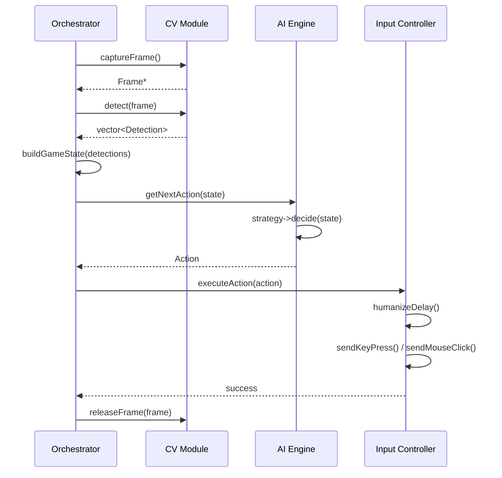
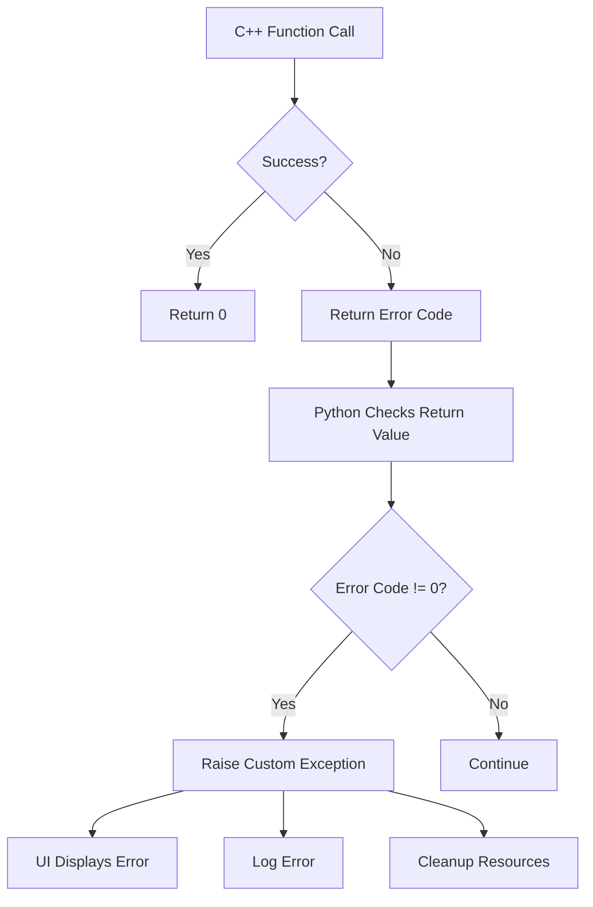

# GameTrainer - Detailed Design

> **Last Updated**: 2026-02-01  
> **Status**: Initial design documentation

## Purpose

This document details the implementation-level design decisions, class structures, and module interactions. While `architecture.md` covers the "what" and "why" at a high level, this document covers the "how" at a code level.

## Module Design

### Python Modules

#### 1. Main Menu / UI Module

**File**: `main_menu.py` (or similar)

**Responsibilities**:
- Display menu options to user
- Capture user input
- Validate selections
- Delegate to orchestrator

**Class Structure** (Proposed):
```python
class MenuItem:
    """Represents a single menu option"""
    def __init__(self, label: str, action: Callable):
        self.label = label
        self.action = action

class Menu:
    """Manages menu display and navigation"""
    def __init__(self, title: str):
        self.title = title
        self.items: List[MenuItem] = []
    
    def add_item(self, item: MenuItem) -> None:
        """Add menu option"""
        
    def display(self) -> None:
        """Render menu to console/GUI"""
        
    def run(self) -> None:
        """Main menu loop"""
```

**Design Pattern**: Command Pattern
- Each MenuItem encapsulates an action
- Decouples menu display from action execution
- Easy to add new menu items without modifying Menu class

**Why Command Pattern**: 
- Common in UI frameworks (buttons, menu items)
- Testable: Can test actions independently of UI
- Interview-relevant: Often asked to implement undo/redo using Command pattern

**Alternative Considered**: Simple dictionary mapping
- Simpler but less extensible
- Harder to add features like undo, logging, or validation

---

#### 2. Configuration Manager

**File**: `config.py`

**Responsibilities**:
- Load/save configuration from files
- Provide type-safe access to settings
- Validate configuration values
- Manage defaults

**Class Structure** (Proposed):
```python
from dataclasses import dataclass
from typing import Optional

@dataclass
class GameConfig:
    """Type-safe configuration for game settings"""
    game_name: str
    resolution: tuple[int, int]
    capture_fps: int = 30
    ai_difficulty: str = "medium"

class ConfigManager:
    """Manages application configuration"""
    
    def __init__(self, config_path: str):
        self.config_path = config_path
        self.config: Optional[GameConfig] = None
    
    def load(self) -> GameConfig:
        """Load config from file, return defaults if not found"""
        
    def save(self, config: GameConfig) -> None:
        """Persist config to file"""
        
    def validate(self, config: GameConfig) -> bool:
        """Ensure config values are valid"""
```

**Design Pattern**: Singleton (potentially)
- Only one configuration instance should exist
- Global access point for settings

**Why Dataclasses**: 
- Type safety (IDE autocomplete, type checking)
- Automatic `__init__`, `__repr__`, `__eq__`
- Cleaner than dictionaries for structured data

**Interview Relevance**: 
- Configuration management is common in system design interviews
- Singleton pattern is frequently discussed (and debated!)

---

#### 3. Game Orchestrator

**File**: `orchestrator.py`

**Responsibilities**:
- Initialize C++ modules
- Coordinate training loop
- Handle errors from C++ layer
- Provide status updates to UI

**Class Structure** (Proposed):
```python
from ctypes import CDLL, c_int, c_char_p
from enum import Enum

class TrainingStatus(Enum):
    IDLE = 0
    RUNNING = 1
    PAUSED = 2
    ERROR = 3

class GameOrchestrator:
    """Facade for C++ game training modules"""
    
    def __init__(self, config: GameConfig):
        self.config = config
        self.cv_module = CDLL("./cv_module.dll")  # Load C++ library
        self.ai_module = CDLL("./ai_module.dll")
        self.status = TrainingStatus.IDLE
        self._initialize_modules()
    
    def _initialize_modules(self) -> None:
        """Setup C++ modules with configuration"""
        
    def start_training(self) -> None:
        """Begin training loop"""
        
    def stop_training(self) -> None:
        """Gracefully stop training"""
        
    def get_status(self) -> dict:
        """Return current training status and metrics"""
```

**Design Pattern**: Facade Pattern
- Simplifies complex C++ interface
- Provides Python-friendly API
- Handles C type conversions

**Why Facade**: 
- C++ libraries have complex initialization sequences
- Error handling differs between C++ and Python
- UI shouldn't need to know about ctypes, pointers, etc.

**Error Handling Strategy**:
```python
class GameTrainerError(Exception):
    """Base exception for GameTrainer errors"""

class CVModuleError(GameTrainerError):
    """Computer vision module errors"""

class AIModuleError(GameTrainerError):
    """AI decision engine errors"""

# In orchestrator:
def start_training(self) -> None:
    try:
        result = self.cv_module.start_capture()
        if result != 0:
            raise CVModuleError(f"Failed to start capture: {result}")
    except OSError as e:
        raise GameTrainerError(f"Failed to load CV module: {e}")
```

**Why Custom Exceptions**: 
- Caller can handle specific errors differently
- Clear error hierarchy
- Better logging and debugging

---

### C++ Modules

#### 1. Computer Vision Module

**File**: `cv_module.cpp`

**Responsibilities**:
- Capture screen region
- Detect game elements (health bars, enemies, etc.)
- Track game state changes
- Provide frame data to AI module

**Class Structure** (Proposed):
```cpp
// Frame data structure
struct Frame {
    unsigned char* data;
    int width;
    int height;
    int channels;
    long long timestamp;
};

// Detection result
struct Detection {
    int x, y, width, height;
    float confidence;
    const char* label;
};

class ScreenCapture {
public:
    ScreenCapture(int x, int y, int width, int height);
    ~ScreenCapture();
    
    Frame* captureFrame();
    void releaseFrame(Frame* frame);
    
private:
    // Platform-specific capture handle
    void* captureHandle;
};

class GameDetector {
public:
    GameDetector(const char* configPath);
    
    std::vector<Detection> detect(const Frame* frame);
    
private:
    // Template matching, feature detection, etc.
    void* detectorImpl;
};
```

**Design Considerations**:

1. **Memory Management**: 
   - Who owns the frame data? (Answer: ScreenCapture)
   - When to free? (Answer: Explicit `releaseFrame()` call)
   - Why not smart pointers? (Answer: C API for Python compatibility)

2. **Performance**:
   - Frame pooling to avoid allocations
   - ROI (Region of Interest) to process only relevant areas
   - Multi-threading for capture + processing

3. **Platform Compatibility**:
   - Windows: Use Windows GDI or DirectX
   - Linux: X11 or Wayland
   - Abstract behind ScreenCapture interface

**Interview Relevance**:
- Memory management (ownership, leaks)
- Performance optimization (pooling, caching)
- Platform abstraction (interfaces, polymorphism)

---

#### 2. AI Decision Engine

**File**: `ai_engine.cpp`

**Responsibilities**:
- Analyze game state from CV detections
- Make decisions based on strategy
- Plan action sequences
- Provide actions to input module

**Class Structure** (Proposed):
```cpp
// Game state representation
struct GameState {
    int playerHealth;
    int playerMana;
    std::vector<Detection> enemies;
    std::vector<Detection> items;
    // ... other state
};

// Action to execute
struct Action {
    enum Type { MOVE, ATTACK, USE_ITEM, WAIT };
    Type type;
    int targetX, targetY;
    const char* itemName;
};

// Strategy interface
class AIStrategy {
public:
    virtual ~AIStrategy() = default;
    virtual Action decide(const GameState& state) = 0;
};

// Concrete strategies
class AggressiveStrategy : public AIStrategy {
public:
    Action decide(const GameState& state) override;
};

class DefensiveStrategy : public AIStrategy {
public:
    Action decide(const GameState& state) override;
};

// Main AI engine
class AIEngine {
public:
    AIEngine();
    
    void setStrategy(AIStrategy* strategy);
    Action getNextAction(const GameState& state);
    
private:
    AIStrategy* currentStrategy;
};
```

**Design Pattern**: Strategy Pattern
- Different AI behaviors without changing AIEngine
- Easy to add new strategies
- Testable: Can test each strategy independently

**Why Strategy Pattern**:
- Games have different phases requiring different behaviors
- User might want to switch strategies on the fly
- Classic interview question: "Design an AI that can switch behaviors"

**Alternative Considered**: State Machine
- Good for discrete states (idle, combat, fleeing)
- Strategy is better for swappable algorithms
- Could combine: State machine chooses which Strategy to use

**Decision-Making Approaches**:

1. **Rule-Based** (Start here):
   ```cpp
   Action AggressiveStrategy::decide(const GameState& state) {
       if (state.playerHealth < 30) {
           return Action{Action::USE_ITEM, 0, 0, "health_potion"};
       }
       if (!state.enemies.empty()) {
           auto& enemy = state.enemies[0];
           return Action{Action::ATTACK, enemy.x, enemy.y, nullptr};
       }
       return Action{Action::WAIT, 0, 0, nullptr};
   }
   ```
   - ✅ Simple, predictable, debuggable
   - ❌ Limited adaptability

2. **Behavior Trees** (Intermediate):
   - Hierarchical decision structure
   - More flexible than pure rules
   - Used in game AI (Halo, Spore)

3. **Machine Learning** (Advanced):
   - Reinforcement learning (Q-learning, PPO)
   - Learns from experience
   - Requires training data and infrastructure

**Recommendation**: Start with rule-based, refactor to behavior trees if complexity grows.

---

#### 3. Input Automation Module

**File**: `input_module.cpp`

**Responsibilities**:
- Send keyboard/mouse inputs to game
- Humanize input timing (anti-detection)
- Queue and execute action sequences
- Validate inputs for safety

**Class Structure** (Proposed):
```cpp
class InputController {
public:
    InputController();
    
    void sendKeyPress(int keyCode, int durationMs);
    void sendMouseClick(int x, int y, bool leftButton = true);
    void sendMouseMove(int x, int y, int durationMs);
    
    void executeAction(const Action& action);
    
private:
    void humanizeDelay(int baseDelayMs);
    // Platform-specific input injection
};
```

**Design Considerations**:

1. **Timing Precision**:
   - Use high-resolution timers (`std::chrono::high_resolution_clock`)
   - Account for OS scheduling delays
   - Measure actual vs intended timing

2. **Humanization**:
   ```cpp
   void InputController::humanizeDelay(int baseDelayMs) {
       // Add random jitter to avoid detection
       std::random_device rd;
       std::mt19937 gen(rd());
       std::normal_distribution<> dist(baseDelayMs, baseDelayMs * 0.1);
       
       int actualDelay = std::max(0, static_cast<int>(dist(gen)));
       std::this_thread::sleep_for(std::chrono::milliseconds(actualDelay));
   }
   ```

3. **Safety**:
   - Rate limiting (max actions per second)
   - Input validation (coordinates within screen bounds)
   - Emergency stop mechanism

**Interview Relevance**:
- Concurrency (timing, threading)
- Random number generation (distributions)
- Platform-specific APIs (Windows SendInput, Linux XTest)

---

## Data Flow Details

### Training Loop Sequence



### Error Handling Flow



---

## API Contracts

### Python → C++ Interface

**C++ Export** (using `extern "C"` for C ABI):
```cpp
extern "C" {
    // CV Module
    int cv_init(int x, int y, int width, int height);
    int cv_capture_frame(unsigned char** outData, int* outWidth, int* outHeight);
    int cv_detect(const unsigned char* frameData, int width, int height, 
                  Detection* outDetections, int* outCount);
    void cv_release_frame(unsigned char* frameData);
    void cv_cleanup();
    
    // AI Module
    int ai_init(const char* strategyName);
    int ai_get_action(const GameState* state, Action* outAction);
    void ai_cleanup();
    
    // Input Module
    int input_init();
    int input_execute_action(const Action* action);
    void input_cleanup();
}
```

**Python Wrapper**:
```python
from ctypes import CDLL, POINTER, c_int, c_char_p, c_ubyte, Structure

class Detection(Structure):
    _fields_ = [
        ("x", c_int),
        ("y", c_int),
        ("width", c_int),
        ("height", c_int),
        ("confidence", c_float),
        ("label", c_char_p)
    ]

class CVModule:
    def __init__(self, dll_path: str):
        self.lib = CDLL(dll_path)
        
        # Define function signatures
        self.lib.cv_init.argtypes = [c_int, c_int, c_int, c_int]
        self.lib.cv_init.restype = c_int
        
        self.lib.cv_detect.argtypes = [
            POINTER(c_ubyte), c_int, c_int,
            POINTER(Detection), POINTER(c_int)
        ]
        self.lib.cv_detect.restype = c_int
    
    def initialize(self, x: int, y: int, width: int, height: int) -> None:
        result = self.lib.cv_init(x, y, width, height)
        if result != 0:
            raise CVModuleError(f"Initialization failed: {result}")
```

---

## Testing Strategy

### Unit Tests

**Python**:
```python
# test_menu.py
import unittest
from main_menu import Menu, MenuItem

class TestMenu(unittest.TestCase):
    def test_add_item(self):
        menu = Menu("Test")
        item = MenuItem("Option 1", lambda: None)
        menu.add_item(item)
        self.assertEqual(len(menu.items), 1)
    
    def test_item_execution(self):
        executed = []
        item = MenuItem("Test", lambda: executed.append(1))
        item.action()
        self.assertEqual(executed, [1])
```

**C++**:
```cpp
// test_ai_strategy.cpp
#include <gtest/gtest.h>
#include "ai_engine.h"

TEST(AggressiveStrategyTest, AttacksWhenEnemyPresent) {
    AggressiveStrategy strategy;
    GameState state;
    state.playerHealth = 100;
    state.enemies.push_back(Detection{100, 100, 50, 50, 0.9, "enemy"});
    
    Action action = strategy.decide(state);
    
    EXPECT_EQ(action.type, Action::ATTACK);
    EXPECT_EQ(action.targetX, 100);
    EXPECT_EQ(action.targetY, 100);
}

TEST(AggressiveStrategyTest, UsesHealthPotionWhenLowHealth) {
    AggressiveStrategy strategy;
    GameState state;
    state.playerHealth = 20;
    
    Action action = strategy.decide(state);
    
    EXPECT_EQ(action.type, Action::USE_ITEM);
    EXPECT_STREQ(action.itemName, "health_potion");
}
```

### Integration Tests

Test Python ↔ C++ interaction:
```python
# test_integration.py
def test_full_training_loop():
    config = GameConfig(game_name="TestGame", resolution=(800, 600))
    orchestrator = GameOrchestrator(config)
    
    # Mock C++ modules to return test data
    orchestrator.start_training()
    
    # Verify training loop executes without errors
    time.sleep(1)
    status = orchestrator.get_status()
    
    assert status['status'] == TrainingStatus.RUNNING
    orchestrator.stop_training()
```

---

## Performance Considerations

### Bottleneck Analysis

1. **Screen Capture**: ~16ms per frame (60 FPS)
2. **CV Detection**: ~50-100ms (depends on complexity)
3. **AI Decision**: ~1-5ms (rule-based)
4. **Input Execution**: ~10-50ms (humanized delays)

**Total Loop Time**: ~77-171ms → **6-13 FPS effective rate**

### Optimization Opportunities

1. **Parallel Processing**:
   ```cpp
   // Capture and process in parallel
   std::thread captureThread([&]() {
       while (running) {
           Frame* frame = capture.captureFrame();
           frameQueue.push(frame);
       }
   });
   
   std::thread processThread([&]() {
       while (running) {
           Frame* frame = frameQueue.pop();
           auto detections = detector.detect(frame);
           // ... process
       }
   });
   ```

2. **ROI Processing**: Only analyze relevant screen regions
3. **Frame Skipping**: Process every Nth frame for non-critical detections
4. **GPU Acceleration**: Use CUDA/OpenCL for CV operations

---

## Open Design Questions

1. **C++/Python Integration Method**:
   - [ ] ctypes (current assumption)
   - [ ] pybind11 (more Pythonic, easier)
   - [ ] Cython (performance, complexity)
   
   **Decision needed**: Prototype with ctypes, evaluate pybind11 if interface becomes complex

2. **CV Detection Approach**:
   - [ ] Template matching (simple, fast)
   - [ ] Feature detection (SIFT, ORB)
   - [ ] Deep learning (YOLO, SSD)
   
   **Decision needed**: Start with template matching, add ML if accuracy insufficient

3. **Configuration Format**:
   - [ ] JSON (human-readable, widely supported)
   - [ ] YAML (more readable, requires library)
   - [ ] TOML (Python-friendly, modern)
   
   **Decision needed**: JSON for simplicity, can migrate later

---

## Next Steps

1. Implement basic Python menu structure
2. Create C++ stub modules with mock implementations
3. Establish Python ↔ C++ communication
4. Implement screen capture (platform-specific)
5. Add simple template-based detection
6. Implement rule-based AI strategy
7. Add input automation with safety checks

---

**Note**: This design will evolve as implementation progresses. Update this document when making significant design changes.
