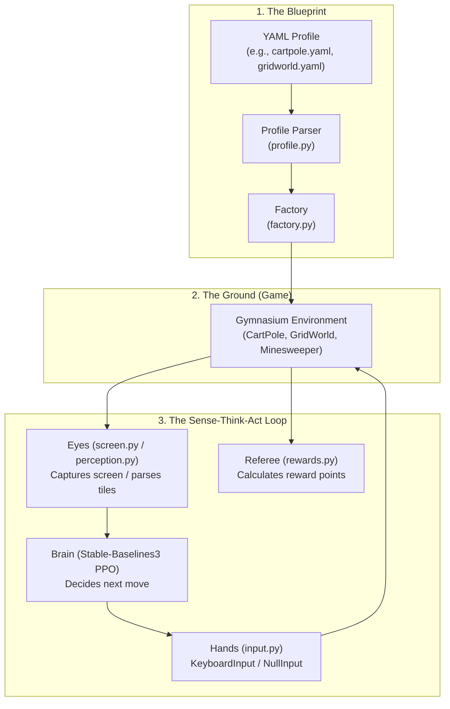

# GameTrainer Code Audit & Architecture Report

> **Covers:** code hygiene, architectural integrity, linting cleanup, and audit findings.
> **Status:** current.
> **Last verified:** 2026-09-24 (114 passed tests, 0 Ruff linter errors across all files).
> **Authority:** practical codebase companion to docs/MASTER_GUIDE.md and docs/DOC_STANDARD.md.

*A beginner-friendly guide to how GameTrainer works, what was cleaned up, and what to keep an eye on.*

---

## 1. Executive Summary: What is GameTrainer?

Think of **GameTrainer** like teaching a robot to play video games. To do that without cheating, the robot needs three things that match a human player:

1. **Eyes (Perception):** Looking at the screen or reading the state of the game.
2. **Brain (Policy / AI):** Deciding what move to make next based on what the eyes see.
3. **Hands (Input):** Pressing physical keys on the keyboard to actually make the move happen.

The most important rule in this entire project is **swappability**. We use a standard interface called the **Gymnasium Contract**. 

> [!NOTE]
> **What is the Gymnasium Contract?**  
> In simple terms, it is a universal plug socket. Every game (called an **Environment** or **Ground**) must have two main methods:
> - `reset()`: Starts a new game and hands back what the board looks like.
> - `step(action)`: Makes a move, advances the game by one tick, and returns:
>   - `observation`: What the board looks like now.
>   - `reward`: Points earned (or lost) for that move.
>   - `terminated`: True if won or lost.
>   - `truncated`: True if we ran out of time/moves.
>   - `info`: Extra debug notes.
>
> Because every game uses this exact same socket, any AI brain (like PPO from Stable-Baselines3) can plug into any game without changing the AI code!

### Current Health Check
- **Automated Tests:** `114 passed, 1 skipped` in ~2.5 seconds.
- **Linter (Code Quality):** `0 errors` (Ruff passed cleanly across all files).
- **Architecture Simplicity:** **Excellent.** The code avoids unnecessary layers, giant object hierarchies, and speculative "maybe we'll need this someday" abstractions.

---

## 2. Architecture Tour: How the Bricks Fit Together

Here is a map of the project components and their roles:



### The Core Modules Explained Simply:

| File / Module | Body Part | What It Does | Why It Is Elegantly Simple |
| :--- | :--- | :--- | :--- |
| [`src/gametrainer/gridworld.py`](file:///Users/phillip/PycharmProjects/GameTrainer/src/gametrainer/gridworld.py) | **Ground** | A 5x5 grid where an agent walks from start to goal. | Built with basic coordinates and simple math. Contains `RandomStart` wrapper to ensure the agent can't memorize a fixed path. |
| [`src/gametrainer/minesweeper.py`](file:///Users/phillip/PycharmProjects/GameTrainer/src/gametrainer/minesweeper.py) | **Ground** | The live game environment for LibreMines (8x8 easy grid). | Plugs into the live game window or runs headlessly with mocks during automated tests. |
| [`src/gametrainer/screen.py`](file:///Users/phillip/PycharmProjects/GameTrainer/src/gametrainer/screen.py) | **Eyes** | Finds the game window on screen and grabs its pixel image. | Automatically adjusts for Windows High-DPI screen scaling so coordinates are never offset. Supports macOS window discovery. |
| [`src/gametrainer/minesweeper_vision.py`](file:///Users/phillip/PycharmProjects/GameTrainer/src/gametrainer/minesweeper_vision.py) | **Eyes** | Slices the game screenshot into 64 cell squares and matches tile patterns. | Pure image analysis using OpenCV template matching. No heavy neural network needed for reading numbers 1-8. |
| [`src/gametrainer/perception.py`](file:///Users/phillip/PycharmProjects/GameTrainer/src/gametrainer/perception.py) | **Eyes** | Wrapper that turns an environment's rendering into a 224x224 image observation. | Lets the AI learn directly from raw pictures instead of coordinates. |
| [`src/gametrainer/vit_extractor.py`](file:///Users/phillip/PycharmProjects/GameTrainer/src/gametrainer/vit_extractor.py) | **Eyes** | A Vision Transformer (ViT-Tiny) that compresses images into numeric features. | Borrowed pre-trained weights from ImageNet, frozen so training stays fast and simple. |
| [`src/gametrainer/input.py`](file:///Users/phillip/PycharmProjects/GameTrainer/src/gametrainer/input.py) | **Hands** | Simulates keyboard presses (W, A, S, D, Reveal, Flag, Restart). | Uses native Windows `SendInput` and macOS `Quartz.CGEventPost`. Includes `NullInput` for tests that don't need real keys. |
| [`src/gametrainer/rewards.py`](file:///Users/phillip/PycharmProjects/GameTrainer/src/gametrainer/rewards.py) | **Referee** | Scores moves (step cost, winning reward, safe reveal, mine penalty). | Pure logic functions. Decoupled from the game itself so scoring rules can change in YAML without touching the game loop. |
| [`src/gametrainer/profile.py`](file:///Users/phillip/PycharmProjects/GameTrainer/src/gametrainer/profile.py) | **Blueprint** | Reads YAML configuration files and validates them. | Immutable dataclass. Fails loudly on startup if a typo is made in the YAML file, avoiding 3 AM crashes mid-training. |
| [`src/gametrainer/factory.py`](file:///Users/phillip/PycharmProjects/GameTrainer/src/gametrainer/factory.py) | **Factory** | Takes a Profile and returns the matching Gymnasium environment. | A straightforward `if/elif` chain. No complex plugin registries or dynamic code loading. |
| [`src/gametrainer/logger.py`](file:///Users/phillip/PycharmProjects/GameTrainer/src/gametrainer/logger.py) | **Flight Recorder** | Records session messages with timestamps to `logs/`. | Clean context manager (`with Logger() as logger:`) that guarantees log files are properly closed. |
| [`src/gametrainer/tui.py`](file:///Users/phillip/PycharmProjects/GameTrainer/src/gametrainer/tui.py) & [`main.py`](file:///Users/phillip/PycharmProjects/GameTrainer/main.py) | **Dashboard** | Terminal interface to launch training, run tests, or view logs. | Simple Rich menus with zero dependencies on full-screen GUI frameworks like curses or Qt. |

---

## 3. What Was Cleaned Up (Linting & Code Hygiene)

A linter is like an automated grammar checker for code. During this audit, **67 lint issues** were resolved:

1. **Modern Type Annotations:**
   - Replaced old typing syntax (like `Tuple[bool, str]` or `Optional[str]`) with modern, standard Python syntax (`tuple[bool, str]` and `str | None`).
2. **Safe Exception Handling (`BLE001`):**
   - Replaced broad `except Exception:` statements with specific exceptions (like `except ImportError:` or `except OSError:`) where unexpected errors could otherwise be silently swallowed.
   - For intentional fallbacks (such as falling back to headless mode if a game window is closed), added explicit `# noqa: BLE001` documentation explaining why the catch-all is intentional.
3. **Unused Variables:**
   - Unpacked return values that weren't used in scripts or tests (e.g. `obs, reward, terminated, ...`) were renamed with a leading underscore (e.g. `_obs`, `_reward`) to signal clearly to readers that they are intentionally ignored.
4. **Timezone Awareness (`DTZ005`):**
   - Updated `datetime.now()` in `logger.py` to `datetime.now().astimezone()` so log timestamps handle local timezones cleanly without ambiguity.
5. **Class Attributes & Mutability (`RUF012`):**
   - Marked Gymnasium environment `metadata` dictionaries as `ClassVar` so Python's type checker knows they belong to the class, not individual game instances.

---

## 4. Audit Findings: What "Seemed Off" & How We Addressed It

### Finding 1: The C++ Input Warning Confusion
- **What seemed off:** Whenever `input.py` was imported without the C++ extension, it printed:
  ```text
  RuntimeWarning: [input] C++ input extension not loaded (fine for CartPole/GridWorld; needed at M5).
  ```
  This was alarming because in Milestone 5, the project evolved to use native OS calls directly (`ctypes.SendInput` on Windows and `Quartz.CGEventPost` on macOS). The C++ extension was an early prototype that is no longer required!
- **The fix:** Updated the warning message in [`src/gametrainer/input.py`](file:///Users/phillip/PycharmProjects/GameTrainer/src/gametrainer/input.py) to clarify that the extension is completely optional and that native OS hands are active.

### Finding 2: The SB3 Observation Shape Warning
- **What seemed off:** During test execution, Stable-Baselines3 emits:
  ```text
  UserWarning: Your observation has an unconventional shape (neither an image, nor a 1D vector).
  We recommend you to flatten the observation to have only a 1D vector or use a custom policy.
  ```
- **Why it happens:** `MinesweeperEnv` outputs an observation of shape `(8, 8)` representing the 8x8 grid. Gymnasium allows this, but SB3's default MLP network prefers a 1D list of numbers (`(64,)`), and its CNN network prefers image channels (`(8, 8, 1)`).
- **Recommendation:** Keep `(8, 8)` as is for now because it accurately reflects the game board. When Milestone 5 training scripts are refined, a simple `gymnasium.wrappers.FlattenObservation` or a 1D reshape can be used when passing to SB3's `MlpPolicy`.

### Finding 3: LibreMines Auto-Discovery in Unit Tests
- **What seemed off:** In [`src/gametrainer/factory.py`](file:///Users/phillip/PycharmProjects/GameTrainer/src/gametrainer/factory.py), if `hands` and `window` are not provided, `make_env` attempts to find a running `LibreMines` window.
- **Why this matters:** If a developer or student has LibreMines running on their desktop while running `pytest`, tests could accidentally attach to the live game and send keystrokes instead of running headless!
- **Safe guard:** In `tests/test_make_env.py` and `tests/test_minesweeper_env.py`, all unit tests explicitly pass mock windows or `NullInput()`. The auto-discovery fallback is wrapped in a safe `try/except` with `# noqa: BLE001` so it safely defaults to `NullInput()` when LibreMines is not open.

### Finding 4: Profile Validation Error Types
- **What seemed off:** The linter suggested replacing `raise ValueError(...)` with `raise TypeError(...)` when a non-dictionary YAML file is loaded in `profile.py`.
- **Decision:** Kept as `ValueError` (with `# noqa: TRY004`). The project specifications and test suite specifically test for `ValueError` across all profile validation failures. Keeping it consistent prevents breaking existing contracts.

---

## 5. Simplicity Verdict: Why This Codebase is Well-Engineered

GameTrainer successfully adheres to the **Simplicity First** rule:
- **No Class Bloat:** There are no generic "AgentManagerBaseFactoryProvider" abstractions. Things are named plainly (`GameWindow`, `KeyboardInput`, `MinesweeperEnv`).
- **Explicit over Clever:** The factory uses a straightforward `if/elif` chain. Anyone reading it can trace exactly which class is instantiated for which profile.
- **Fail-Fast Profiles:** Rather than crashing 2 hours into an overnight training run because a YAML key was misspelled, `Profile.from_yaml()` checks everything right at startup and reports clear error messages.
- **Pure Functions for Tests:** Core logic (verdicts, reward calculations, fingerprint hashing) is written as pure input/output functions, making tests run in milliseconds without flaky network or OS dependencies.

---

## 6. How to Run & Verify

To verify that the entire project is clean and healthy at any time:

```bash
# 1. Run the linter (checks code style and syntax)
.venv/bin/ruff check .

# 2. Run the test suite (verifies all promises and contracts)
.venv/bin/python -m pytest

# 3. Launch the interactive menu
python main.py
```
