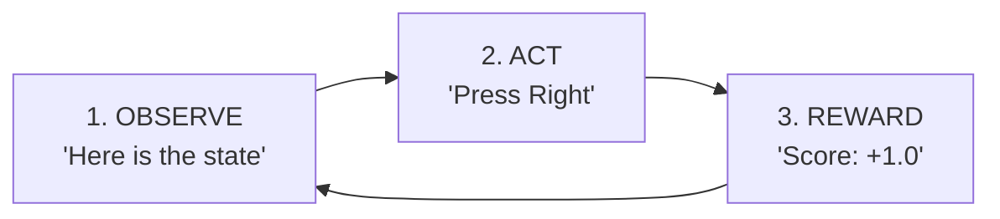
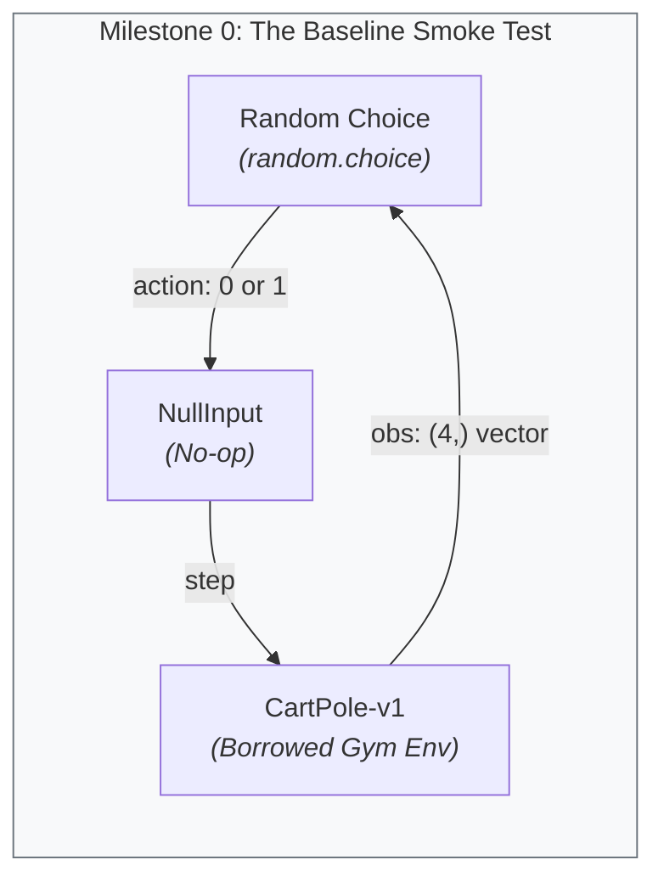
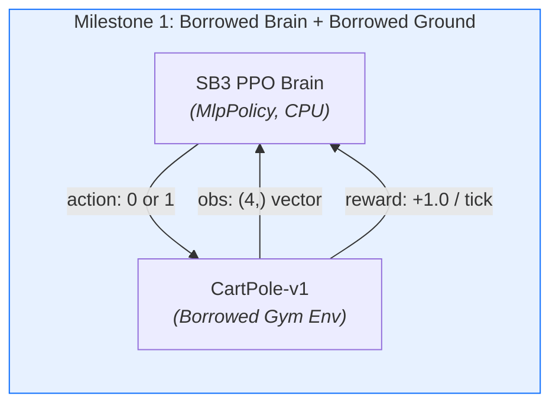
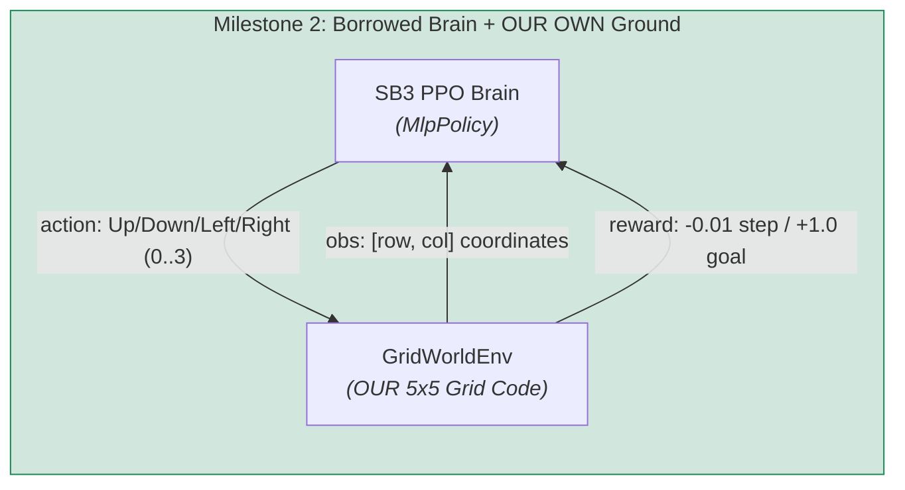
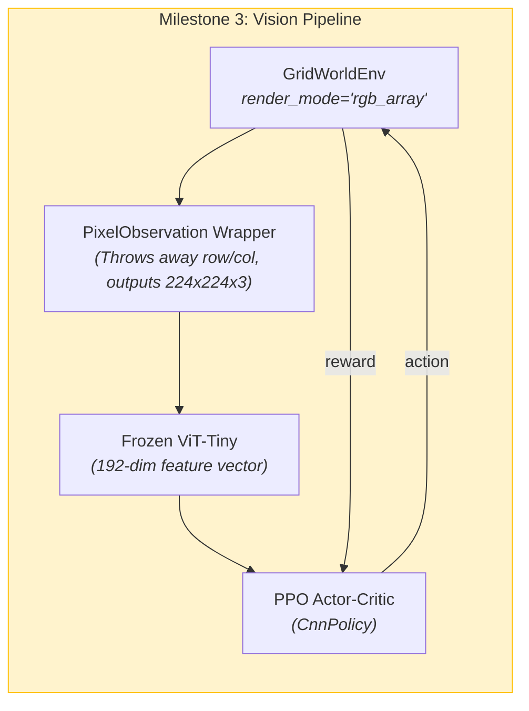
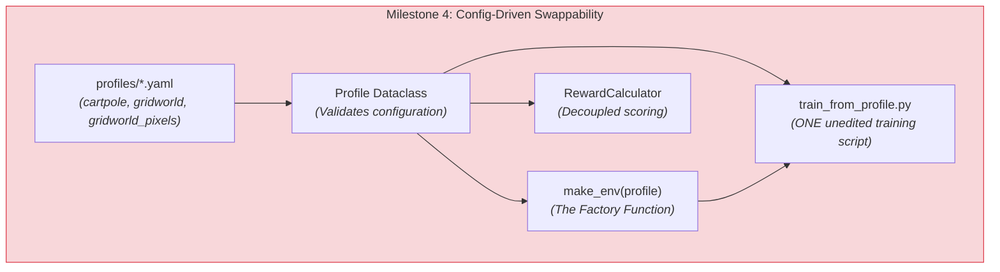
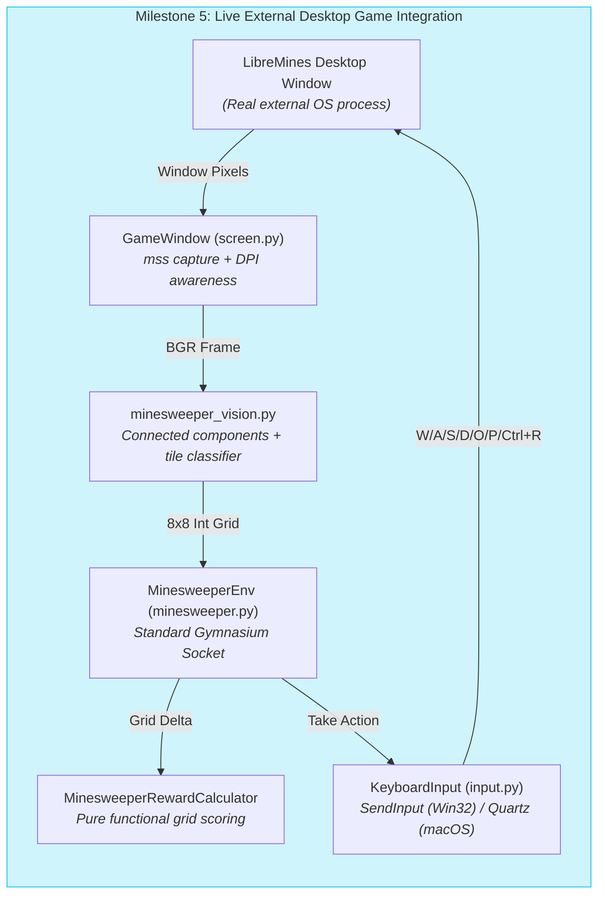

# GameTrainer — The Master Architectural Guide & Rosetta Stone

> **Covers:** the complete architectural guide, Rosetta stone, and engineering chronicle across Milestones 0 to 5.
> **Status:** current.
> **Last verified:** 2026-09-24 (M0–M5 complete and verified live on macOS & Windows 11; all 7 traps and 7 design patterns verified).
> **Authority:** comprehensive master educational guide and engineering reference.
> Written to .

---

## Table of Contents

1. [The Big Picture: What Are We Actually Building?](#1-the-big-picture-what-are-we-actually-building)
   - [The Lego Brick Metaphor](#the-lego-brick-metaphor)
   - [The Three Pillars: Ground, Link, AI](#the-three-pillars-ground-link-ai)
   - [Build vs. Borrow: The Engineering Philosophy](#build-vs-borrow-the-engineering-philosophy)
2. [The Holy Contract: The Observe-Act-Reward Loop](#2-the-holy-contract-the-observe-act-reward-loop)
   - [The Universal Game Loop](#the-universal-game-loop)
   - [Gymnasium Contract Anatomy: `reset()` and `step()`](#gymnasium-contract-anatomy-reset-and-step)
   - [The Fatal Trap: `terminated` vs. `truncated`](#the-fatal-trap-terminated-vs-truncated)
3. [Demystifying the Technologies & Verbiage (Plain English)](#3-demystifying-the-technologies--verbiage-plain-english)
   - [Reinforcement Learning in Plain English](#reinforcement-learning-in-plain-english)
   - [The Brain: Proximal Policy Optimization (PPO)](#the-brain-proximal-policy-optimization-ppo)
   - [The Eyes: Vision Transformers (ViT) vs. CNNs](#the-eyes-vision-transformers-vit-vs-cnns)
   - [The Hands: OS Native Event Queues (`SendInput` & `Quartz`)](#the-hands-os-native-event-queues-sendinput--quartz)
   - [Fast Capture: `mss` vs. GDI/OS Screen Capture](#fast-capture-mss-vs-gdios-screen-capture)
4. [Software Design Patterns & Architectural Decisions](#4-software-design-patterns--architectural-decisions)
   - [Why No God Object? (The Backpack vs. Factory Decision)](#why-no-god-object-the-backpack-vs-factory-decision)
   - [The 7 Core Design Patterns in GameTrainer](#the-7-core-design-patterns-in-gametrainer)
5. [Milestone by Milestone: The Lego Assembly Walkthrough](#5-milestone-by-milestone-the-lego-assembly-walkthrough)
   - [Milestone 0: Setup & The Link Smoke Test](#milestone-0-setup--the-link-smoke-test)
   - [Milestone 1: Borrow the Brain (PPO Solves CartPole)](#milestone-1-borrow-the-brain-ppo-solves-cartpole)
   - [Milestone 2: Build Our Own Ground (GridWorld)](#milestone-2-build-our-own-ground-gridworld)
   - [Milestone 3: Add the Eyes (GridWorld Through a Frozen ViT)](#milestone-3-add-the-eyes-gridworld-through-a-frozen-vit)
   - [Milestone 4: Make It Swappable (`Profile` + `RewardCalculator`)](#milestone-4-make-it-swappable-profile--rewardcalculator)
   - [Milestone 5: Add the Hands (LibreMines + Real Native Input)](#milestone-5-add-the-hands-libremines--real-native-input)
   - [Milestones Comparison Table](#milestones-comparison-table)
6. [Battle Scars: The 7 Big Traps We Found Along the Way](#6-battle-scars-the-7-big-traps-we-found-along-the-way)
   - [Trap 1: The Blind Agent Illusion (M3)](#trap-1-the-blind-agent-illusion-m3)
   - [Trap 2: The High-DPI Coordinate Shift (M5)](#trap-2-the-high-dpi-coordinate-shift-m5)
   - [Trap 3: Pixel Counting Lies; Grid State Truth (M5)](#trap-3-pixel-counting-lies-grid-state-truth-m5)
   - [Trap 4: The Invisible Keyboard Cursor Highlight (M5)](#trap-4-the-invisible-keyboard-cursor-highlight-m5)
   - [Trap 5: The Untracked Files Fingerprint Leak (M4)](#trap-5-the-untracked-files-fingerprint-leak-m4)
   - [Trap 6: Virtual Desktop Subshell Isolation (M5)](#trap-6-virtual-desktop-subshell-isolation-m5)
   - [Trap 7: macOS Qt Reset Chord Translation (M5)](#trap-7-macos-qt-reset-chord-translation-m5)
7. [The Junior Engineer's Cheat Sheet (How to Speak Confidently)](#7-the-junior-engineers-cheat-sheet-how-to-speak-confidently)
   - [10 Ready-to-Use Explanations](#10-ready-to-use-explanations)
8. [Master Codebase Map: Files, Roles & Connections](#8-master-codebase-map-files-roles--connections)

---

## 1. The Big Picture: What Are We Actually Building?

If you talk to someone outside this project, they might assume we are writing an artificial intelligence from scratch to beat video games like Stardew Valley.

**We are not.**

If we tried to invent a brand new machine learning algorithm, write a custom neural network optimizer, and build a bot for an enormous game like Stardew Valley all on Day 1, we would fail. You wouldn't know if a failure was caused by a math bug in the neural network, a typo in the game coordinates, a graphics driver crash, or bad game scoring.

Instead, **GameTrainer is an architecture project.** The real product is the **standard plumbing** (the universal socket) that allows **any video game** to snap cleanly into **any AI brain**, with zero hacky glue code.

### The Lego Brick Metaphor

Think of GameTrainer as three modular Lego blocks:

```
┌────────────────────────────────────────────────────────┐
│                      THE AI PLAYER                     │
│   ┌───────────────┐  ┌───────────────┐  ┌──────────┐   │
│   │     EYES      │  │     BRAIN     │  │  HANDS   │   │
│   │ (Perception)  │  │     (PPO)     │  │ (Input)  │   │
│   └───────┬───────┘  └───────▲───────┘  └────┬─────┘   │
└───────────┼──────────────────┼───────────────┼─────────┘
            │                  │               │
      [1. Observation]    [3. Reward]     [2. Action]
            │                  │               │
┌───────────▼──────────────────┴───────────────▼─────────┐
│                    THE LINK (SOCKET)                   │
│             Standard Gymnasium Interface               │
│                   reset()  ·  step()                   │
└──────────────────────────────┬─────────────────────────┘
                               │
┌──────────────────────────────▼─────────────────────────┐
│                   THE GROUND (GAME)                    │
│       CartPole  ·  GridWorld  ·  LibreMines            │
└────────────────────────────────────────────────────────┘
```

1. **The Ground (The World):** The game itself. It only does two things:
   - Displays what is happening (**Observation**).
   - Grades how well the player is doing (**Reward**).
2. **The AI (The Player):** The entity trying to master the world. It has three organs:
   - **Eyes (`Perception`):** Takes raw screen pixels or coordinates and summarizes them.
   - **Brain (`Agent` / PPO):** Takes that summary, consults its memory, and picks a move.
   - **Hands (`InputController`):** Takes that decision and physically presses a keyboard button.
3. **The Link (The Socket):** The standard adapter where Ground and AI plug into each other. We use an industry-standard interface called **Gymnasium**.

### The Three Pillars: Ground, Link, AI

| Term | Plain English Meaning | In Our Metaphor |
| :--- | :--- | :--- |
| **Ground** | The environment where the game runs | The Board / The World |
| **Link** | The two-method contract (`reset`, `step`) | The Wall Power Socket |
| **AI** | The agent observing, deciding, and acting | The Player with Eyes, Brain, and Hands |

Because the **Link** is a strict, unchanging electrical socket:
- We can unplug **CartPole** and plug in **GridWorld**, and the AI never knows the difference.
- We can unplug **GridWorld** and plug in **LibreMines** (Minesweeper), and the brain still receives observations and issues actions.
- We can unplug a **Random Agent** and plug in **PPO**, and the game never knows who is playing.

### Build vs. Borrow: The Engineering Philosophy

A junior engineer often thinks, *"To be a real engineer, I have to write every line of code myself."*
A senior engineer thinks, *"I build the novel value and borrow the robust, battle-tested solutions for solved problems."*

In GameTrainer:
- ✅ **WE BUILD:**
  - The **Ground** (our custom `GridWorldEnv`, the `MinesweeperEnv` wrapper).
  - The **Link wiring** (`Profile`, `make_env`, contract compliance tests).
  - The **Reward Calculators** (deciding what earns points vs. what costs points).
  - The **Eyes integration** (resizing frames, patch extraction, cell classification).
  - The **Hands** (sending native OS keyboard scan codes via Windows `SendInput` and macOS `Quartz`).
- 🔄 **WE BORROW:**
  - The **Brain** (`PPO` from the library `stable-baselines3`).
  - The **Eyes Backbone** (a pretrained `vit_tiny_patch16_224` from the library `timm`).
  - The **Link Standard** (`gymnasium.Env` interface).
  - The **Math Engine** (`PyTorch` and `NumPy`).

Writing PPO from scratch would take months and leave you with silent mathematical gradient bugs. Borrowing PPO allows us to focus 100% of our energy on building the clean, swappable harness.

---

## 2. The Holy Contract: The Observe-Act-Reward Loop

Every single milestone in this repository runs on a single, continuous heartbeat:



### The Universal Game Loop

1. **Observe:** The Ground hands the agent a description of the current situation. (e.g., `"The cart is at x=0.2, pole angle is 0.05"` or `"Here is a 224x224 RGB image"`).
2. **Act:** The Brain looks at that observation and chooses an action from its legal list of choices (e.g., `0 = Left, 1 = Right`). The hands execute it.
3. **Reward:** The Ground updates the world rules by one tick, checks the result, and returns a numeric score (e.g., `+1.0` for staying alive, `-10.0` for hitting a bomb).
4. **Repeat:** The loop restarts with the brand new observation.

### Gymnasium Contract Anatomy: `reset()` and `step()`

To make this loop universal across all games, the Python library **Gymnasium** defines two functions that every Ground **must** implement.

```python
# 1. Start or restart a game
observation, info = env.reset()

# 2. Take a single action in the world
observation, reward, terminated, truncated, info = env.step(action)
```

Let's dissect what each piece means in plain English:

- **`env.reset()`**:
  - *"Wipe the slate clean, start a fresh game, and show me what the board looks like right now."*
  - Returns a 2-tuple:
    - `observation`: The initial board state.
    - `info`: A Python dictionary for extra debugging stats (e.g., `{"seed": 42}`).

- **`env.step(action)`**:
  - *"I am choosing to execute `action`. Advance the game by one clock cycle, tell me what happened, and give me my score."*
  - Returns a strict 5-tuple:
    - `observation`: The new board state resulting from that action.
    - `reward`: A floating-point number representing points gained or lost on this exact step.
    - `terminated`: A boolean (`True` or `False`).
    - `truncated`: A boolean (`True` or `False`).
    - `info`: Extra metadata.

### The Fatal Trap: `terminated` vs. `truncated`

Why does Gymnasium return **two** different booleans for whether the game is over? Why not just one `done` boolean?

> [!CAUTION]
> Confusing `terminated` with `truncated` silently corrupts the mathematical training of an AI. This is one of the most common beginner mistakes in reinforcement learning.

- **`terminated = True`** means the episode ended **naturally by the rules of the game world**:
  - The cart pole tipped over.
  - The player walked onto the Goal tile.
  - The player stepped on a landmine and exploded.
  - *Mathematical consequence:* There is **no future reward possible**. The game reached an absorbing terminal state. Expected future value = $0$.

- **`truncated = True`** means the episode was **artificially cut short by an outside referee or clock**:
  - The step limit reached 100 ticks.
  - The game timer expired.
  - The test suite interrupted the run.
  - *Mathematical consequence:* The world **did not end**. If the agent had more time, it could have kept earning points! The algorithm must use its Critic network to estimate what future rewards the agent *would have gotten* if time hadn't run out (a process called *value bootstrapping*).

If you mark a timeout as `terminated=True`, the agent thinks: *"Standing here causes the universe to instantly vaporize and give 0 points; I should avoid this state at all costs!"*

---

## 3. Demystifying the Technologies & Verbiage (Plain English)

Reinforcement learning is infamous for intimidating vocabulary. Let's break down the concepts into plain English so you can speak about them with authority.

### Reinforcement Learning in Plain English

| Term | Plain English Definition | Real World Analogy |
| :--- | :--- | :--- |
| **Agent** | The software learner that takes actions. | A dog being trained. |
| **Environment** | The world the agent lives and moves in. | The obstacle course. |
| **State ($s$)** | The complete, perfect truth of the world. | The exact X, Y, Z physics coordinates of everything. |
| **Observation ($o$)** | What the agent can actually see. | What the dog sees through its eyes (could be incomplete). |
| **Action ($a$)** | A move chosen from the allowed options. | Sit, Bark, Jump. |
| **Reward ($r$)** | A numeric signal indicating immediate success. | A tasty treat (+1) or a stern "No!" (-1). |
| **Policy ($\pi$)** | The strategy or brain mapping: `Observation -> Action`. | The dog's habit: "When human holds hand up, sit down." |
| **Trajectory / Rollout** | A recorded history of states, actions, and rewards over time. | A video replay of one practice run. |
| **Discount Factor ($\gamma$)** | How much the AI cares about future rewards vs. immediate rewards (e.g. 0.99). | "A cookie right now is worth slightly more than a cookie 10 minutes from now." |

### The Brain: Proximal Policy Optimization (PPO)

**PPO** is an algorithm developed by OpenAI in 2017. It is widely considered the gold standard default algorithm for reinforcement learning because it is stable, robust, and doesn't explode during training.

#### The Actor-Critic Architecture
Inside PPO, the brain is actually split into two cooperating sub-networks:

```
                      Observation (from game)
                                 │
                 ┌───────────────┴───────────────┐
                 ▼                               ▼
       ┌──────────────────┐            ┌──────────────────┐
       │    THE ACTOR     │            │    THE CRITIC    │
       │     (Policy)     │            │ (Value Function) │
       │                  │            │                  │
       │ "In this state,  │            │ "Being here is   │
       │  I should press  │            │  worth about     │
       │     RIGHT"       │            │  +0.75 points"   │
       └─────────┬────────┘            └─────────┬────────┘
                 │                               │
                 ▼                               ▼
               Action                     Baseline Value
```

1. **The Actor (Policy $\pi$):** Its only job is to look at the observation and assign probabilities to actions. (e.g., `Up: 10%, Down: 70%, Left: 10%, Right: 10%`).
2. **The Critic (Value Function $V$):** Its only job is to look at the observation and predict: *"How many total points will we end up getting from here until the end of the game?"*

#### The "Advantage" Function: Was That Move Actually Good?
Suppose an agent gets $+1.0$ point. Is that good?
- If the agent was in a terrible spot where usually it loses $-10.0$, getting $+1.0$ is an **incredible move**!
- If the agent was standing right in front of a jackpot worth $+100.0$, getting only $+1.0$ was a **terrible fumble**!

This is captured by the **Advantage ($A$)**:
$$\text{Advantage} = \text{Actual Reward Gained} - \text{Expected Value from the Critic}$$
If Advantage is positive, the Actor is rewarded for picking that move. If Advantage is negative, the Actor is nudged away from picking that move.

#### Why is it called "Proximal"? (The Clipped Objective)
In older RL algorithms (like standard Policy Gradient or REINFORCE), if the agent stumbled upon a great reward, the math would update the neural network so aggressively that the policy completely changed overnight. But neural networks are complex: changing weights to make one move better often destroys 50 other skills the agent previously learned. The policy collapsed, and the agent forgot how to play.

**"Proximal" means "stay close by."**
PPO enforces a mathematical leash: it clips the update so the new policy can never drift more than roughly 20% ($\epsilon = 0.2$) away from the old policy in a single training step.
- *Metaphor:* If you are steering a car on the highway, you make gentle 2-degree adjustments. You do not yank the steering wheel 90 degrees just because you saw a cool billboard.

### The Eyes: Vision Transformers (ViT) vs. CNNs

In Milestone 3, we gave our agent eyes using a **Vision Transformer** ([`ViTTinyFeaturesExtractor`](file:///Users/phillip/PycharmProjects/GameTrainer/src/gametrainer/vit_extractor.py#L240-L260)).

#### Why ViT Instead of a Convolutional Neural Network (CNN)?
Traditional computer vision uses CNNs. CNNs slide tiny filters (e.g. 3x3 pixels) across an image. They see local lines and edges first, then textures, and only after 20 layers of pooling can they notice that something on the top-left relates to something on the bottom-right.

**Video games have long-distance relationships across the screen:**
- The player's health bar is in the top-left corner.
- The selected weapon is in the bottom-center hotbar.
- The monster is in the middle of the screen.

A **Transformer** uses **Self-Attention**. Every part of the image can look at and compare itself to every other part of the image **on the very first layer**.

```
224x224 RGB Screenshot
        │
        ▼ Cut into 14x14 grid of 16x16 pixel squares (196 "Patches")
┌────┬────┬────┬────┐
│ P1 │ P2 │ P3 │ P4 │ ...
├────┼────┼────┼────┤
│ P5 │ P6 │ P7 │ P8 │ ...
└────┴────┴────┴────┘
        │
        ▼ Linear Projection + Position Tags + [CLS] Token
        │
        ▼ Transformer Encoder Layers (Self-Attention)
        │ "Patch 1 (Health Bar) attends directly to Patch 150 (Monster)"
        │
        ▼ Output: 192-dimensional summary vector ([CLS] token)
```

#### Why We Freeze the Backbone
The Vision Transformer has 5.7 million parameters. If we tried to train all 5.7 million parameters on a laptop CPU using trial-and-error RL, training would take days.

Instead, we borrow a ViT pretrained on **ImageNet** (1.2 million real-world photos) and set `param.requires_grad = False` ([`vit_extractor.py:L160`](file:///Users/phillip/PycharmProjects/GameTrainer/src/gametrainer/vit_extractor.py#L160-L165)).
Even though ImageNet had pictures of dogs, trees, and teacups, the frozen ViT already knows how to detect edges, colors, borders, and shapes. The eyes stay fixed; only the tiny PPO brain learns what those visual features mean in our game.

### The Hands: OS Native Event Queues (`SendInput` & `Quartz`)

In Milestone 5, we moved from simulated environments to controlling a real, external desktop application: **LibreMines** (Minesweeper).

Why couldn't we just use standard Python libraries like `pyautogui`?
1. **Game Engines Ignore Fake Events:** Many games read low-level DirectInput or raw OS scan codes. High-level libraries often synthesize synthetic messages (`WM_CHAR`) that games completely ignore.
2. **Timing & Key Chords:** Resetting a game requires pressing `Ctrl+R` (or `Cmd+R`). That means holding the modifier key down, tapping the letter, and releasing the modifier in exact chronological order.

- **On Windows:** We use Win32 `SendInput` ([`input.py:L260`](file:///Users/phillip/PycharmProjects/GameTrainer/src/gametrainer/input.py#L260)). `SendInput` places hardware scan-code events directly into the Windows kernel system input queue. To the operating system and game, our Python script is indistinguishable from a physical USB keyboard.
- **On macOS:** We use Apple's CoreGraphics Quartz API (`Quartz.CGEventPost`), generating hardware-level keydown and keyup events with appropriate virtual keycodes and modifier flags ([`input.py:L310`](file:///Users/phillip/PycharmProjects/GameTrainer/src/gametrainer/input.py#L310)).

### Fast Capture: `mss` vs. GDI/OS Screen Capture

Taking screenshots with naive libraries (like `PIL.ImageGrab`) takes 50 to 100 milliseconds per frame, which limits you to 10 frames per second before the AI even starts thinking.
We use **`mss`**, a Python C-extension that reads the OS display framebuffer directly. It grabs full-window images in under 5 milliseconds without graphical overhead.

---

## 4. Software Design Patterns & Architectural Decisions

### Why No God Object? (The Backpack vs. Factory Decision)

Early in the project (PRD v1), the planned architecture was an all-in-one class called `GameEnvironment`:

```
           ORIGINAL PLAN (The "Backpack" God Object)
           ┌──────────────────────────────────────┐
           │           GameEnvironment            │
           │  ┌────────────────────────────────┐  │
           │  │ Holds Profile                  │  │
           │  │ Holds Perception (Eyes)        │  │
           │  │ Holds InputController (Hands)  │  │
           │  │ Holds RewardCalculator         │  │
           │  │ Implements reset() & step()    │  │
           │  └────────────────────────────────┘  │
           └──────────────────────────────────────┘
```

When we built Milestone 4, we asked: *"Does this wrapper class actually earn its keep?"*
No. Wrapping an environment inside another generic container environment introduced indirection, pass-through boilerplate, and made debugging painful.

Instead, we adopted a clean **Factory + Functional Composition** model:

```
                  CURRENT ARCHITECTURE (Factory Seam)
                      
                       profiles/cartpole.yaml
                                 │
                                 ▼
                     Profile (Validated Dataclass)
                                 │
                                 ▼
              factory.py ──> make_env(profile)
                                 │
         ┌───────────────────────┼───────────────────────┐
         ▼                       ▼                       ▼
   gym.make("CartPole")    GridWorldEnv(..)       MinesweeperEnv(..)
         │                       │                       │
         └───────────────┬───────┴───────────────────────┘
                         ▼
        Returns clean gymnasium.Env straight to PPO
```

There is **no God object wrapper**. Each environment is self-contained. The function [`make_env(profile)`](file:///Users/phillip/PycharmProjects/GameTrainer/src/gametrainer/factory.py#L18) is the single seam in the entire codebase where a text name in a YAML file becomes an executable Python environment object.

### The 7 Core Design Patterns in GameTrainer

1. **Adapter Pattern (The Link):**
   Gymnasium acts as an Adapter. Whether a game is a 1980s physics equation (`CartPole`) or a desktop Qt C++ application (`LibreMines`), [`MinesweeperEnv`](file:///Users/phillip/PycharmProjects/GameTrainer/src/gametrainer/minesweeper.py) adapts its idiosyncrasies to the standard `reset()` and `step()` signatures.

2. **Decorator / Wrapper Pattern (`gymnasium.Wrapper`):**
   Instead of modifying [`GridWorldEnv`](file:///Users/phillip/PycharmProjects/GameTrainer/src/gametrainer/gridworld.py) to output pictures in Milestone 3, we wrote [`PixelObservation`](file:///Users/phillip/PycharmProjects/GameTrainer/src/gametrainer/perception.py#L22), which wraps the environment:
   ```python
   env = PixelObservation(TimeLimit(RandomStart(GridWorldEnv())))
   ```
   Each wrapper adds one isolated responsibility (randomizing start, enforcing a 25-step timer, swapping coordinates for pixels) without altering a single line of the original game code!

3. **Factory Method Pattern (`factory.py`):**
   [`make_env(profile)`](file:///Users/phillip/PycharmProjects/GameTrainer/src/gametrainer/factory.py#L18) encapsulates environment creation. Callers pass a configuration object; the factory handles constructor arguments, wrappers, and dependency assembly.

4. **Strategy Pattern (`RewardCalculator`):**
   In Milestone 4, we decoupled the scoring math from the game physics. [`RewardCalculator`](file:///Users/phillip/PycharmProjects/GameTrainer/src/gametrainer/rewards.py#L17) and [`MinesweeperRewardCalculator`](file:///Users/phillip/PycharmProjects/GameTrainer/src/gametrainer/rewards.py#L29) encapsulate the scoring strategy. You can invert penalties or boost win rewards entirely from YAML without editing the game engine.

5. **Null Object Pattern (`NullInput`):**
   In [`input.py`](file:///Users/phillip/PycharmProjects/GameTrainer/src/gametrainer/input.py#L137), [`NullInput`](file:///Users/phillip/PycharmProjects/GameTrainer/src/gametrainer/input.py#L137) inherits from [`InputController`](file:///Users/phillip/PycharmProjects/GameTrainer/src/gametrainer/input.py#L42) but its methods silently do nothing. This allows headless environments (CartPole, GridWorld) or negative-control test scripts to run through the exact same code paths without needing `if hands is not None:` guards scattered throughout the codebase.

6. **Configuration as Code (`Profile` Dataclass):**
   [`Profile`](file:///Users/phillip/PycharmProjects/GameTrainer/src/gametrainer/profile.py#L24) is a frozen, strongly-typed dataclass. By validating types and fields immediately upon reading YAML, errors like typos (`step_kost: -0.01`) trigger clear, loud exceptions on startup, rather than silently failing 20 minutes into training.

7. **Dependency Injection (Hermetic Testing):**
   [`MinesweeperEnv`](file:///Users/phillip/PycharmProjects/GameTrainer/src/gametrainer/minesweeper.py#L40) accepts optional `hands` and `window` objects in its constructor. In production, it discovers the live desktop window. In unit tests (`test_minesweeper_env.py`), we inject mock hands and a mock window, allowing the test suite to run in 2 seconds on a headless Linux GitHub Actions server without needing a display!

---

## 5. Milestone by Milestone: The Lego Assembly Walkthrough

Let's look at each milestone as a progressive assembly of Lego pieces.

### Milestone 0: Setup & The Link Smoke Test



- **Goal:** Prove the plumbing runs at all. Establish our ground-floor baseline.
- **Done When:** CartPole runs 100 random steps without crashing.
- **What We Built:**
  - [`scripts/run_cartpole.py`](file:///Users/phillip/PycharmProjects/GameTrainer/scripts/run_cartpole.py): The simplest runner script possible.
- **The Numbers:**
  - A random agent blindly pushing left or right averages **~22 steps** before the pole falls over. This is our baseline: if our AI can't beat 22, it hasn't learned anything.

---

### Milestone 1: Borrow the Brain (PPO Solves CartPole)



- **Goal:** Connect a borrowed brain (`stable-baselines3` PPO) to the socket and prove it actually learns.
- **Done When:** PPO clearly beats the random baseline of 22.
- **What We Built:**
  - [`scripts/train_cartpole.py`](file:///Users/phillip/PycharmProjects/GameTrainer/scripts/train_cartpole.py): Trains PPO with `MlpPolicy` for 25,000 steps.
- **The Numbers:**
  - Trained score skyrocketed from **22.0 to 500.0** (CartPole's maximum possible score ceiling) in under 10 seconds on CPU.

---

### Milestone 2: Build Our Own Ground (GridWorld)



- **Goal:** Prove we can author our own game from scratch while strictly honoring the Gymnasium contract.
- **Done When:** PPO learns the optimal path to the goal in our custom world.
- **What We Built:**
  - [`src/gametrainer/gridworld.py`](file:///Users/phillip/PycharmProjects/GameTrainer/src/gametrainer/gridworld.py): A 5x5 grid environment. Agent starts at `(0, 0)`, goal is at `(4, 4)`.
  - Actions: 0=Up, 1=Down, 2=Left, 3=Right.
  - Rewards: -0.01 per step (encourages speed), +1.0 for reaching the goal.
  - Contract tests in [`tests/test_gridworld.py`](file:///Users/phillip/PycharmProjects/GameTrainer/tests/test_gridworld.py).
- **The Numbers:**
  - Random baseline: **-0.14** (wastes time wandering into walls).
  - Trained PPO: **+0.93** (reaches the goal in the theoretical minimum of 8 steps: 20/20 greedy episodes).

---

### Milestone 3: Add the Eyes (GridWorld Through a Frozen ViT)



- **Goal:** The agent must learn **solely by looking at a picture** of the board. The `(row, col)` numbers are completely deleted from the observation.
- **Done When:** PPO learns to solve the visual grid task above a live random baseline.
- **What We Built:**
  - [`PixelObservation`](file:///Users/phillip/PycharmProjects/GameTrainer/src/gametrainer/perception.py#L22): An observation wrapper rendering the 5x5 grid into a 224x224 RGB image.
  - [`ViTTinyFeaturesExtractor`](file:///Users/phillip/PycharmProjects/GameTrainer/src/gametrainer/vit_extractor.py#L240): Converts the 224x224 image into a 192-dimensional vector using a frozen `vit_tiny_patch16_224`.
  - Task randomization wrappers: [`RandomStart`](file:///Users/phillip/PycharmProjects/GameTrainer/src/gametrainer/gridworld.py#L173) and [`make_vision_task`](file:///Users/phillip/PycharmProjects/GameTrainer/src/gametrainer/gridworld.py#L210) (to defeat the "blind agent" cheat — see [Trap 1](#trap-1-the-blind-agent-illusion-m3)).
- **The Numbers:**
  - Live random baseline: **+0.48**.
  - Trained vision agent: **+0.99** (100% goal reach rate across 20 evaluation episodes, trained in 19.2 min on CPU).

---

### Milestone 4: Make It Swappable (`Profile` + `RewardCalculator`)



- **Goal:** Prove swappability. Train on CartPole, GridWorld (numeric), or GridWorld (pixels) using **one single runner script**, toggled **only** by the YAML file path on the command line. Zero Python edits allowed.
- **Done When:** All three profiles pass through `train_from_profile.py`, verified by the negative-control swap check [`scripts/check_swap.py`](file:///Users/phillip/PycharmProjects/GameTrainer/scripts/check_swap.py).
- **What We Built:**
  - [`Profile`](file:///Users/phillip/PycharmProjects/GameTrainer/src/gametrainer/profile.py#L24): Validated dataclass loading YAML.
  - [`RewardCalculator`](file:///Users/phillip/PycharmProjects/GameTrainer/src/gametrainer/rewards.py#L17): Decouples reward math from grid movement.
  - [`make_env(profile)`](file:///Users/phillip/PycharmProjects/GameTrainer/src/gametrainer/factory.py#L18): The one factory function instantiating the requested environment.
  - Source Fingerprinting: Hashes all tracked + untracked python files to mathematically guarantee not a single line of Python was touched between runs.
- **The Numbers:**
  - `cartpole.yaml`: PASS (+500.0).
  - `gridworld.yaml`: PASS (+0.93).
  - `gridworld_pixels.yaml`: PASS (+0.99, 100% goal reach).

---

### Milestone 5: Add the Hands (LibreMines + Real Native Input)



- **Goal:** Break out of simulation into the real world. Drive an external, live video game window (`LibreMines`) using real screen capture and real operating system keyboard injection.
- **Done When:** Four strict behavioral controls pass live in [`scripts/check_hands.py`](file:///Users/phillip/PycharmProjects/GameTrainer/scripts/check_hands.py):
  1. *Keys Live:* Agent navigates to `(1, 2)` and flags it; exactly cell `(1, 2)` mutates on the board.
  2. *NullInput Negative Control:* Identical run with `NullInput` causes zero cells to change.
  3. *Frozen Frame Negative Control:* Frozen vision leaves the board unchanged while live keys press.
  4. *Unattended Reset:* Resets the game 20 consecutive times via keyboard chords with 0 mouse clicks.
- **What We Built:**
  - [`GameWindow`](file:///Users/phillip/PycharmProjects/GameTrainer/src/gametrainer/screen.py#L75): Finds target window by title, handles high-DPI scaling, captures via `mss`.
  - [`KeyboardInput`](file:///Users/phillip/PycharmProjects/GameTrainer/src/gametrainer/input.py#L210): Injects real scan-code keyboard events and chords via Win32 `SendInput` (Windows) and `Quartz` (macOS).
  - [`read_board`](file:///Users/phillip/PycharmProjects/GameTrainer/src/gametrainer/minesweeper_vision.py#L130): Computer vision algorithm that dynamically finds the board using connected components and classifies all 64 cells (`0`–`8`, `HIDDEN`, `FLAGGED`, `MINE`).
  - [`MinesweeperEnv`](file:///Users/phillip/PycharmProjects/GameTrainer/src/gametrainer/minesweeper.py#L40): Gymnasium adapter wrapping LibreMines.
- **The Numbers:**
  - **macOS:** PASS (16.8s total, 20/20 clean unattended resets).
  - **Windows 11:** PASS (22.4s total, 20/20 clean unattended resets).

---

### Milestones Comparison Table

| Milestone | What is the Ground? | What are the Eyes? | What is the Brain? | What are the Hands? | What Did It Prove? |
| :--- | :--- | :--- | :--- | :--- | :--- |
| **M0** | CartPole-v1 | Raw numbers `(4,)` | Random Choice | `NullInput` | The Gymnasium socket contract runs without crashing. |
| **M1** | CartPole-v1 | Raw numbers `(4,)` | PPO (`MlpPolicy`) | In-memory API | Borrowed PPO learns to maximize rewards (+22 -> +500). |
| **M2** | GridWorld (Ours) | Raw numbers `(2,)` | PPO (`MlpPolicy`) | In-memory API | We can build our own Ground obeying the contract (+0.93). |
| **M3** | GridWorld (Ours) | 224x224 RGB image + Frozen ViT | PPO (`CnnPolicy`) | In-memory API | The agent can learn exclusively through visual perception (+0.99). |
| **M4** | CartPole OR GridWorld | Swappable (Numeric vs. Pixels) | PPO | In-memory API | Switching games is **100% config-driven via YAML**; one unedited runner. |
| **M5** | LibreMines (Desktop App) | Window capture + CV cell classifier | Referee / Script | Native OS keystrokes (`SendInput`/`Quartz`) | The loop drives a real, external desktop window end-to-end. |
| **M6** | Stardew Valley | ViT Vision | PPO | Native OS keystrokes | Full stretch goal: complex game treated as "just another profile". |

---

## 6. Battle Scars: The 7 Big Traps We Found Along the Way

Every great engineering project is defined by the bugs and traps uncovered along the journey. Here are the 7 most important discoveries in this codebase.

### Trap 1: The Blind Agent Illusion (M3)
- **What Happened:** In Milestone 3, our first vision-trained agent scored an impressive `+0.905` reward. We celebrated — until we checked the action distribution. The agent was pressing `DOWN` 53% of the time and `RIGHT` 47% of the time on *every single square*. We wrote a completely blind script that closed its eyes and randomly chose between Down and Right, and it scored `+0.907`!
- **Why It Happened:** The original GridWorld started at `(0, 0)` in the top-left and placed the goal at `(4, 4)` in the bottom-right. When an agent runs into an outer wall, it simply stays in place rather than dying. Therefore, an agent blindly alternating between Down and Right is mathematically guaranteed to hit the bottom-right corner eventually! The agent wasn't looking at the screen at all; the geometry of our Ground was flawed.
- **How We Fixed It:** We built [`RandomStart`](file:///Users/phillip/PycharmProjects/GameTrainer/src/gametrainer/gridworld.py#L173) (spawning the agent in any random square) and moved the goal to the center `(2, 2)`. If you start below or to the right of the center, pressing Down and Right fails 100% of the time. The task became provably impossible to solve without looking at the picture!

### Trap 2: The High-DPI Coordinate Shift (M5)
- **What Happened:** During early screen-capture testing on Windows 11, `mss` captured an image that looked completely normal, but our tile classifier found zero cells. We saved the screenshot to disk and were stunned to discover we had captured an edge of a Google Chrome window on a secondary monitor!
- **Why It Happened:** Modern displays use High-DPI scaling (e.g., 125% or 150%). To prevent legacy programs from rendering microscopic windows, Windows tells programs a fake "logical" coordinate system. But low-level screen capture tools like `mss` operate in real, physical hardware pixels. When our script asked for the window at logical position `(1371, 223)`, `mss` cropped physical `(1371, 223)` — grabbing empty desktop space an entire monitor away!
- **How We Fixed It:** In [`screen.py`](file:///Users/phillip/PycharmProjects/GameTrainer/src/gametrainer/screen.py#L75), we call `_user32.SetProcessDpiAwarenessContext(-4)` (`_DPI_PER_MONITOR_AWARE_V2`) at **import time**. This forces Windows to report true physical pixel coordinates before any window query can be made.

### Trap 3: Pixel Counting Lies; Grid State Truth (M5)
- **What Happened:** In our initial M5 spike, we tried to verify whether a key press worked by counting changed pixels: `pixels_after != pixels_before`.
- **Why It Failed:** When the agent pressed `P` to flag a hidden cell, **237 pixels changed**. But when the agent accidentally pressed `O` (reveal) on an *already-revealed cell* (a complete no-op move), **342 pixels changed** simply because LibreMines redrew its blinking keyboard cursor! Pixel counts gave a false positive on a failed action.
- **How We Fixed It:** We abandoned pixel differencing. We mandated that verification must be based on the classified $8 \times 8$ board state ([`classify_cell`](file:///Users/phillip/PycharmProjects/GameTrainer/src/gametrainer/minesweeper_vision.py#L82)). An action is only verified if the cell at `(1, 2)` transitions from `HIDDEN` to `FLAGGED`.

### Trap 4: The Invisible Keyboard Cursor Highlight (M5)
- **What Happened:** Our tile classifier was trained on screenshots captured via mouse clicks. When we hooked up keyboard navigation in Brick 7, our classifier suddenly threw `UnreadableCell` exceptions on the active cell.
- **Why It Happened:** LibreMines has two input modes. In mouse mode, cells have two background colors: Hidden Grey `(70, 70, 70)` and Revealed Dark `(26, 26, 26)`. But the moment you touch a keyboard key, LibreMines highlights the active cell with a third color: Cursor Grey `(185, 185, 185)`. Because our test fixtures were captured with a mouse, the keyboard highlight was an invisible state that never existed in our test suite!
- **How We Fixed It:** We added `_CURSOR_BODY = (185, 185, 185)` to [`minesweeper_vision.py`](file:///Users/phillip/PycharmProjects/GameTrainer/src/gametrainer/minesweeper_vision.py#L35) and created dedicated regression fixtures for cursor-highlighted cells.

### Trap 5: The Untracked Files Fingerprint Leak (M4)
- **What Happened:** In Milestone 4, we built a source code fingerprinting function to prove that not a single Python file changed when swapping between games. But our test suite passed even when we created brand-new uncommitted files!
- **Why It Happened:** The original code used `git ls-files` to gather filenames for hashing. But `git ls-files` by default only lists **tracked** (already-committed) files. Newly created scripts in the working directory were invisible to the fingerprint! You could have completely rewritten the runner, and the hash wouldn't change.
- **How We Fixed It:** We updated the command to `git ls-files -c -o --exclude-standard` (tracked + untracked, excluding gitignored items) and pinned it with [`test_fingerprint_covers_uncommitted_files`](file:///Users/phillip/PycharmProjects/GameTrainer/tests/test_m4_verdict.py).

### Trap 6: Virtual Desktop Subshell Isolation (M5)
- **What Happened:** When automated test runners launched on Windows, `FindWindow` consistently threw `WindowNotFound`, even though LibreMines was visibly open on the screen right in front of us.
- **Why It Happened:** Background terminal subshells (like those launched by IDEs or automated agent environments) often run inside a segregated virtual desktop station (`exebox-...`). In Windows security, a process in one window station is prohibited from enumerating or interacting with windows on the interactive user desktop.
- **How We Fixed It:** In [`screen.py`](file:///Users/phillip/PycharmProjects/GameTrainer/src/gametrainer/screen.py#L125), we explicitly call `OpenDesktopW("Default")` and `SetThreadDesktop` on Windows. This attaches our script's thread directly to the interactive desktop station.

### Trap 7: macOS Qt Reset Chord Translation (M5)
- **What Happened:** On Windows, LibreMines resets when pressing `Ctrl+R`. On macOS, sending `Ctrl+R` via Quartz did absolutely nothing.
- **Why It Happened:** Qt on macOS automatically translates standard UI shortcut conventions: Control-key menu accelerators are remapped to Command (`⌘`). Sending a physical `Control` keycode was ignored by Qt's menu handler.
- **How We Fixed It:** In [`input.py`](file:///Users/phillip/PycharmProjects/GameTrainer/src/gametrainer/input.py#L325), we implemented platform-aware chord dispatch. On macOS, `restart()` holds `kCGEventFlagMaskCommand` instead of Control.

---

## 7. The Junior Engineer's Cheat Sheet (How to Speak Confidently)

When discussing this codebase in engineering reviews, interviews, or team syncs, here are 10 clear, authoritative answers to common questions.

### 10 Ready-to-Use Explanations

1. **"What is the core architecture of GameTrainer?"**
   > *"GameTrainer decouples game environments from machine learning algorithms using the Gymnasium standard socket interface (`reset` and `step`). The AI is partitioned into three swappable components: Eyes (Perception/ViT), Brain (PPO), and Hands (InputController). We build the Ground and the Link plumbing, while borrowing battle-tested reinforcement learning algorithms."*

2. **"Why didn't we just start by training on Stardew Valley?"**
   > *"Starting on a complex game with ambiguous visual rewards conflates infrastructure bugs with algorithmic learning failures. By following a strict crawl-first milestone strategy (CartPole -> GridWorld -> GridWorld Pixels -> LibreMines -> Stardew), we independently verified the link contract, reward calculation, vision feature extraction, and native OS input injection before tackling complex game dynamics."*

3. **"Why use PPO instead of DQN or standard Policy Gradient?"**
   > *"PPO strikes the best balance between implementation stability and sample efficiency. Traditional policy gradient algorithms suffer from policy collapse if a step update is too large. PPO uses a clipped surrogate objective that constrains policy updates within a trust region ($\approx 20\%$), preventing catastrophic forgetting without the instability of Q-learning off-policy replay buffers."*

4. **"Why did we choose a Vision Transformer over a CNN?"**
   > *"CNNs rely on local receptive fields and require deep architectures before distant regions of an image can interact. In game interfaces, critical information is spatially disjointed — like a health bar in the top corner and an action hotbar at the bottom. A Vision Transformer's self-attention mechanism allows all image patches to attend to each other from the very first layer."*

5. **"Why is the ViT backbone frozen during training?"**
   > *"The ViT has millions of parameters. Training them end-to-end via reinforcement learning on a CPU would take days. Pretrained ImageNet weights already provide general visual features like edges, textures, and bounding shapes. Freezing the backbone lets us use the ViT as a fixed 192-dimensional visual summarizer, requiring PPO to train only a small MLP head on top."*

6. **"What is the difference between `terminated` and `truncated`?"**
   > *"`terminated` indicates that an episode ended due to natural game rules (such as hitting a mine or reaching the goal), meaning the expected future return is zero. `truncated` indicates an artificial termination due to an external constraint (like exceeding a step budget). Distinguishing between them is essential so the algorithm knows when to bootstrap future value estimates."*

7. **"Why do we separate unit tests from experiment scripts?"**
   > *"Unit tests must be fast, deterministic, and hermetic — running in seconds via `pytest` to guarantee contract shapes and scoring math. Reinforcement learning training experiments are inherently stochastic and computationally expensive. Mixing long training runs into CI creates flaky tests and slows iteration."*

8. **"Why was the monolithic `GameEnvironment` class rejected in M4?"**
   > *"Wrapping environments inside another generic wrapper class created unnecessary boilerplate and tight coupling. We adopted a Factory pattern (`make_env`) combined with Gymnasium's native `ObservationWrapper` and functional `RewardCalculator` classes. This achieved complete config-driven swappability without adding an extra layer of object hierarchy."*

9. **"How do we know the M4 config swap is actually genuine?"**
   > *"We wrote `scripts/check_swap.py`, which executes four automated negative controls: verifying that swapping YAML profiles alters action spaces, observation spaces, and step rewards on identical steps. We also use a SHA-256 source code fingerprinting mechanism over all repository files to guarantee no Python code was altered between runs."*

10. **"How does M5 interact with a live desktop game without an API?"**
    > *"We combine two OS-level interfaces: screen capture via `mss` with mandatory DPI-awareness initialization, and hardware scan-code injection via Win32 `SendInput` (on Windows) or Quartz `CGEventPost` (on macOS). The agent's vision classifies the board using connected-component blob analysis and color tint classification, completely eliminating reliance on internal game memory."*

---

## 8. Master Codebase Map: Files, Roles & Connections

| File Path | Primary Role | Milestone | Key Classes / Functions |
| :--- | :--- | :--- | :--- |
| [`src/gametrainer/gridworld.py`](file:///Users/phillip/PycharmProjects/GameTrainer/src/gametrainer/gridworld.py) | Custom 5x5 grid game environment. | M2, M3 | [`GridWorldEnv`](file:///Users/phillip/PycharmProjects/GameTrainer/src/gametrainer/gridworld.py#L25), [`RandomStart`](file:///Users/phillip/PycharmProjects/GameTrainer/src/gametrainer/gridworld.py#L173), [`make_vision_task`](file:///Users/phillip/PycharmProjects/GameTrainer/src/gametrainer/gridworld.py#L210) |
| [`src/gametrainer/perception.py`](file:///Users/phillip/PycharmProjects/GameTrainer/src/gametrainer/perception.py) | Observation wrapper converting state numbers to RGB images. | M3 | [`PixelObservation`](file:///Users/phillip/PycharmProjects/GameTrainer/src/gametrainer/perception.py#L22) |
| [`src/gametrainer/vit_extractor.py`](file:///Users/phillip/PycharmProjects/GameTrainer/src/gametrainer/vit_extractor.py) | PyTorch feature extractors wrapping `timm` Vision Transformers. | M3 | [`ViTFeaturesExtractor`](file:///Users/phillip/PycharmProjects/GameTrainer/src/gametrainer/vit_extractor.py#L82), [`ViTTinyFeaturesExtractor`](file:///Users/phillip/PycharmProjects/GameTrainer/src/gametrainer/vit_extractor.py#L240) |
| [`src/gametrainer/profile.py`](file:///Users/phillip/PycharmProjects/GameTrainer/src/gametrainer/profile.py) | Validated frozen dataclass loading YAML profiles. | M4 | [`Profile`](file:///Users/phillip/PycharmProjects/GameTrainer/src/gametrainer/profile.py#L24) |
| [`src/gametrainer/rewards.py`](file:///Users/phillip/PycharmProjects/GameTrainer/src/gametrainer/rewards.py) | Functional scoring calculations isolated from game physics. | M4, M5 | [`RewardCalculator`](file:///Users/phillip/PycharmProjects/GameTrainer/src/gametrainer/rewards.py#L17), [`MinesweeperRewardCalculator`](file:///Users/phillip/PycharmProjects/GameTrainer/src/gametrainer/rewards.py#L29) |
| [`src/gametrainer/factory.py`](file:///Users/phillip/PycharmProjects/GameTrainer/src/gametrainer/factory.py) | The single seam translating profile names into Gym environments. | M4, M5 | [`make_env`](file:///Users/phillip/PycharmProjects/GameTrainer/src/gametrainer/factory.py#L18) |
| [`src/gametrainer/screen.py`](file:///Users/phillip/PycharmProjects/GameTrainer/src/gametrainer/screen.py) | DPI-aware live OS window discovery and fast `mss` screen capture. | M5 | [`GameWindow`](file:///Users/phillip/PycharmProjects/GameTrainer/src/gametrainer/screen.py#L75), [`set_dpi_awareness`](file:///Users/phillip/PycharmProjects/GameTrainer/src/gametrainer/screen.py#L52) |
| [`src/gametrainer/input.py`](file:///Users/phillip/PycharmProjects/GameTrainer/src/gametrainer/input.py) | Hardware scan-code keystroke injection (`SendInput` / `Quartz`). | M5 | [`InputController`](file:///Users/phillip/PycharmProjects/GameTrainer/src/gametrainer/input.py#L42), [`NullInput`](file:///Users/phillip/PycharmProjects/GameTrainer/src/gametrainer/input.py#L137), [`KeyboardInput`](file:///Users/phillip/PycharmProjects/GameTrainer/src/gametrainer/input.py#L210) |
| [`src/gametrainer/minesweeper_vision.py`](file:///Users/phillip/PycharmProjects/GameTrainer/src/gametrainer/minesweeper_vision.py) | Computer vision board localization and 8x8 cell classification. | M5 | [`read_board`](file:///Users/phillip/PycharmProjects/GameTrainer/src/gametrainer/minesweeper_vision.py#L130), [`find_board`](file:///Users/phillip/PycharmProjects/GameTrainer/src/gametrainer/minesweeper_vision.py#L42), [`classify_cell`](file:///Users/phillip/PycharmProjects/GameTrainer/src/gametrainer/minesweeper_vision.py#L82) |
| [`src/gametrainer/minesweeper.py`](file:///Users/phillip/PycharmProjects/GameTrainer/src/gametrainer/minesweeper.py) | Full Gymnasium environment adapter wrapping live `LibreMines`. | M5 | [`MinesweeperEnv`](file:///Users/phillip/PycharmProjects/GameTrainer/src/gametrainer/minesweeper.py#L40) |
| [`scripts/train_from_profile.py`](file:///Users/phillip/PycharmProjects/GameTrainer/scripts/train_from_profile.py) | The universal runner training any profile end-to-end. | M4 | `main()`, `source_fingerprint()`, `check_contract()` |
| [`scripts/check_swap.py`](file:///Users/phillip/PycharmProjects/GameTrainer/scripts/check_swap.py) | 4-part negative control proving configuration genuinely alters execution. | M4 | Negative control test suite |
| [`scripts/check_hands.py`](file:///Users/phillip/PycharmProjects/GameTrainer/scripts/check_hands.py) | 4-part live behavioral proof driving real desktop window. | M5 | Live behavioral verification runner |
| [`main.py`](file:///Users/phillip/PycharmProjects/GameTrainer/main.py) | Main user entry point launching interactive terminal menu. | All | CLI routing & TUI launcher |
