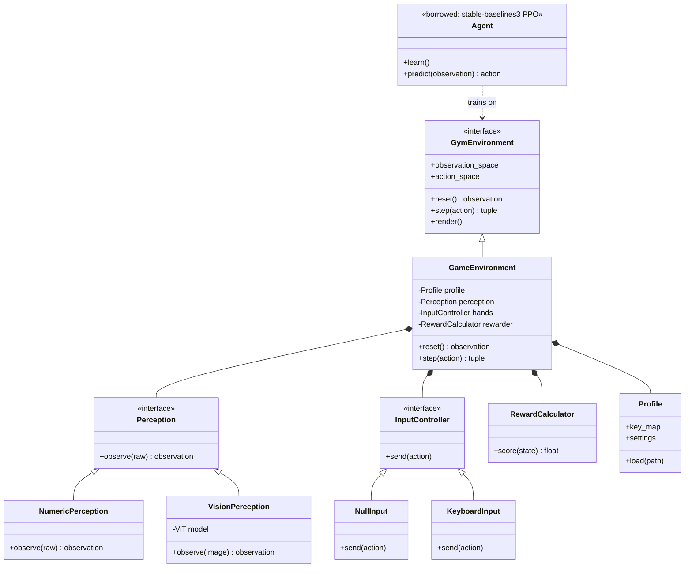

# GameTrainer — PRD v2

> A system that teaches an AI to play games by watching the screen and learning by trial and error.
> **The real point of this project is the architecture:** a clean, swappable link between *any* game world and *any* AI brain.

---

## 1. The one-paragraph pitch

GameTrainer connects a **game** to an **AI** through a **standard link**, so the AI can learn to play by looking at the screen, taking actions, and getting a score. We are not trying to invent a new AI. We are building the *plumbing* — the part that lets any game and any brain snap together — and proving it works by starting tiny and scaling up.

---

## 2. The mental model (read this before anything else)

Three big parts:

| Part | What it is | Its job |
| :--- | :--- | :--- |
| **Ground** | The game world | 1) Show what's happening (**observation**) &nbsp; 2) Grade the AI (**reward**) |
| **AI** | The player | Look, decide, act |
| **Link** | The Gymnasium API | The standard socket both plug into |

The **AI** is itself three pieces:

- **Eyes** → a Vision Transformer (ViT). *Only sees.* Turns pixels into a summary.
- **Brain** → PPO (from stable-baselines3). *Only decides.* Learns what's good.
- **Hands** → a Python input library. *Only acts.* Presses keys.

The whole thing is one tiny loop, forever:

```
observe  →  act  →  reward  →  repeat
```

**What we build vs. borrow:**

- ✅ **We build:** the Ground (game worlds) and the Link (the socket + profiles).
- 🔁 **We borrow:** the Brain (PPO) and the Eyes backbone (a pretrained ViT).

---

## 3. Scope — the crawl-first plan

We do **NOT** start on Stardew Valley. It has no clear score and messy rewards. We earn our way up:

1. **CartPole** (built-in game) → prove the link + borrowed brain work. *Build nothing.*
2. **Tiny GridWorld** (our own game) → prove we can author a Ground with its own reward.
3. **Add the Eyes** → make the agent learn from a *picture* of the grid instead of from numbers.
4. **Add the Hands** → drive a real, simple game window with Python key-presses.
5. **Stardew (stretch / later)** → it becomes *just another profile*.

**Non-goals (on purpose, for now):**

- ❌ No control discovery — controls are hard-typed in a profile. (Discovering them is two hard problems stacked; skip it.)
- ❌ No memory reading / process injection.
- ❌ No C++ in v1. Python hands are fast enough to start.
- ❌ No cloud / paid APIs. Local only.

---

## 4. Architecture — components & the contract

Everything hangs off **one contract**: the Gymnasium environment interface.

```python
# Every "Ground" MUST look like this. This is the socket.
observation = env.reset()
observation, reward, done, info = env.step(action)
```

If a Ground obeys that, **any** brain can plug in. That swappability *is* the architecture flex.

- **`GameEnvironment`** — wraps a game. Holds a **Perception** (eyes), an **InputController** (hands), a **RewardCalculator**, and a **Profile**.
- **`Perception`** — swappable. `NumericPerception` early on; `VisionPerception` (ViT) later.
- **`InputController`** — swappable. `NullInput` (programmatic, for CartPole/GridWorld); `KeyboardInput` (Python lib, for real games).
- **`RewardCalculator`** — turns game state into a score.
- **`Profile`** — loads `profile.yaml` (key mappings, settings). Adding a new game = adding a profile.
- **`Agent`** — *borrowed*. PPO from stable-baselines3. We don't write this.

---

## 5. UML class diagram



---

## 6. Suggested libraries (imports)

| Library | Role | Phase |
| :--- | :--- | :--- |
| `gymnasium` | The Link (the socket standard) | 1 |
| `stable-baselines3` | The Brain (borrowed PPO) | 1 |
| `torch` | Runs the models | 1 |
| `numpy` | Number crunching everywhere | 1 |
| `pyyaml` | Loads `profile.yaml` | 2 |
| `tensorboard` | Watch training improve | 1 |
| `timm` | The Eyes (pretrained ViT) | 3 |
| `opencv-python` | Resize / process screen images | 3 |
| `mss` | Fast screen capture of a real game | 4 |
| `pydirectinput` | The Hands (sends key presses) | 4 |

> ⚠️ **AMD note (your RX 9070 XT):** GPU PyTorch on AMD (ROCm) can be fiddly. Good news — CartPole and GridWorld train fine on **CPU**, so you don't need the GPU working until Phase 3 (the ViT). Sort ROCm out before then, or start the ViT phase small.

---

## 7. SMART timeline (light pace — a few hours/week)

Each milestone has a **"Done when…"** so you (or an AI assistant) know exactly when to move on. Weeks are rough at light hours — slide them if life happens.

| # | Goal | Done when… | ~Time |
| :--- | :--- | :--- | :--- |
| **M0** | Setup | Repo + virtualenv created, libs installed, a script runs CartPole with random actions for 100 steps without crashing. | Week 1 |
| **M1** | Borrow the brain | PPO trains on CartPole through your runner; average reward clearly rises vs. the random baseline. | Week 2–3 |
| **M2** | Build your own Ground | A `GridWorld` env obeys the Gymnasium contract; a random agent runs, then PPO learns to reach the goal. | Week 4–5 |
| **M3** | Add the Eyes | `VisionPerception` feeds a *picture* of GridWorld to the ViT; PPO still learns (slower is fine). | Week 6–8 |
| **M4** | Make it swappable | `Profile` + `RewardCalculator` exist; switching between CartPole and GridWorld is **config-only**, no code edits. | Week 9–10 |
| **M5** | Add the Hands | `KeyboardInput` sends real key presses; the loop drives a tiny real game window end-to-end. | Week 11–13 |
| **M6** | *(Stretch)* Stardew | A `stardew.yaml` profile loads and the agent does *something* sensible on screen. | Later |

**The win condition for a portfolio:** finishing **M4** already proves the whole thesis — any ground, any brain, one socket. Everything after is bonus.

---

## 8. Risks & honest notes

- **Reward from pixels is brittle.** Reading a score off the screen for a real game is error-prone — that's why Stardew is last and simple worlds come first.
- **Keep the contract strict.** If you ever break the `reset()` / `step()` shape to "make it work," you lose swappability — the one thing that matters. Don't.
- **Light hours = scope discipline.** Resist jumping to Stardew. The boring CartPole step is what teaches the loop that scales to everything.

---

## 9. For the AI coding assistant

Build in milestone order (M0 → M6). Do **not** scaffold later phases early. After each milestone, stop and confirm the "Done when…" check passes before continuing. Keep the Gymnasium contract (`reset`, `step`) untouched across every environment.

---

## 10. Glossary (the words to know)

Learn these five first — everything else hangs off them:

| Term | Plain meaning | In our metaphor |
| :--- | :--- | :--- |
| **Environment** | The game, in code | The **Ground** |
| **Agent** | The AI that plays | The **AI** |
| **Observation** | What the game shows the AI | "Here's the screen" |
| **Action** | What the AI does | "Press right" |
| **Reward** | The score the game gives back | "Good: +1" |

The link itself:

| Term | Plain meaning |
| :--- | :--- |
| **Gymnasium** | The standard socket every game and AI plugs into |
| **`step()`** | One turn of the loop: take an action, get back observation + reward |
| **`reset()`** | Start a fresh attempt |
| **Episode** | One full attempt, start to finish (one life, one round) |
| **Action space** | The list of legal moves |
| **Observation space** | The shape of what the AI can see |

The learning (borrowed brain):

| Term | Plain meaning |
| :--- | :--- |
| **Reinforcement Learning (RL)** | Learning by trial, error, and reward — the whole field |
| **Policy** | The AI's current strategy; training = improving it |
| **PPO** | The specific learning recipe we borrow |
| **Exploration vs exploitation** | Try new things vs. stick with what works |