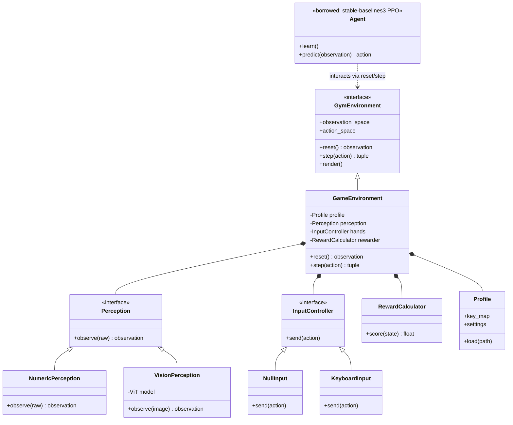

# GameTrainer - PRD v2

> **Covers:** what gets built, and in what order - the milestone plan, scope, and
> the architecture this project is proving out.
> **Status:** current. **Last verified:** 2026-10-04 (M5 closed and verified PASS
> live on both macOS and Windows; all 8 bricks complete; updated cross-references to unified docs).
> **Authority:** this file wins on *what* gets built and in what order.
> `docs/DOC_STANDARD.md` wins on *how* docs are written.

> A system that teaches an AI to play games by watching the screen and learning by trial and error.
> **The real point of this project is the architecture:** a clean, swappable link between *any* game world and *any* AI brain.

---

## 1. The one-paragraph pitch

GameTrainer connects a **game** to an **AI** through a **standard link**, so the AI can learn to play by looking at the screen, taking actions, and getting a score. We are not trying to invent a new AI. We are building the *plumbing* - the part that lets any game and any brain snap together - and proving it works by starting tiny and scaling up.

---

## 2. The mental model (read this before anything else)

Three big parts:

| Part | What it is | Its job |
| :--- | :--- | :--- |
| **Ground** | The game world | 1) Show what's happening (**observation**) &nbsp; 2) Grade the AI (**reward**) |
| **AI** | The player | Look, decide, act |
| **Link** | The Gymnasium API | The standard socket both plug into |

The **AI** is itself three pieces:

- **Eyes** – a Vision Transformer (ViT) or CV tile classifier. *Only sees.* Turns pixels into a summary.
- **Brain** – PPO (from stable-baselines3). *Only decides.* Learns what's good.
- **Hands** – a Python/native input layer. *Only acts.* Presses keys.

The whole thing is one tiny loop, forever:

```
observe ➔ act ➔ reward ➔ repeat
```

**What we build vs. borrow:**

- 🔨 **We build:** the Ground (game worlds) and the Link (the socket + profiles).
- 📦 **We borrow:** the Brain (PPO) and the Eyes backbone (a pretrained ViT).

---

## 3. Scope - the crawl-first plan

We do **NOT** start on Stardew Valley. It has no clear score and messy rewards. We earn our way up:

1. **CartPole** (built-in game) ➔ prove the link + borrowed brain work. *Build nothing.*
2. **Tiny GridWorld** (our own game) ➔ prove we can author a Ground with its own reward.
3. **Add the Eyes** ➔ make the agent learn from a *picture* of the grid instead of from numbers.
4. **Make it swappable** ➔ prove switching games is config-only.
5. **Add the Hands** ➔ drive a real, simple game window with real key-presses (**VERIFIED LIVE**).
6. **Stardew (stretch / later)** ➔ it becomes *just another profile*.

**Non-goals (on purpose, for now):**

- ❌ No control discovery - controls are hard-typed in a profile. (Discovering them is two hard problems stacked; skip it.)
- ❌ No memory reading / process injection.
- ❌ No C++ in v1. Python hands are fast enough to start.
- ❌ No cloud / paid APIs. Local only.

---

## 4. Architecture - components & the contract

Everything hangs off **one contract**: the Gymnasium environment interface.

```python
# Every "Ground" MUST look like this. This is the socket.
observation, info = env.reset()
observation, reward, terminated, truncated, info = env.step(action)
# terminated = the episode ended naturally (goal reached / pole fell)
# truncated  = the episode was cut short (e.g. ran out of time)
```

If a Ground obeys that, **any** brain can plug in. That swappability *is* the architecture flex.

- **`GameEnvironment`** - wraps a game. Holds a **Perception** (eyes), an **InputController** (hands), a **RewardCalculator**, and a **Profile**.
- **`Perception`** - swappable. `NumericPerception` early on; `VisionPerception` (ViT / CV) later.
- **`InputController`** - swappable. `NullInput` (programmatic, for CartPole/GridWorld); `KeyboardInput` (SendInput/Quartz, for real games).
- **`RewardCalculator`** - turns game state into a score.
- **`Profile`** - loads `profile.yaml` (key mappings, settings). Adding a new game = adding a profile.
- **`Agent`** - *borrowed*. PPO from stable-baselines3. We don't write this.

---

## 5. UML class diagram

> **Correction - 2026-08-14 (M4 closed).** The diagram below was the original
> composition idea: a `GameEnvironment` class holding a `Perception`, an
> `InputController`, a `RewardCalculator`, and a `Profile`. **M4 did not build
> it this way.** There is no `GameEnvironment` wrapper class - `GridWorldEnv`
> does the eyes/hands/scorecard job directly, and `make_env(profile)`
> (`src/gametrainer/factory.py`) is the only place a `Profile`'s name becomes an
> object: one function, one `if`-chain, not a class hierarchy. `RewardCalculator`
> and `Profile` themselves *were* built close to as shown here. Kept as the
> historical design intent, not deleted, per `docs/DOC_STANDARD.md` rule 4 - see
> `docs/m4/M4_ToDo.md` ("the design") and `docs/m4/backpack_diagram.png` for the
> full comparison.
>
> **For the live, implemented system class diagrams, sequence flows, and layered C4 architecture models across M0-M5, see [`docs/UML_FULL.md`](UML_FULL.md).**


```mermaid
classDiagram
    class GymEnvironment {
        <<interface>>
        +reset() observation
        +step(action) tuple
        +render()
        +observation_space
        +action_space
    }

    class GameEnvironment {
        -Profile profile
        -Perception perception
        -InputController hands
        -RewardCalculator rewarder
        +reset() observation
        +step(action) tuple
    }

    class Perception {
        <<interface>>
        +observe(raw) observation
    }
    class NumericPerception {
        +observe(raw) observation
    }
    class VisionPerception {
        -ViT model
        +observe(image) observation
    }

    class InputController {
        <<interface>>
        +send(action)
    }
    class NullInput {
        +send(action)
    }
    class KeyboardInput {
        +send(action)
    }

    class RewardCalculator {
        +score(state) float
    }

    class Profile {
        +key_map
        +settings
        +load(path)
    }

    class Agent {
        <<borrowed: stable-baselines3 PPO>>
        +learn()
        +predict(observation) action
    }

    GymEnvironment <|-- GameEnvironment
    Perception <|-- NumericPerception
    Perception <|-- VisionPerception
    InputController <|-- NullInput
    InputController <|-- KeyboardInput
    GameEnvironment *-- Perception
    GameEnvironment *-- InputController
    GameEnvironment *-- RewardCalculator
    GameEnvironment *-- Profile
    Agent ..> GymEnvironment : interacts via reset/step
```

---

## 6. Suggested libraries (imports)

```python
# The Link
import gymnasium as gym

# The Brain (borrowed)
from stable_baselines3 import PPO

# Math / arrays
import numpy as np

# Config
import yaml
from dataclasses import dataclass

# The Eyes (borrowed backbone, M3)
import torch
import timm

# The Hands (M5 - built, Win32 + Quartz via Python ctypes)
import ctypes
# Optional C++ extension (src/cpp/clib.cpp) remains available for v2
```

---

## 7. SMART timeline (light pace - a few hours/week)

Each milestone has **one job** and a clear test to prove it works.

| # | Milestone | Time | Done when... | Status |
| :--- | :--- | :--- | :--- | :--- |
| **M0** | Setup | 1-2 wks | CartPole runs 100 random steps, no crash | ✅ PASS |
| **M1** | Borrow the Brain | 2-3 wks | PPO trains on CartPole, clearly beats random | ✅ PASS |
| **M2** | Build our own Ground | 2-3 wks | Tiny GridWorld runs with PPO, reaches goal | ✅ PASS |
| **M3** | Add the Eyes | 3-4 wks | GridWorld trains from ViT pixel input on CPU | ✅ PASS |
| **M4** | Make it swappable | 2-3 wks | Swap CartPole/GridWorld via YAML, 0 code changes | ✅ PASS |
| **M5** | Add the Hands | 3-4 wks | Drive real game window (LibreMines) live | ✅ PASS |
| **M6** | Stardew (stretch) | 4-6 wks | Run on real game as "just another profile" | ⏳ NEXT |

**Total estimated:** ~4-6 months at light pace. (M0–M5 complete).

### 7.1 Future milestones (v2+ / post-M6 roadmap)

Items that are intentionally out of scope for v1:

- **M7: Linux live hands backend (`uinput` / `X11` / `Wayland`).** M5 shipped Win32 `SendInput` and macOS `Quartz`. Linux completes the OS trio.
- **M8: Opt-in C++ input extension (`src/cpp/clib.cpp`).** Python `ctypes` handles M5 cleanly. Compiling the C++ extension provides sub-millisecond input latency for action-heavy titles.
- **M9: Multi-game concurrent training.** Vectorized environments across multiple physical display targets.

---

## 8. Risks & honest notes

- **Stardew has no score.** We will have to define one (money earned, time survived, crops harvested). *That's why it's last.*
- **ViT can be slow on CPU.** Keep images small (224x224), batch size low, freeze the backbone.
- **PPO is tricky to tune.** Don't tweak hyperparameters until everything else works. Use defaults first.
- **Window focus & key-presses can be flaky.**
  > **Note - 2026-09-10 (corrected in place per DOC_STANDARD rule 4).** An earlier
  > draft of this section noted: *"M5 initially targeted Windows SendInput; macOS /
  > Linux will need their own input layers later."* That note is obsolete. On
  > 2026-09-07 (M5 Brick 7), a live macOS backend was built and proved - `GameWindow`
  > via `Quartz.CGWindowListCopyWindowInfo`, `KeyboardInput` via
  > `CGEventCreateKeyboardEvent`/`CGEventPost` - and `check_hands.py` PASSed all
  > four controls live on macOS. Live hands are **Windows + macOS**, not
  > Windows-only; Linux remains the open item, still tracked as Future Milestone
  > M7 in § 7.1. Kept in place rather than rewritten, per DOC_STANDARD rule 4.

---

## 9. For the AI coding assistant

Build in milestone order (M0 ➔ M6). Do **not** scaffold later phases early. After each milestone, stop and confirm the "Done when." check passes before continuing. Keep the Gymnasium contract (`reset`, `step`) untouched across every environment.

---

## 10. Glossary (the words to know)

Learn these five first - everything else hangs off them:

| Term | Plain meaning | In our metaphor |
| :--- | :--- | :--- |
| **Environment** | The game, in code | The **Ground** |
| **Agent** | The AI that plays | The **AI** |
| **Observation** | What the game shows the AI | "Here's the screen" |
| **Action** | What the AI does | "Press right" |
| **Reward** | The score the game gives back | "Good: +1" |

For everything else - Gymnasium's API, RL vocabulary, PPO - the full reference
lives in one place: [`docs/MASTER_GUIDE.md`](MASTER_GUIDE.md) § 4.
