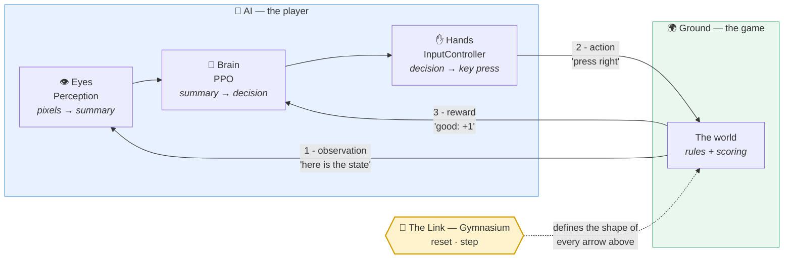
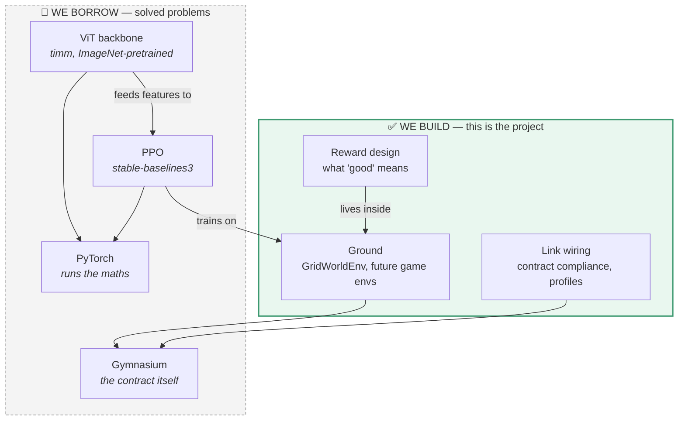
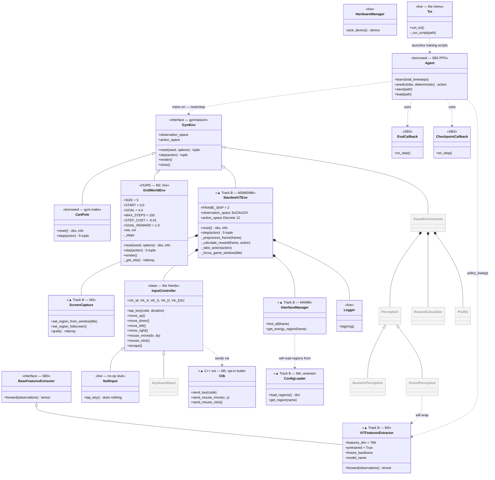
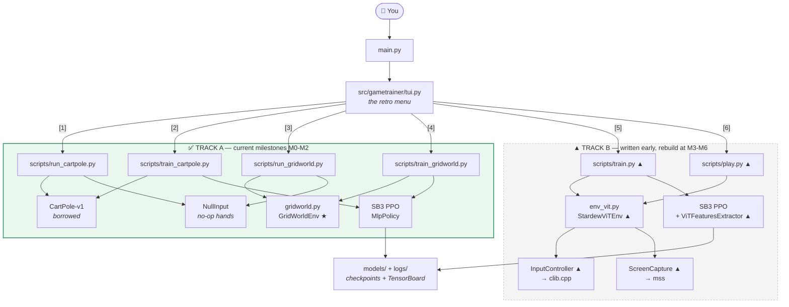
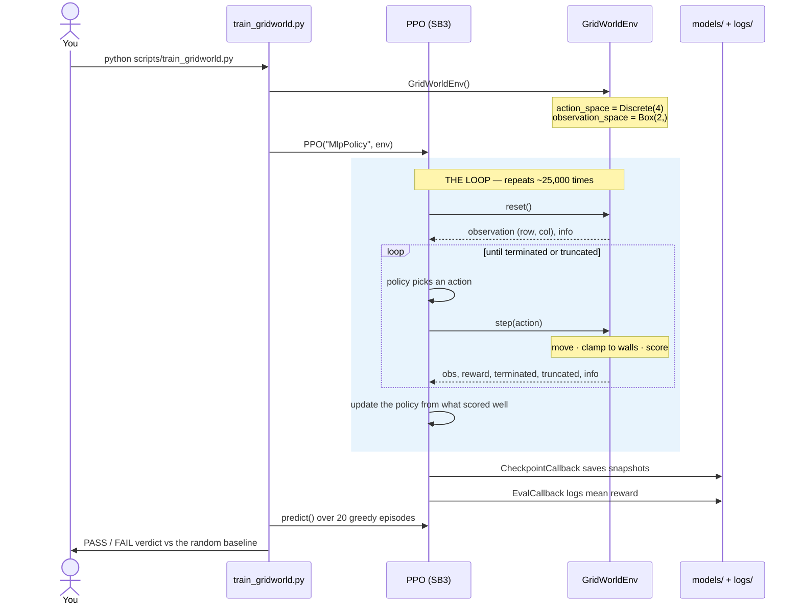
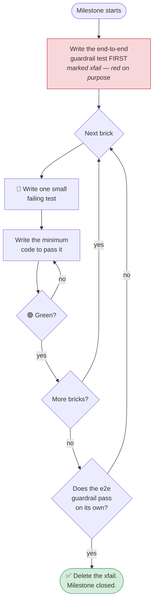

# GameTrainer — Full UML & Diagrams

> **Covers:** diagrams of the system — the mental model, the class layout, and
> the milestone roadmap.
> **Status:** partially stale. §1–2 (the loop, build-vs-borrow) are timeless and
> current. §3 and §6–8 (the full class diagram, milestone roadmap, and snapshot
> table) were drawn mid-M2 and were never refreshed for M3, M4, or the 2026-08-04
> Track B deletion — they still show Track B classes as live and M3/M4 as
> "not started." Treat those sections as a historical snapshot, not current fact.
> **Last verified:** 2026-08-08 (confirmed §1–2 still accurate; confirmed §3/§6–8
> are stale, per above — not yet redrawn).
> **Authority:** for the real current status, read `docs/ONBOARDING.md` §8 and
> `docs/CHANGELOG.md`. This file wins on *diagrams*, not on *current status*.
> Written to `docs/DOC_STANDARD.md`.

> Companion to [`docs/ONBOARDING.md`](ONBOARDING.md). Every diagram here is
> **Mermaid** — GitHub, VS Code (with the Markdown Preview Mermaid extension),
> and most Markdown viewers render it directly.
>
> **Legend used throughout:**
> - **Solid arrow `-->` / `..>`** — "uses / calls / depends on"
> - **Hollow triangle `<|--`** — "is a kind of" (inheritance)
> - **Filled diamond `*--`** — "owns one of these" (composition)
> - ✅ built and live &nbsp;&nbsp; ▲ written but ahead of schedule &nbsp;&nbsp; ⏳ planned, not written

---

## 1. The loop — the whole project in one picture

Everything else is detail. This is the system.

**Read it as:** the game shows a state → the eyes summarise it → the brain picks
a move → the hands perform it → the game scores it → repeat, thousands of times.
The Link (Gymnasium) is the agreement that makes every arrow a standard shape.

---

## 2. Build vs. borrow — what is actually *our* work

**Why this split?** Writing your own RL algorithm is months of subtle, silently
wrong maths. Writing your own connector is where the actual insight is.

---

## 3. Full class diagram — the whole system, current state

This is the main UML. Grey dashed = planned. `▲` = code that exists but belongs
to a later milestone (see §5 of the onboarding doc).

### Reading the important relationships

| Arrow | Says |
| :--- | :--- |
| `GymEnv <\|-- GridWorldEnv` | Our world **is a** Gymnasium env. This one line is the whole architecture. |
| `Agent ..> GymEnv` | PPO talks to the **interface**, never to a specific game. That's why games are swappable. |
| `InputController <\|-- NullInput` | The Hands seam exists *now*, filled with a do-nothing stub. |
| `StardewViTEnv *-- ScreenCapture` | The old Stardew env **owns** its capture, input, and UI-detection — all hard-wired. M4 exists to break exactly that coupling apart into a `Profile`. |

---

## 4. What actually runs — files and entry points

**The takeaway:** menu options 1–4 are the real, tested, current project. Options
5–6 run the older Stardew prototype and need a game window, a GPU, and libraries
the early milestones deliberately avoid.

---

## 5. Sequence — one training run, start to finish

What actually happens when you run `python scripts/train_gridworld.py`:

**The key detail:** PPO only ever calls `reset()` and `step()`. It has no idea
whether it's playing CartPole, GridWorld, or Stardew. Swap the `Env` line and
everything else is unchanged — *that* is what the project is proving.

---

## 6. The milestone roadmap — and exactly where we are

```mermaid
flowchart LR
    M0["M0 · Setup<br/>✅ DONE<br/><i>CartPole, random<br/>baseline ≈ 22</i>"]
    M1["M1 · Borrow the Brain<br/>✅ DONE<br/><i>PPO: 22 → 500</i>"]
    M2["M2 · Build our Ground<br/>⏳ IN PROGRESS<br/><i>GridWorld built;<br/>e2e test still xfail</i>"]
    M3["M3 · Add the Eyes<br/>⏳ NEXT<br/><i>picture + ViT</i>"]
    M4["M4 · Make it swappable<br/>⏳<br/><i>Profile + RewardCalculator<br/>★ thesis proven here</i>"]
    M5["M5 · Add the Hands<br/>⏳<br/><i>real key presses</i>"]
    M6["M6 · Stardew<br/>⏳ stretch<br/><i>just another profile</i>"]

    M0 --> M1 --> M2 --> M3 --> M4 --> M5 --> M6

    style M0 fill:#d4edda,stroke:#3d9970
    style M1 fill:#d4edda,stroke:#3d9970
    style M2 fill:#fff3cd,stroke:#d39e00,stroke-width:3px
    style M4 fill:#e7f1ff,stroke:#4a90d9,stroke-width:2px
```

**Each milestone changes exactly one thing.** That's the discipline: when
something breaks, there's only one candidate cause.

| Milestone | The one thing that changes |
| :--- | :--- |
| M0 → M1 | Random actions → a learning brain |
| M1 → M2 | Borrowed game → our own game |
| M2 → M3 | Observation is numbers → observation is a picture |
| M3 → M4 | Hard-coded wiring → config-driven wiring |
| M4 → M5 | Fake key presses → real ones |
| M5 → M6 | A toy window → a real commercial game |

---

## 7. How a milestone gets finished — the test-first loop

**Why work this way?** Because "done" becomes an assertion instead of an
opinion. For M2, the finish line is one specific line in
`tests/test_m2_e2e.py`: PPO must beat the random baseline **and** reach the goal
in ≥90% of episodes. Until then, M2 is open — no debate required.

---

## 8. Snapshot summary

| Component | Status | Milestone |
| :--- | :--- | :--- |
| Gymnasium contract | ✅ live | M0 |
| CartPole runner + PPO trainer | ✅ live | M0 / M1 |
| `NullInput` seam | ✅ live | M0 |
| `HardwareManager`, `Logger`, `Tui` | ✅ live | M0 |
| `GridWorldEnv` + contract tests | ✅ live | M2 |
| GridWorld runner + trainer | ✅ live | M2 |
| M2 end-to-end guardrail | ⏳ still `xfail` | **M2 — the finish line** |
| `ViTFeaturesExtractor` | ▲ written, ahead | M3 |
| `ScreenCapture` | ▲ written, ahead | M3 |
| `ConfigLoader` / profiles | ▲ written, unwired | M4 |
| `Perception` / `RewardCalculator` / `GameEnvironment` | ⏳ not written | M3 / M4 |
| `InputController` + `clib.cpp` | ▲ written, not built by default | M5 |
| `StardewViTEnv` | ▲ prototype, untested | M6 |
