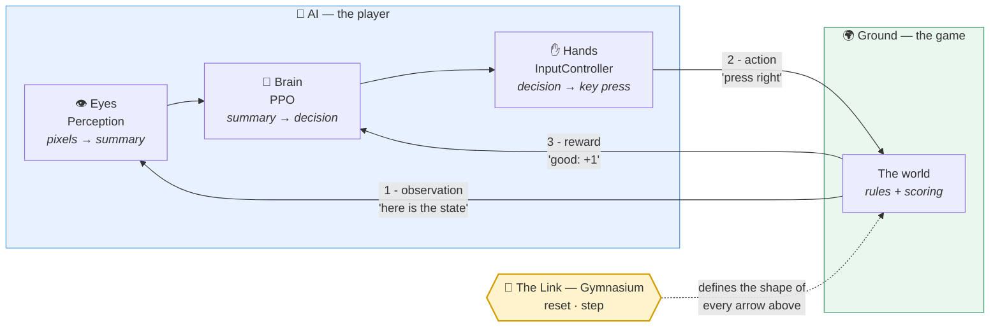
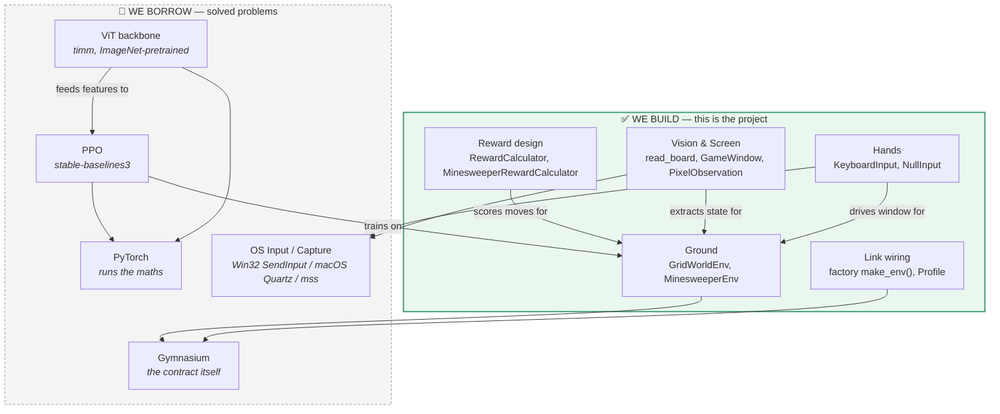
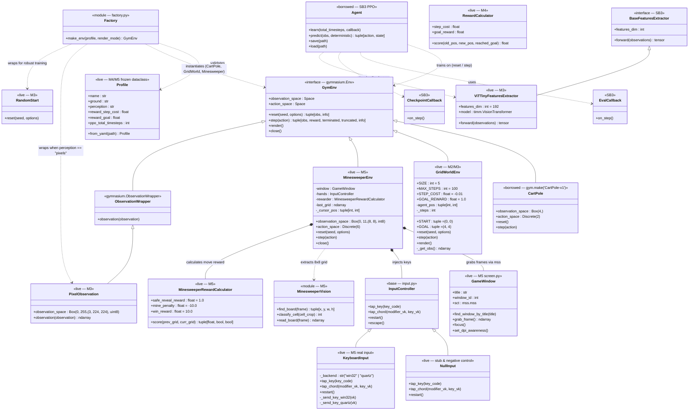
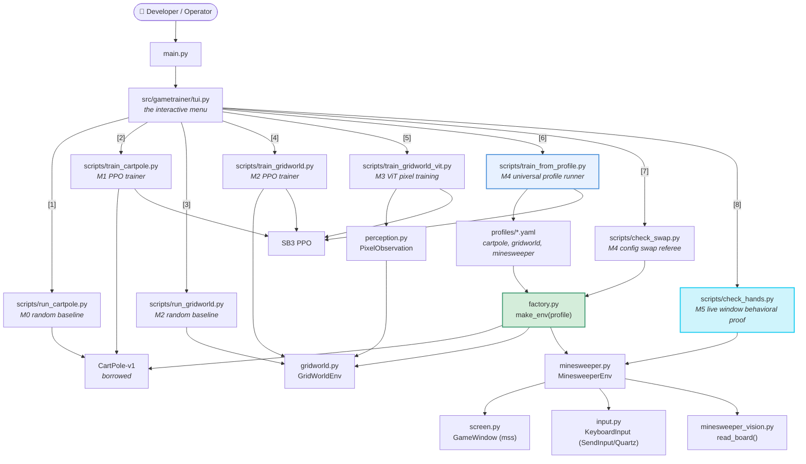
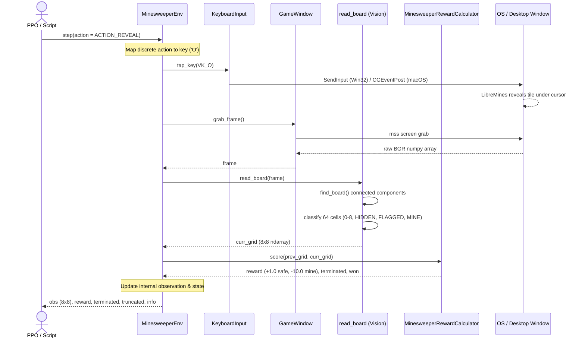

# GameTrainer — Full UML & Diagrams

> **Covers:** diagrams of the system — the mental model, the class layout, the
> execution flows, and the milestone roadmap.
> **Status:** current.
> **Last verified:** 2026-09-24 (M0–M5 complete and verified live on macOS & Windows 11;
> fully updated to reflect the completed Milestone 5 architecture: `MinesweeperEnv`,
> `GameWindow`, `KeyboardInput`, `read_board`, `MinesweeperRewardCalculator`, `Profile`,
> and `make_env`).
> **Authority:** this file owns the *diagrams* and architectural relationships across
> all milestones. For textual onboarding, see [`docs/ONBOARDING.md`](ONBOARDING.md);
> for the comprehensive architectural guide, see [`docs/MASTER_GUIDE.md`](MASTER_GUIDE.md).
> Written to `docs/DOC_STANDARD.md`.

> Companion to [`docs/ONBOARDING.md`](ONBOARDING.md) and [`docs/MASTER_GUIDE.md`](MASTER_GUIDE.md).
> Every diagram here is **Mermaid** — GitHub, VS Code (with the Markdown Preview
> Mermaid extension), and most Markdown viewers render it directly.
>
> **Legend used throughout:**
> - **Solid arrow `-->` / `..>`** — "uses / calls / depends on"
> - **Hollow triangle `<|--`** — "is a kind of" (inheritance)
> - **Filled diamond `*--`** — "owns one of these" (composition)
> - ✅ built and live &nbsp;&nbsp; ⏳ planned, next milestone

---

## 1. The loop — the whole project in one picture

Everything else is detail. This is the system.

**Read it as:** the game shows a state → the eyes summarise it → the brain picks
a move → the hands perform it → the game scores it → repeat, thousands of times.
The Link (Gymnasium) is the agreement that makes every arrow a standard shape.

---

## 2. Build vs. borrow — what is actually *our* work

**Why this split?** Writing your own RL algorithm is months of subtle, silently
wrong maths. Writing your own connector is where the actual insight is.

---

## 3. Full class diagram — the complete implemented system (M0–M5)

This diagram shows all active classes across the repository following the completion
of Milestone 5. Note the absence of a monolithic "God Object": environments are
instantiated through the factory function `make_env()` and configured via `Profile`.

### Key Architectural Patterns

| Relationship | Architectural Meaning |
| :--- | :--- |
| `GymEnv <\|-- MinesweeperEnv` | LibreMines is adapted into a pure Gymnasium socket; SB3 algorithms treat it identically to CartPole. |
| `Factory ..> GymEnv` | `make_env(profile)` is the single point where configuration becomes an active environment. |
| `MinesweeperEnv *-- GameWindow` | Screen capture is encapsulated inside the environment, hidden from the agent. |
| `MinesweeperEnv *-- InputController` | Hands are injected into the environment; `NullInput` can be hot-swapped for tests with zero logic changes. |
| `MinesweeperEnv ..> MinesweeperVision` | Computer vision translates high-resolution pixels into a discrete 8×8 integer grid before scoring. |

---

## 4. What actually runs — files, entry points, and runners

---

## 5. Sequence — one live environment step in Milestone 5

What happens under the hood when `env.step(action)` executes against the live game:

---

## 6. The milestone roadmap — completed state (M0–M5) & next (M6)

```mermaid
flowchart LR
    M0["M0 · Setup<br/>✅ DONE<br/><i>CartPole baseline ≈ 22</i>"]
    M1["M1 · Borrow the Brain<br/>✅ DONE<br/><i>PPO: 22 → 500</i>"]
    M2["M2 · Build our Ground<br/>✅ DONE<br/><i>GridWorld: +0.93<br/>20/20 goals</i>"]
    M3["M3 · Add the Eyes<br/>✅ DONE<br/><i>ViT-Tiny pixels: +0.99<br/>100% goals</i>"]
    M4["M4 · Make it Swappable<br/>✅ DONE<br/><i>Profile + factory<br/>4/4 check_swap PASS</i>"]
    M5["M5 · Add the Hands<br/>✅ DONE<br/><i>Live LibreMines<br/>4/4 check_hands PASS</i>"]
    M6["M6 · Stardew Valley<br/>⏳ NEXT / STRETCH<br/><i>Complex real game<br/>just another profile</i>"]

    M0 --> M1 --> M2 --> M3 --> M4 --> M5 --> M6

    style M0 fill:#d4edda,stroke:#3d9970
    style M1 fill:#d4edda,stroke:#3d9970
    style M2 fill:#d4edda,stroke:#3d9970
    style M3 fill:#d4edda,stroke:#3d9970
    style M4 fill:#d4edda,stroke:#3d9970
    style M5 fill:#d4edda,stroke:#3d9970
    style M6 fill:#fff3cd,stroke:#d39e00,stroke-width:3px
```

### The Discipline of the Milestones

| Milestone | The One Thing That Changed | Result |
| :--- | :--- | :--- |
| **M0 → M1** | Random actions → a learning brain | Reward **22 → 500** (ceiling reached on CartPole). |
| **M1 → M2** | Borrowed game → our own game | **+0.93** mean reward, **20/20** greedy goals on GridWorld. |
| **M2 → M3** | Observation is numbers → observation is a picture | **+0.99** mean reward, **100%** goals via frozen ViT-Tiny on CPU. |
| **M3 → M4** | Hard-coded wiring → config-driven wiring | 3 profiles trained via **1 unedited runner**; 4/4 swap checks PASS. |
| **M4 → M5** | Simulated in-memory env → live external desktop window | **4/4 live controls PASS** on macOS (16.8s) & Windows (22.4s); 20/20 unattended resets. |
| **M5 → M6** | Single-screen logic game → complex commercial game (Stardew) | Planned post-M5: complex multi-region visual perception profile. |

---

## 7. Component snapshot summary

| Component / Layer | Implementation | Status | Milestone |
| :--- | :--- | :--- | :--- |
| **Gymnasium Contract** | `gymnasium.Env` (`reset`, `step`) | ✅ Live | M0 |
| **Borrowed Brain** | `stable_baselines3.PPO` | ✅ Live | M1 |
| **Custom GridWorld Ground** | [`src/gametrainer/gridworld.py`](file:///Users/phillip/PycharmProjects/GameTrainer/src/gametrainer/gridworld.py) | ✅ Live | M2 |
| **ViT Eyes Extractor** | [`src/gametrainer/vit_extractor.py`](file:///Users/phillip/PycharmProjects/GameTrainer/src/gametrainer/vit_extractor.py) | ✅ Live | M3 |
| **Pixel Observation Wrapper** | [`src/gametrainer/perception.py`](file:///Users/phillip/PycharmProjects/GameTrainer/src/gametrainer/perception.py) | ✅ Live | M3 |
| **Profile Dataclass** | [`src/gametrainer/profile.py`](file:///Users/phillip/PycharmProjects/GameTrainer/src/gametrainer/profile.py) | ✅ Live | M4 |
| **Environment Factory** | [`src/gametrainer/factory.py`](file:///Users/phillip/PycharmProjects/GameTrainer/src/gametrainer/factory.py) | ✅ Live | M4 |
| **GridWorld Reward Calculator** | [`src/gametrainer/rewards.py`](file:///Users/phillip/PycharmProjects/GameTrainer/src/gametrainer/rewards.py) | ✅ Live | M4 |
| **Universal Profile Runner** | [`scripts/train_from_profile.py`](file:///Users/phillip/PycharmProjects/GameTrainer/scripts/train_from_profile.py) | ✅ Live | M4 |
| **Config Swappability Referee** | [`scripts/check_swap.py`](file:///Users/phillip/PycharmProjects/GameTrainer/scripts/check_swap.py) | ✅ Live | M4 |
| **Live Screen Capture** | [`src/gametrainer/screen.py`](file:///Users/phillip/PycharmProjects/GameTrainer/src/gametrainer/screen.py) (`GameWindow`) | ✅ Live | M5 |
| **Live Native Hands** | [`src/gametrainer/input.py`](file:///Users/phillip/PycharmProjects/GameTrainer/src/gametrainer/input.py) (`KeyboardInput`) | ✅ Live | M5 |
| **Connected Components CV** | [`src/gametrainer/minesweeper_vision.py`](file:///Users/phillip/PycharmProjects/GameTrainer/src/gametrainer/minesweeper_vision.py) | ✅ Live | M5 |
| **Minesweeper Reward Calculator** | [`src/gametrainer/rewards.py`](file:///Users/phillip/PycharmProjects/GameTrainer/src/gametrainer/rewards.py) | ✅ Live | M5 |
| **Minesweeper Gymnasium Adapter** | [`src/gametrainer/minesweeper.py`](file:///Users/phillip/PycharmProjects/GameTrainer/src/gametrainer/minesweeper.py) | ✅ Live | M5 |
| **Live Behavioral Proof** | [`scripts/check_hands.py`](file:///Users/phillip/PycharmProjects/GameTrainer/scripts/check_hands.py) | ✅ Live | M5 |
| **Stardew Valley Ground** | `profiles/stardew.yaml` | ⏳ Planned | M6 |
