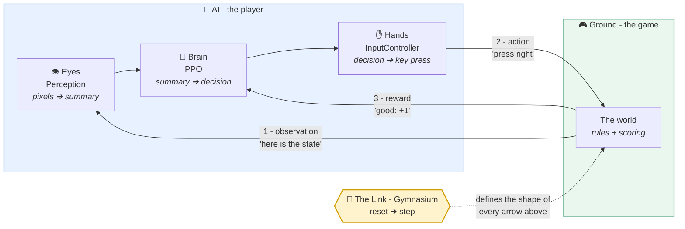
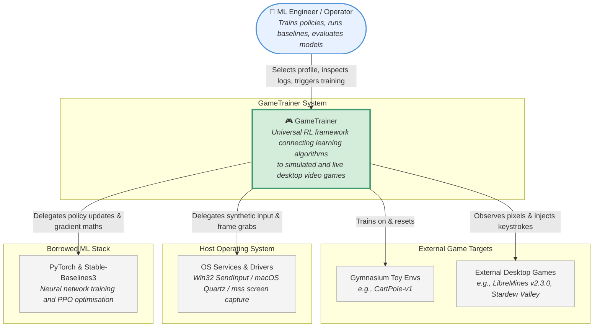
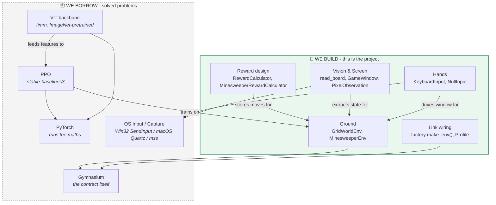
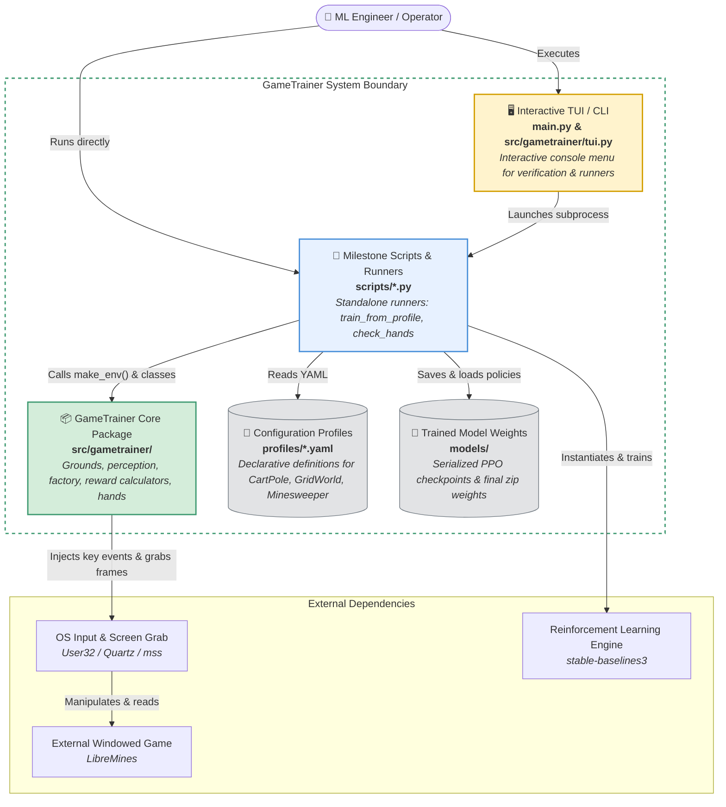
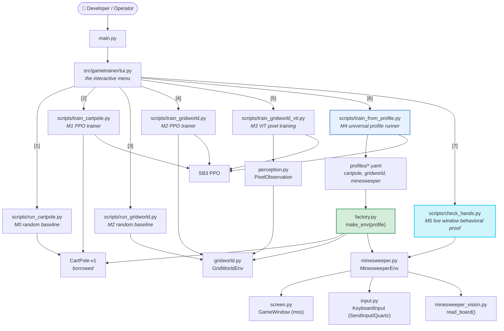
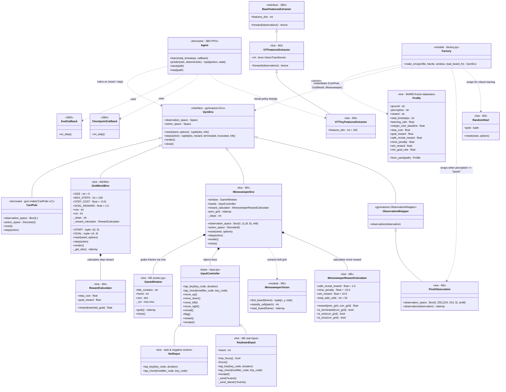
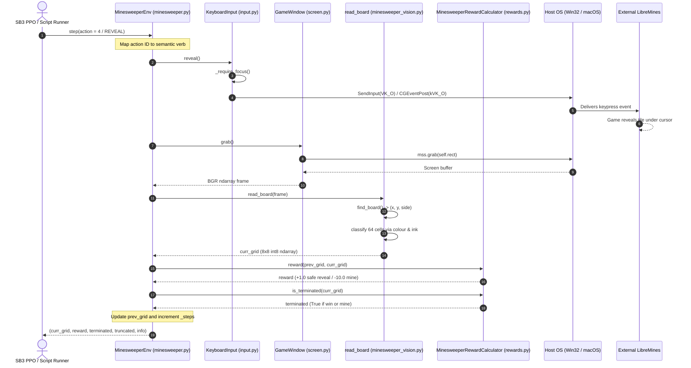
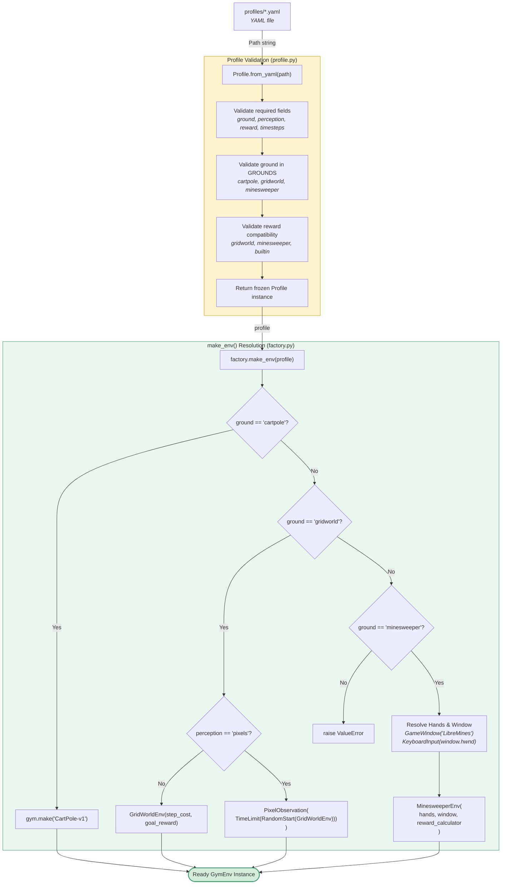

# GameTrainer - Full Architecture & UML Diagrams

> **Covers:** the complete architectural model and visual diagrams of GameTrainer -
> hierarchical C4 layers (Context, Containers, Components, Code workflows),
> class hierarchy, execution sequences, and milestone roadmap.
> **Status:** current.
> **Last verified:** 2026-10-04 (unified C4 layered models and UML diagrams into a single architectural authority).
> **Authority:** this file owns all *diagrams* and architectural relationships across
> all milestones. For textual explanations, traps, and developer onboarding, see [`docs/MASTER_GUIDE.md`](MASTER_GUIDE.md);
> for project requirements and milestone scopes, see [`docs/PRD.md`](PRD.md).
> Written to `docs/DOC_STANDARD.md`.

> Every diagram here is rendered with **Mermaid** - GitHub, VS Code (with Markdown Preview Mermaid Support),
> and standard Markdown previewers render them natively.
>
> **Legend used throughout:**
> - **Solid arrow `-->` / `..>`** - "uses / calls / depends on"
> - **Hollow triangle `<|--`** - "is a kind of" (inheritance)
> - **Filled diamond `*--`** - "owns one of these" (composition)
> - ✅ built and live &nbsp;&nbsp; ⏳ planned, next milestone

---

## 1. Introduction: The C4 Abstraction Hierarchy

To understand GameTrainer, we zoom in progressively through four levels of abstraction:

```
Level 1: System Context  --> Who uses GameTrainer and what external systems does it touch?
Level 2: Containers      --> What are the high-level apps, runners, and storage units?
Level 3: Components      --> What internal modules make up the gametrainer core engine?
Level 4: Code & Classes  --> How do classes, methods, and workflows execute in real-time?
```

---

## 2. Level 1: System Context & The Universal Loop

### 2.1 The Universal Loop (The Whole Project in One Picture)

Everything else is detail. This is the system:


```mermaid
flowchart LR
    subgraph AI["🤖 AI - the player"]
        direction TB
        EYES["👁️ Eyes<br/>Perception<br/><i>pixels ➔ summary</i>"]
        BRAIN["🧠 Brain<br/>PPO<br/><i>summary ➔ decision</i>"]
        HANDS["✋ Hands<br/>InputController<br/><i>decision ➔ key press</i>"]
        EYES --> BRAIN --> HANDS
    end

    subgraph GROUND["🎮 Ground - the game"]
        GAME["The world<br/><i>rules + scoring</i>"]
    end

    GAME -- "1 - observation<br/>'here is the state'" --> EYES
    HANDS -- "2 - action<br/>'press right'" --> GAME
    GAME -- "3 - reward<br/>'good: +1'" --> BRAIN

    LINK{{"🔌 The Link - Gymnasium<br/>reset ➔ step"}}
    LINK -.->|"defines the shape of<br/>every arrow above"| GAME

    style LINK fill:#fff3cd,stroke:#d39e00,stroke-width:2px
    style AI fill:#e7f1ff,stroke:#4a90d9
    style GROUND fill:#e9f7ef,stroke:#3d9970
```

**Read it as:** the game shows a state ➔ the eyes summarise it ➔ the brain picks a move ➔ the hands perform it ➔ the game scores it ➔ repeat, thousands of times. The Link (Gymnasium) is the contract that makes every arrow a standard shape.

### 2.2 System Context Diagram

The bird's-eye view showing how GameTrainer interacts with human engineers, external games, the host OS, and borrowed ML libraries:


```mermaid
flowchart TB
    USER(["👤 ML Engineer / Operator<br/><i>Trains policies, runs baselines, evaluates models</i>"])
    
    subgraph SYSTEM["GameTrainer System"]
        GT["🎮 GameTrainer<br/><i>Universal RL framework connecting learning algorithms<br/>to simulated and live desktop video games</i>"]
    end

    subgraph EXT_GAMES["External Game Targets"]
        GYM_GAMES["Gymnasium Toy Envs<br/><i>e.g., CartPole-v1</i>"]
        DESKTOP_GAMES["External Desktop Games<br/><i>e.g., LibreMines v2.3.0, Stardew Valley</i>"]
    end

    subgraph OS_LAYER["Host Operating System"]
        OS_SERVICES["OS Services & Drivers<br/><i>Win32 SendInput / macOS Quartz / mss screen capture</i>"]
    end

    subgraph ML_STACK["Borrowed ML Stack"]
        SB3_TORCH["PyTorch & Stable-Baselines3<br/><i>Neural network training and PPO optimisation</i>"]
    end

    USER -->|"Selects profile, inspects logs, triggers training"| GT
    GT -->|"Trains on & resets"| GYM_GAMES
    GT -->|"Observes pixels & injects keystrokes"| DESKTOP_GAMES
    GT -->|"Delegates synthetic input & frame grabs"| OS_SERVICES
    GT -->|"Delegates policy updates & gradient maths"| SB3_TORCH

    style USER fill:#e7f1ff,stroke:#4a90d9,stroke-width:2px
    style GT fill:#d4edda,stroke:#3d9970,stroke-width:3px
    style GYM_GAMES fill:#f4f4f4,stroke:#999999
    style DESKTOP_GAMES fill:#f4f4f4,stroke:#999999
    style OS_SERVICES fill:#f4f4f4,stroke:#999999
    style SB3_TORCH fill:#f4f4f4,stroke:#999999
```

### 2.3 Build vs. Borrow (Our Work vs. Solved Problems)


```mermaid
flowchart TB
    subgraph WEBUILD["🔨 WE BUILD - this is the project"]
        G["Ground<br/>GridWorldEnv, MinesweeperEnv"]
        L["Link wiring<br/>factory make_env(), Profile"]
        R["Reward design<br/>RewardCalculator, MinesweeperRewardCalculator"]
        V["Vision & Screen<br/>read_board, GameWindow, PixelObservation"]
        H["Hands<br/>KeyboardInput, NullInput"]
    end

    subgraph WEBORROW["📦 WE BORROW - solved problems"]
        P["PPO<br/><i>stable-baselines3</i>"]
        VT["ViT backbone<br/><i>timm, ImageNet-pretrained</i>"]
        GY["Gymnasium<br/><i>the contract itself</i>"]
        T["PyTorch<br/><i>runs the maths</i>"]
        OS["OS Input / Capture<br/><i>Win32 SendInput / macOS Quartz / mss</i>"]
    end

    G --> GY
    L --> GY
    P --> T
    VT --> T
    P -- "trains on" --> G
    VT -- "feeds features to" --> P
    R -- "scores moves for" --> G
    V -- "extracts state for" --> G
    H -- "drives window for" --> G
    H --> OS
    V --> OS

    style WEBUILD fill:#e9f7ef,stroke:#3d9970,stroke-width:2px
    style WEBORROW fill:#f4f4f4,stroke:#999999,stroke-dasharray:4 3
```

**Why this split?** Writing your own RL algorithm is months of subtle, silently wrong maths. Writing your own connector is where the actual engineering insight is.

---

## 3. Level 2: Containers & Runtime Execution

### 3.1 Container Diagram

Zooming in on the **GameTrainer System Boundary** to show deployable/runnable units, file-based configuration, and model storage:


```mermaid
flowchart TB
    USER(["👤 ML Engineer / Operator"])

    subgraph BOUNDARY["GameTrainer System Boundary"]
        TUI_APP["🖥️ Interactive TUI / CLI<br/><b>main.py & src/gametrainer/tui.py</b><br/><i>Interactive console menu for verification & runners</i>"]

        RUNNERS["🏃 Milestone Scripts & Runners<br/><b>scripts/*.py</b><br/><i>Standalone runners: train_from_profile, check_hands</i>"]

        CORE_LIB["📦 GameTrainer Core Package<br/><b>src/gametrainer/</b><br/><i>Grounds, perception, factory, reward calculators, hands</i>"]

        CONFIGS[("📄 Configuration Profiles<br/><b>profiles/*.yaml</b><br/><i>Declarative definitions for CartPole, GridWorld, Minesweeper</i>")]

        MODELS[("💾 Trained Model Weights<br/><b>models/</b><br/><i>Serialized PPO checkpoints & final zip weights</i>")]
    end

    subgraph EXTERNAL["External Dependencies"]
        EXT_GAME["External Windowed Game<br/><i>LibreMines</i>"]
        OS_APIS["OS Input & Screen Grab<br/><i>User32 / Quartz / mss</i>"]
        SB3_LIB["Reinforcement Learning Engine<br/><i>stable-baselines3</i>"]
    end

    USER -->|"Executes"| TUI_APP
    USER -->|"Runs directly"| RUNNERS
    TUI_APP -->|"Launches subprocess"| RUNNERS
    RUNNERS -->|"Reads YAML"| CONFIGS
    RUNNERS -->|"Calls make_env() & classes"| CORE_LIB
    RUNNERS -->|"Instantiates & trains"| SB3_LIB
    RUNNERS -->|"Saves & loads policies"| MODELS

    CORE_LIB -->|"Injects key events & grabs frames"| OS_APIS
    OS_APIS -->|"Manipulates & reads"| EXT_GAME

    style BOUNDARY fill:#ffffff,stroke:#3d9970,stroke-width:2px,stroke-dasharray: 5 5
    style CORE_LIB fill:#d4edda,stroke:#3d9970,stroke-width:2px
    style RUNNERS fill:#e7f1ff,stroke:#4a90d9,stroke-width:2px
    style TUI_APP fill:#fff3cd,stroke:#d39e00,stroke-width:2px
    style CONFIGS fill:#e2e3e5,stroke:#6c757d
    style MODELS fill:#e2e3e5,stroke:#6c757d
```

### 3.2 What Actually Runs (Runners & Entry Points)


```mermaid
flowchart TB
    USER(["👤 Developer / Operator"])
    USER --> MAIN["main.py"]
    MAIN --> TUI["src/gametrainer/tui.py<br/><i>the interactive menu</i>"]

    TUI -->|"[1]"| S1["scripts/run_cartpole.py<br/><i>M0 random baseline</i>"]
    TUI -->|"[2]"| S2["scripts/train_cartpole.py<br/><i>M1 PPO trainer</i>"]
    TUI -->|"[3]"| S3["scripts/run_gridworld.py<br/><i>M2 random baseline</i>"]
    TUI -->|"[4]"| S4["scripts/train_gridworld.py<br/><i>M2 PPO trainer</i>"]
    TUI -->|"[5]"| S5["scripts/train_gridworld_vit.py<br/><i>M3 ViT pixel training</i>"]
    TUI -->|"[6]"| S6["scripts/train_from_profile.py<br/><i>M4 universal profile runner</i>"]
    TUI -->|"[7]"| S7["scripts/check_hands.py<br/><i>M5 live window behavioral proof</i>"]

    S1 --> CP["CartPole-v1<br/><i>borrowed</i>"]
    S2 --> CP
    S3 --> GW["gridworld.py<br/>GridWorldEnv"]
    S4 --> GW
    S5 --> GWP["perception.py<br/>PixelObservation"] --> GW
    
    S6 --> PROF["profiles/*.yaml<br/><i>cartpole, gridworld, minesweeper</i>"]
    PROF --> FACT["factory.py<br/>make_env(profile)"]
    FACT --> CP
    FACT --> GW
    FACT --> MS["minesweeper.py<br/>MinesweeperEnv"]

    S7 --> MS
    MS --> GWIN["screen.py<br/>GameWindow (mss)"]
    MS --> KBD["input.py<br/>KeyboardInput (SendInput/Quartz)"]
    MS --> VIS["minesweeper_vision.py<br/>read_board()"]

    S2 --> PPO["SB3 PPO"]
    S4 --> PPO
    S5 --> PPO
    S6 --> PPO

    style S6 fill:#e7f1ff,stroke:#4a90d9,stroke-width:2px
    style S7 fill:#cff4fc,stroke:#0dcaf0,stroke-width:2px
    style FACT fill:#d4edda,stroke:#3d9970,stroke-width:2px
```

---

## 4. Level 3: Components & Architecture

### 4.1 Component Diagram

Zooming inside the **GameTrainer Core Package (`src/gametrainer/`)**. Here we see how internal modules align with the architectural roles: **The Link**, **The Ground**, **The Eyes**, **The Hands**, and **The Rewards**:

```mermaid
flowchart TB
    subgraph LINK_LAYER["🔌 The Link & Config Layer"]
        FACTORY["factory.py<br/><b>make_env()</b><br/><i>Builds GymEnv from Profile</i>"]
        PROFILE["profile.py<br/><b>Profile</b><br/><i>Validates YAML settings & hyperparameters</i>"]
    end

    subgraph GROUND_LAYER["🎮 The Ground (Environments)"]
        GRIDWORLD["gridworld.py<br/><b>GridWorldEnv</b><br/><i>In-memory 5x5 navigation environment</i>"]
        MINESWEEPER["minesweeper.py<br/><b>MinesweeperEnv</b><br/><i>Adapter turning live desktop window into GymEnv</i>"]
    end

    subgraph EYES_LAYER["👁️ The Eyes (Perception & Vision)"]
        SCREEN["screen.py<br/><b>GameWindow</b><br/><i>Window discovery & mss frame grabber</i>"]
        VISION["minesweeper_vision.py<br/><b>read_board()</b><br/><i>Connected components & tile classification</i>"]
        PERCEPTION["perception.py<br/><b>PixelObservation</b><br/><i>Gymnasium observation wrapper for pixel array</i>"]
    end

    subgraph BRAIN_LAYER["🧠 The Brain Features (SB3 Custom Vision)"]
        VIT_EXTRACTOR["vit_extractor.py<br/><b>ViTTinyFeaturesExtractor</b><br/><i>Frozen ViT-Tiny backbone converting 224x224 to 192-dim</i>"]
    end

    subgraph HANDS_LAYER["✋ The Hands (Input Controller)"]
        INPUT_BASE["input.py<br/><b>InputController</b><br/><i>Base interface for key & chord dispatch</i>"]
        KEYBOARD_INPUT["input.py<br/><b>KeyboardInput</b><br/><i>Platform SendInput/Quartz injector with focus guard</i>"]
        NULL_INPUT["input.py<br/><b>NullInput</b><br/><i>No-op negative control & headless stub</i>"]
    end

    subgraph REWARD_LAYER["🎯 Reward Design"]
        REWARDS_GW["rewards.py<br/><b>RewardCalculator</b><br/><i>Scores GridWorld step and goal</i>"]
        REWARDS_MS["rewards.py<br/><b>MinesweeperRewardCalculator</b><br/><i>Calculates reveal reward, penalty, win/loss</i>"]
    end

    %% Wiring
    PROFILE -->|"validated by"| FACTORY
    FACTORY -->|"instantiates"| GRIDWORLD
    FACTORY -->|"instantiates"| MINESWEEPER
    FACTORY -->|"wraps"| PERCEPTION

    GRIDWORLD *-- REWARDS_GW
    MINESWEEPER *-- REWARDS_MS
    MINESWEEPER *-- SCREEN
    MINESWEEPER *-- KEYBOARD_INPUT
    MINESWEEPER ..> VISION

    INPUT_BASE <|-- KEYBOARD_INPUT
    INPUT_BASE <|-- NULL_INPUT

    style LINK_LAYER fill:#fff3cd,stroke:#d39e00
    style GROUND_LAYER fill:#e9f7ef,stroke:#3d9970
    style EYES_LAYER fill:#e7f1ff,stroke:#4a90d9
    style BRAIN_LAYER fill:#f8d7da,stroke:#dc3545
    style HANDS_LAYER fill:#f3e8fd,stroke:#6f42c1
    style REWARD_LAYER fill:#d1ecf1,stroke:#17a2b8
```

### 4.2 Component Snapshot Summary

| Component / Layer | Implementation | Status | Milestone |
| :--- | :--- | :--- | :--- |
| **Gymnasium Contract** | `gymnasium.Env` (`reset`, `step`) | ✅ Live | M0 |
| **Borrowed Brain** | `stable_baselines3.PPO` | ✅ Live | M1 |
| **Custom GridWorld Ground** | [`gridworld.py`](../src/gametrainer/gridworld.py) | ✅ Live | M2 |
| **ViT Eyes Extractor** | [`vit_extractor.py`](../src/gametrainer/vit_extractor.py) | ✅ Live | M3 |
| **Pixel Observation Wrapper** | [`perception.py`](../src/gametrainer/perception.py) | ✅ Live | M3 |
| **Profile Dataclass** | [`profile.py`](../src/gametrainer/profile.py) | ✅ Live | M4 |
| **Environment Factory** | [`factory.py`](../src/gametrainer/factory.py) | ✅ Live | M4 |
| **GridWorld Reward Calculator** | [`rewards.py`](../src/gametrainer/rewards.py) (`RewardCalculator`) | ✅ Live | M4 |
| **Universal Profile Runner** | [`train_from_profile.py`](../scripts/train_from_profile.py) | ✅ Live | M4 |
| **Swappability Referee & Proof** | [`test_m4_verdict.py`](../tests/test_m4_verdict.py) | ✅ Live | M4 |
| **Live Screen Capture** | [`screen.py`](../src/gametrainer/screen.py) (`GameWindow`) | ✅ Live | M5 |
| **Live Native Hands** | [`input.py`](../src/gametrainer/input.py) (`KeyboardInput`) | ✅ Live | M5 |
| **Connected Components CV** | [`minesweeper_vision.py`](../src/gametrainer/minesweeper_vision.py) | ✅ Live | M5 |
| **Minesweeper Reward Calculator** | [`rewards.py`](../src/gametrainer/rewards.py) (`MinesweeperRewardCalculator`) | ✅ Live | M5 |
| **Minesweeper Gymnasium Adapter** | [`minesweeper.py`](../src/gametrainer/minesweeper.py) | ✅ Live | M5 |
| **Live Behavioral Proof** | [`check_hands.py`](../scripts/check_hands.py) | ✅ Live | M5 |
| **Stardew Valley Ground** | `profiles/stardew.yaml` | ⏳ Planned | M6 |

---

## 5. Level 4: Code, Classes & Detailed Workflows

### 5.1 Full Class Diagram (M0-M5 Live System)

Shows all active classes and inheritance/composition relationships across the codebase. Note the absence of any monolithic "God Object":


```mermaid
classDiagram
    %% ============ THE CONTRACT ============
    class GymEnv {
        <<interface - gymnasium.Env>>
        +observation_space : Space
        +action_space : Space
        +reset(seed, options) tuple[obs, info]
        +step(action) tuple[obs, reward, terminated, truncated, info]
        +render()
        +close()
    }

    %% ============ GROUNDS (ENVIRONMENTS) ============
    class CartPole {
        <<borrowed - gym.make('CartPole-v1')>>
        +observation_space : Box(4,)
        +action_space : Discrete(2)
        +reset()
        +step(action)
    }

    class GridWorldEnv {
        <<live - M2/M3>>
        +SIZE : int = 5
        +START : tuple = (0, 0)
        +GOAL : tuple = (4, 4)
        +MAX_STEPS : int = 100
        +STEP_COST : float = -0.01
        +GOAL_REWARD : float = 1.0
        +row : int
        +col : int
        -_steps : int
        -_reward_calculator : RewardCalculator
        +reset(seed, options)
        +step(action)
        +render()
        -_get_obs() ndarray
    }

    class MinesweeperEnv {
        <<live - M5>>
        +observation_space : Box(0, 11, (8, 8), int8)
        +action_space : Discrete(6)
        +window : GameWindow
        +hands : InputController
        +reward_calculator : MinesweeperRewardCalculator
        +prev_grid : ndarray
        -_steps : int
        +reset(seed, options)
        +step(action)
        +render()
        +close()
    }

    %% ============ GYMNASIUM WRAPPERS ============
    class ObservationWrapper {
        <<gymnasium.ObservationWrapper>>
        +observation(observation)
    }
    class PixelObservation {
        <<live - M3>>
        +observation_space : Box(0, 255, (224, 224, 3), uint8)
        +observation(observation) ndarray
    }
    class RandomStart {
        <<live - M3>>
        +goal : tuple
        +reset(seed, options)
    }

    %% ============ THE BRAIN (SB3) ============
    class Agent {
        <<borrowed - SB3 PPO>>
        +learn(total_timesteps, callback)
        +predict(obs, deterministic) tuple[action, state]
        +save(path)
        +load(path)
    }
    class EvalCallback {
        <<SB3>>
        +on_step()
    }
    class CheckpointCallback {
        <<SB3>>
        +on_step()
    }

    %% ============ THE EYES ============
    class BaseFeaturesExtractor {
        <<interface - SB3>>
        +features_dim : int
        +forward(observations) tensor
    }
    class ViTFeaturesExtractor {
        <<live - M3>>
        +vit : timm.VisionTransformer
        +forward(observations) tensor
    }
    class ViTTinyFeaturesExtractor {
        <<live - M3>>
        +features_dim : int = 192
    }
    class MinesweeperVision {
        <<module - M5>>
        +find_board(frame) tuple[x, y, side]
        +classify_cell(patch) int
        +read_board(frame) ndarray
    }

    %% ============ THE HANDS ============
    class InputController {
        <<base - input.py>>
        +tap_key(key_code, duration)
        +tap_chord(modifier_code, key_code)
        +move_up()
        +move_down()
        +move_left()
        +move_right()
        +reveal()
        +flag()
        +restart()
        +escape()
    }
    class NullInput {
        <<live - stub & negative control>>
        +tap_key(key_code, duration)
        +tap_chord(modifier_code, key_code)
    }
    class KeyboardInput {
        <<live - M5 real input>>
        +hwnd : int
        +has_focus() bool
        +focus()
        +tap_key(key_code, duration)
        +tap_chord(modifier_code, key_code)
        +escape()
        -_send(*events)
        -_send_darwin(*events)
    }

    %% ============ SCREEN & WINDOW ============
    class GameWindow {
        <<live - M5 screen.py>>
        +title_contains : str
        +hwnd : int
        +rect : dict
        -_sct : mss.mss
        +grab() ndarray
        +close()
    }

    %% ============ FACTORY & REWARDS ============
    class Profile {
        <<live - M4/M5 frozen dataclass>>
        +ground : str
        +perception : str
        +reward : str
        +total_timesteps : int
        +learning_rate : float
        +margin_over_baseline : float
        +step_cost : float
        +goal_reward : float
        +safe_reveal_reward : float
        +mine_penalty : float
        +win_reward : float
        +min_goal_rate : float
        +from_yaml(path) Profile
    }
    class RewardCalculator {
        <<live - M4>>
        +step_cost : float
        +goal_reward : float
        +reward(reached_goal) float
    }
    class MinesweeperRewardCalculator {
        <<live - M5>>
        +safe_reveal_reward : float = 1.0
        +mine_penalty : float = -10.0
        +win_reward : float = 10.0
        +total_safe_cells : int = 54
        +reward(prev_grid, curr_grid) float
        +is_terminated(curr_grid) bool
        +is_win(curr_grid) bool
        +is_loss(curr_grid) bool
    }
    class Factory {
        <<module - factory.py>>
        +make_env(profile, hands, window, read_board_fn) GymEnv
    }

    %% ============ RELATIONSHIPS ============
    GymEnv <|-- CartPole
    GymEnv <|-- GridWorldEnv
    GymEnv <|-- MinesweeperEnv
    GymEnv <|-- ObservationWrapper
    ObservationWrapper <|-- PixelObservation

    InputController <|-- NullInput
    InputController <|-- KeyboardInput

    BaseFeaturesExtractor <|-- ViTFeaturesExtractor
    ViTFeaturesExtractor <|-- ViTTinyFeaturesExtractor

    Agent ..> GymEnv : trains on (reset / step)
    Agent ..> EvalCallback : uses
    Agent ..> CheckpointCallback : uses
    Agent ..> ViTTinyFeaturesExtractor : visual policy kwargs

    MinesweeperEnv *-- GameWindow : grabs frames via mss
    MinesweeperEnv *-- InputController : injects keys
    MinesweeperEnv ..> MinesweeperVision : extracts 8x8 grid
    MinesweeperEnv *-- MinesweeperRewardCalculator : calculates move reward

    GridWorldEnv *-- RewardCalculator : calculates step reward

    Factory ..> Profile : validates
    Factory ..> GymEnv : instantiates (CartPole, GridWorld, Minesweeper)
    Factory ..> PixelObservation : wraps when perception == "pixels"
    Factory ..> RandomStart : wraps for robust training
```

### 5.2 Code Workflow: The Live Desktop Step (`MinesweeperEnv.step`)

Illustrates the exact method interactions during one environment step against an external desktop game window:


```mermaid
sequenceDiagram
    autonumber
    actor Caller as SB3 PPO / Script Runner
    participant Env as MinesweeperEnv (minesweeper.py)
    participant Hands as KeyboardInput (input.py)
    participant Win as GameWindow (screen.py)
    participant CV as read_board (minesweeper_vision.py)
    participant Calc as MinesweeperRewardCalculator (rewards.py)
    participant OS as Host OS (Win32 / macOS)
    participant App as External LibreMines

    Caller->>Env: step(action = 4 / REVEAL)
    Note over Env: Map action ID to semantic verb
    Env->>Hands: reveal()
    Hands->>Hands: _require_focus()
    Hands->>OS: SendInput(VK_O) / CGEventPost(kVK_O)
    OS->>App: Delivers keypress event
    App-->>App: Game reveals tile under cursor

    Env->>Win: grab()
    Win->>OS: mss.grab(self.rect)
    OS-->>Win: Screen buffer
    Win-->>Env: BGR ndarray frame

    Env->>CV: read_board(frame)
    CV->>CV: find_board() -> (x, y, side)
    CV->>CV: classify 64 cells via colour & ink
    CV-->>Env: curr_grid (8x8 int8 ndarray)

    Env->>Calc: reward(prev_grid, curr_grid)
    Calc-->>Env: reward (+1.0 safe reveal / -10.0 mine)
    Env->>Calc: is_terminated(curr_grid)
    Calc-->>Env: terminated (True if win or mine)

    Note over Env: Update prev_grid and increment _steps
    Env-->>Caller: (curr_grid, reward, terminated, truncated, info)
```

### 5.3 Code Workflow: Universal Profile Factory Instantiation

Shows how declarative YAML configuration becomes a fully composed runtime environment without modifying Python code:


```mermaid
flowchart TD
    YAML["profiles/*.yaml<br/><i>YAML file</i>"] -->|"Path string"| FROM_YAML["Profile.from_yaml(path)"]
    
    subgraph VALIDATION["Profile Validation (profile.py)"]
        FROM_YAML --> CHECK_REQ["Validate required fields<br/><i>ground, perception, reward, timesteps</i>"]
        CHECK_REQ --> CHECK_GROUND["Validate ground in GROUNDS<br/><i>cartpole, gridworld, minesweeper</i>"]
        CHECK_GROUND --> CHECK_REWARD["Validate reward compatibility<br/><i>gridworld, minesweeper, builtin</i>"]
        CHECK_REWARD --> PROD_OBJ["Return frozen Profile instance"]
    end

    PROD_OBJ -->|"profile"| MAKE_ENV["factory.make_env(profile)"]

    subgraph FACTORY_DISPATCH["make_env() Resolution (factory.py)"]
        MAKE_ENV --> C1{"ground == 'cartpole'?"}
        C1 -->|Yes| R_CP["gym.make('CartPole-v1')"]
        C1 -->|No| C2{"ground == 'gridworld'?"}

        C2 -->|Yes| C3{"perception == 'pixels'?"}
        C3 -->|No| R_GW["GridWorldEnv(step_cost, goal_reward)"]
        C3 -->|Yes| R_GWP["PixelObservation(<br/>TimeLimit(RandomStart(GridWorldEnv)))<br/>)"]

        C2 -->|No| C4{"ground == 'minesweeper'?"}
        C4 -->|Yes| DISCOVER["Resolve Hands & Window<br/><i>GameWindow('LibreMines')<br/>KeyboardInput(window.hwnd)</i>"]
        DISCOVER --> R_MS["MinesweeperEnv(<br/>hands, window, reward_calculator<br/>)"]
        C4 -->|No| ERR["raise ValueError"]
    end

    R_CP --> OUT(["Ready GymEnv Instance"])
    R_GW --> OUT
    R_GWP --> OUT
    R_MS --> OUT

    style VALIDATION fill:#fff3cd,stroke:#d39e00
    style FACTORY_DISPATCH fill:#e9f7ef,stroke:#3d9970
    style OUT fill:#d4edda,stroke:#3d9970,stroke-width:2px
```

---

## 6. The Milestone Roadmap: Completed State (M0-M5) & Next (M6)


```mermaid
flowchart LR
    M0["M0 • Setup<br/>✅ DONE<br/><i>CartPole baseline ~ 22</i>"]
    M1["M1 • Borrow the Brain<br/>✅ DONE<br/><i>PPO: 22 ➔ 500</i>"]
    M2["M2 • Build our Ground<br/>✅ DONE<br/><i>GridWorld: +0.93<br/>20/20 goals</i>"]
    M3["M3 • Add the Eyes<br/>✅ DONE<br/><i>ViT-Tiny pixels: +0.99<br/>100% goals</i>"]
    M4["M4 • Make it Swappable<br/>✅ DONE<br/><i>Profile + factory<br/>4/4 verdict checks PASS</i>"]
    M5["M5 • Add the Hands<br/>✅ DONE<br/><i>Live LibreMines<br/>4/4 check_hands PASS</i>"]
    M6["M6 • Stardew Valley<br/>⏳ NEXT / STRETCH<br/><i>Complex real game<br/>just another profile</i>"]

    M0 --> M1 --> M2 --> M3 --> M4 --> M5 --> M6

    style M0 fill:#d4edda,stroke:#3d9970
    style M1 fill:#d4edda,stroke:#3d9970
    style M2 fill:#d4edda,stroke:#3d9970
    style M3 fill:#d4edda,stroke:#3d9970
    style M4 fill:#d4edda,stroke:#3d9970
    style M5 fill:#d4edda,stroke:#3d9970
    style M6 fill:#fff3cd,stroke:#d39e00,stroke-width:3px
```

### The Discipline of the Milestones

| Milestone | The One Thing That Changed | Result |
| :--- | :--- | :--- |
| **M0 ➔ M1** | Random actions ➔ a learning brain | Reward **22 ➔ 500** (ceiling reached on CartPole). |
| **M1 ➔ M2** | Borrowed game ➔ our own game | **+0.93** mean reward, **20/20** greedy goals on GridWorld. |
| **M2 ➔ M3** | Observation is numbers ➔ observation is a picture | **+0.99** mean reward, **100%** goals via frozen ViT-Tiny on CPU. |
| **M3 ➔ M4** | Hard-coded wiring ➔ config-driven wiring | 3 profiles trained via **1 unedited runner**; 4/4 swap checks PASS in `test_m4_verdict.py`. |
| **M4 ➔ M5** | Simulated in-memory env ➔ live external desktop window | **4/4 live controls PASS** on macOS (16.8s) & Windows (22.4s); 20/20 unattended resets. |
| **M5 ➔ M6** | Single-screen logic game ➔ complex commercial game (Stardew) | Planned post-M5: complex multi-region visual perception profile. |
