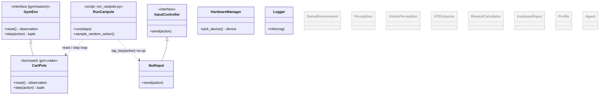

# GameTrainer — Milestone 0 (UML)

Progress so far. Only three live pieces: the **borrowed CartPole** env, a **random-action runner**, and the **`NullInput` stub** wired in early to prove the input seam exists. No brain, no eyes, no `GameEnvironment` yet.

> **Greyed, dashed boxes = planned but not yet built.**

**Built so far:** `GymEnv` contract (borrowed), `CartPole`, `RunCartpole`, `InputController` + `NullInput`, `HardwareManager`, `Logger`.

**Still planned:** `Agent`, `GameEnvironment`, `Perception` / `VisionPerception`, `ViTExtractor`, `RewardCalculator`, `KeyboardInput` + `Clib`, `Profile`.

**Proven at M0:** the loop runs (100 random steps, no crash) and the swappable-input seam is in place before it's needed.
