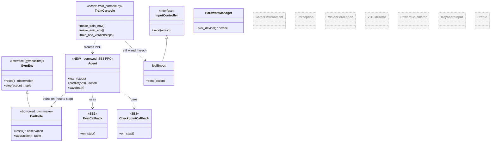

# GameTrainer — Milestone 1 (UML)

Progress so far. One real thing changed since M0: the **`Agent` (SB3 PPO)** got connected, replacing random actions. It trains on the same CartPole contract, with two SB3 callbacks for eval and checkpoints. `NullInput` is still wired (still a no-op). Eyes, `GameEnvironment`, reward, profiles — still planned.

> **Greyed, dashed boxes = planned but not yet built.**

**New at M1:** the `Agent` (PPO) node and its training dependency on the contract — the random policy is gone. **Result:** reward climbed 22 → 500.

**Built so far:** everything from M0, plus `Agent` (PPO) and the SB3 `EvalCallback` / `CheckpointCallback`.

**Still planned:** `GameEnvironment`, `Perception` / `VisionPerception`, `ViTExtractor`, `RewardCalculator`, `KeyboardInput` + `Clib`, `Profile`.

Note: swapping the decision-maker (random → PPO) required **no change to the contract** — which is the whole point of the architecture.
