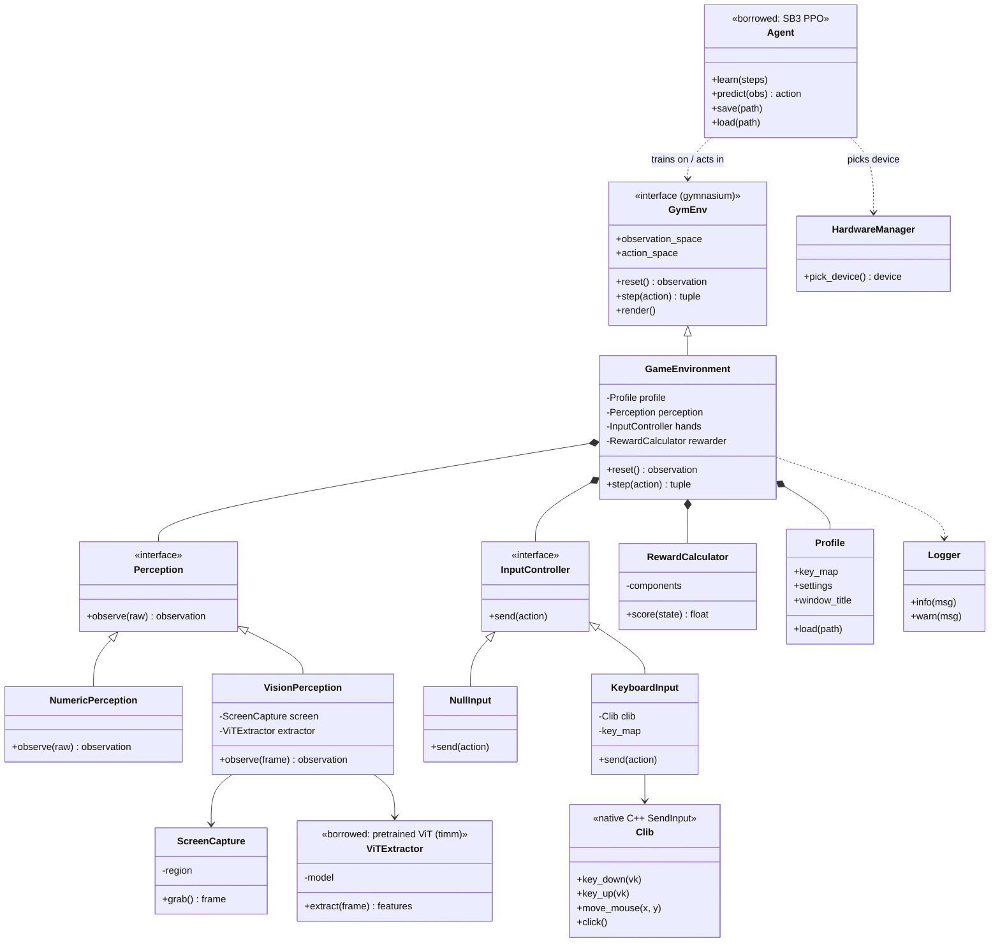
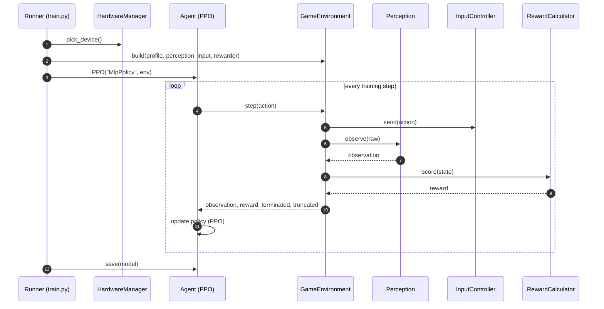
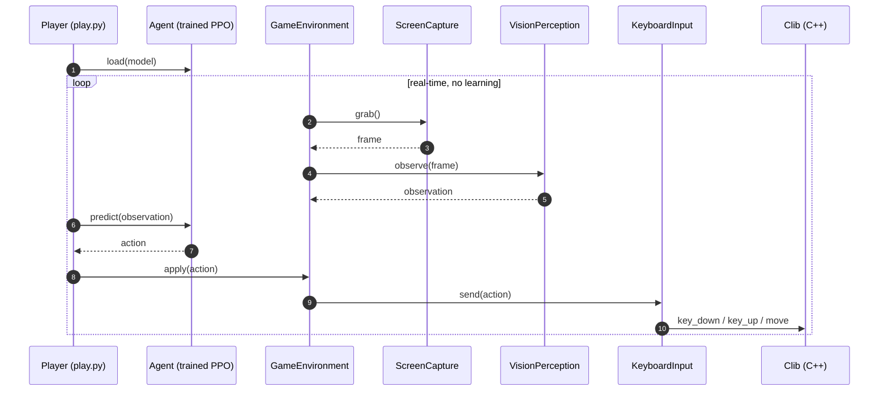

# GameTrainer — Target Architecture (UML)

The complete projected design: every class, plus the training and inference flows. Everything hangs off one contract (`GymEnv`); the `Agent` is borrowed and only ever talks to that contract.

---

## Class diagram — all projected classes

`step()` returns the gymnasium 5-tuple: `observation, reward, terminated, truncated, info`.

---

## Training flow

The agent acts, the env grades it, the agent updates its policy. Input is the `NullInput` stub during simulated worlds (CartPole / GridWorld).

---

## Inference flow

Playing for real: capture the screen, decide, press keys. **No reward, no weight updates** — the model is frozen.

